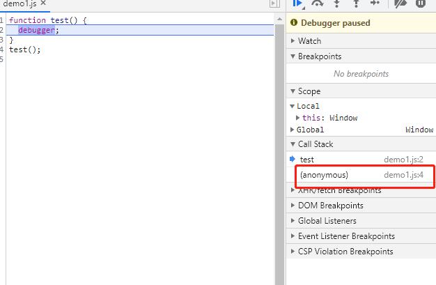

# 变量提升、函数作用域、块级作用域
1. 所有javascript代码执行的时候都默认包裹在一个匿名函数里执行<br>
在浏览器运行以下代码：
```js
function test() {
  debugger;
}
test();
```
查看调用栈可发现外面默认包裹了一个匿名函数<br>
<br>

2.带var的变量提升
```js
if (false) {
  var a = 20;
}
console.log(a);  //undefined
```
打印undefined而不是报错，默认把a的声明提升到了作用域顶端，等同如下
```js
var a;
if (false) {
  a = 20;
}
console.log(a);  //undefined
```

3.函数提升优先级高于var变量提升<br>
例1：
```js
function fun() { }
var fun;
console.log(f);  //ƒ fun() { }
```
例2：
```js
alert(a); // 弹出a的函数定义
a();  //10
var a = 3;

function a() {
  alert(10);
}
alert(a);  //3
a = 6;
a();  // a is not a function
```
例3：
```js
function fun() {
    console.log(1);
}
function init() {
    console.log(fun);//undefined
    if (false) {
        function fun() {
            console.log(2);
        }
    }
    console.log(fun); //undefined 提升了fun的声明，但是函数体不会提升
}
fun();//1
init();
```
例4
```js
var x = 1,
  y = 0,
  z = 0;
function add(x) {
  return (x = x + 1);
}
y = add(x);
console.log(y); //4

function add(x) {
  return (x = x + 3);
}
z = add(x);
console.log(z);  //4
console.log(x)  //1  只改变形参，外部的x 不会变
```
例5
```js
var x = 1,
  y = 0,
  z = 0;
function add(x) {
  return (x = x + 1);
}
y = add(x);
console.log(y); //2  //这里下面那个add不会提升到外部
{
  function add(x) {
    return (x = x + 3);
  }
}
z = add(x);
console.log(z);  //4
console.log(x)  //1  只改变形参，外部的x 不会变
```

4.函数作用域<br>
在ES6之前，js的作用域只有两种：函数作用域和全局作用域。使用var声明的变量，都存在变量提升的过程<br>
🌰 例1
```js
console.log(a); //undefined
console.log(c); //undefined
console.log(d); //function d() {}
console.log(b); //报错，b is not defined

var a = 0;
let b = 1;
var c = function () {
};
function d() {
}
```
由此可见使用let声明的变量不会提升，函数声明会完全提升，上面的代码等价于：
```js
var a;
var c;
function d() {}

console.log(a);
console.log(c);
console.log(d);
console.log(b);

a = 0;
let b = 1;
c = function () {

    };
```
🌰 例2
```js
var a;
console.log(a);  //undefined
a = 20;
function init() {
  //js private 私有变量
  var a = 30;
  console.log(a) //30  函数作用域：a的声明只能提升到init函数内部的顶端
}
init();
console.log(a);  //20
```
5.块级作用域<br>
ES6中定义了块级作用域，使用let声明的变量只能在块级作用域里访问，有“暂时性死区”的特性（也就是说声明前不可用）<br>
🌰例1
```js
var test = 1;
function func(){
  //打印test的值
  console.log(test); //报错，Cannot access 'test' before initialization
  let test = 2;
};
func();
```
🌰例2
```js
{
  var a = 1
  let b = 2
}
console.log(a)  // 1
console.log(b)  //b is not defined
```
🌰例3
```js
var x = 1,
  y = 0,
  z = 0;
function add(x) {
  return (x = x + 1);
}
y = add(x);
console.log(y); //2
{
  function add(x) {
    return (x = x + 3);
  }
}
z = add(x);
console.log(z);  //4
console.log(x)  //1  只改变形参，外部的x 不会变
```