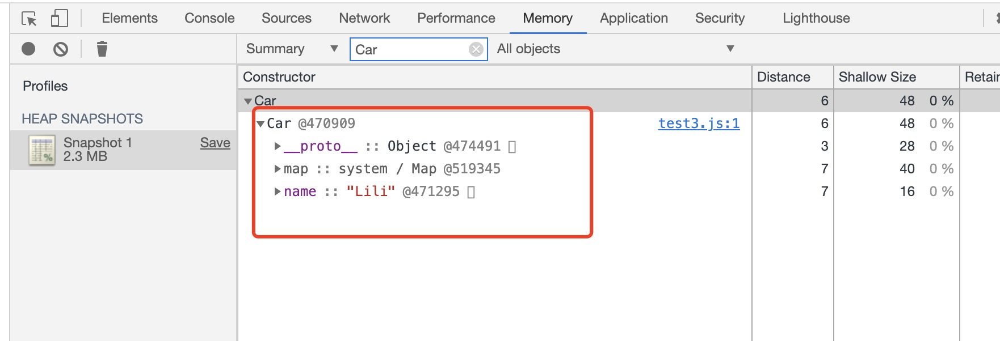
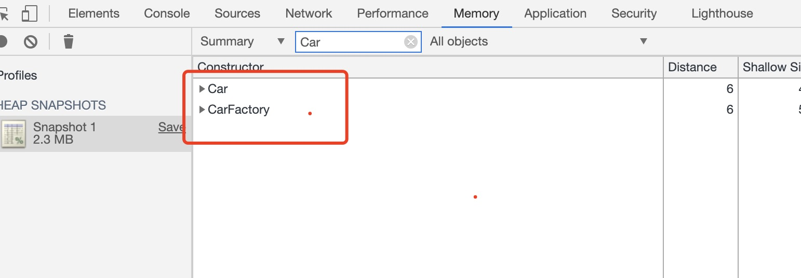

# 闭包
* 闭包是指那些能够访问自由变量的函数。
* 自由变量是指在函数中使用的，但既不是函数参数也不是函数的局部变量的变量。
例1
```js
function Foo() {
  var i = 0;
  return function() {
    console.log(i++);
  }
}

var f1 = Foo(),
  f2 = Foo();  // 
f1();  //0
f1();  //1  //f1引用的变量i是同一变量
f2();  //0  和f1引用的变量i是不同的变量
```
例2
```js
var i = 0;
function Foo() {
  return function() {
    console.log(i++);
  }
}

var f1 = Foo(),
  f2 = Foo();
f1();  //0
f1();  //1
f2();  //2  都引用的是同一个全局遍历i
```
## 销毁闭包
```js
function Car(name) {
  this.name = name;
}

let CarFactory = function (name) {
  let c1 = new Car(name);
  return function () {
    console.log(c1);
  };
};

let p1 = new CarFactory("Lili");  
p1();  
```
运行以上代码可以通过Chrome的Memory查案内存情况：<br>
<br>
清空c1，才会在内存中销毁Car<br>
<br>
但是这样，就修改了业务逻辑，打印结果就变成null了<br>
优化点：如果闭包里只用到name的话，则可以进行以下优化，Car也会被回收：
```js
function Car(name) {
  this.name = name;
}

let CarFactory = function (name) {
  let c1 = new Car(name);
  const n  = c1.name   //n相当于变成临时变量了
  c1 = null;
  return function () {
    console.log(n);
  };
};

let p1 = new CarFactory("Lili");
p1();
```
## eval
含义eval的函数会放弃eval环境下所有GC，容易造成内存泄漏，因为不知道eval里写的是什么，
```js
function Car(name) {
  this.name = {
    first: "Lily",
  };
}

let CarFactory = function (name) {
  let c1 = new Car(name);
  return function () {
    eval("");
  };
};

let p1 = new CarFactory("Lili");
p1();
```
查看内存结果：<br>
<br>
但是如果把eval移到window环境下，则Car和CarFactory会被回收
```js
function Car(name) {
  this.name = {
    first: "Lily",
  };
}

let CarFactory = function (name) {
  let c1 = new Car(name);
  return function () {
    window.eval("");
  };
};

let p1 = new CarFactory("Lili");
p1();
```
其他的容易造成内存泄漏的还有：
* try...cache：cache延长了作用域链，cache里的e不会回收，造成内存泄漏<br>
  ES10里cache里不用写e:`try{ }cache{new Error('xxx')}`，可以避免内存泄露
* new Function,
* with
```js
var s = {};
with (s) {
  var a = 1;
}
console.log(a);  // 1  (变量a变成全局的了)
```