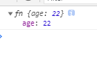

# 手写Object.create函数
## 第一步
Object.create()方法创建一个新的对象，并以方法的第一个参数作为新对象的__proto__属性的值
（以第一个参数作为新对象的构造函数的原型对象）
```js
function myCreate(proto) {
  function fn(){}
  fn.prototype = proto
  return new fn()
}

const a = {
  name:'Lily'
}

const b = myCreate(a)
b.name = 'Ann'
console.log(a.name)  // 'Lily'  (不会改变a.name)
```
## 第二步
Object.create()方法还有第二个可选参数，是一个对象，对象的每个属性都会作为新对象的自身属性，对象的
属性值以descriptor（Object.getOwnPropertyDescriptor(obj, 'key')）的形式出现，且enumerable默认为false<br>
```js
function myCreate(proto, propertiesObject) {
  function fn() {}
  fn.prototype = proto;
  const obj = new fn();

  if (propertiesObject instanceof Object) {
    Object.defineProperties(obj, propertiesObject);
  }
  return obj;
}

const a = {
  name: "Lily",
};

const b = myCreate(a, {
  age: {
    // age会成为所创建对象的数据属性
    configurable: true,
    writable: true,
    enumerable: true,
    value: 22,
  },
  color: {
    // color会成为所创建对象的访问器属性
    configurable: false,
    enumerable: true,
    get() {
      return "red";
    },
    set(value) {
      this.name += value;
    },
  },
});
console.log(b)  //{ age: 22, color: [Getter/Setter] }
console.log(b.name); // Lily
b.color = 'yellow'
console.log(b) //{ age: 22, color: [Getter/Setter], name: 'Lilyyellow' }
```
## 第三步
当Object.create的参数为null时，创建的是没有原型的空对象
```js
function myCreate(proto, propertiesObject) {
  function fn() {}
  fn.prototype = proto;
  const obj = new fn();

  if (propertiesObject instanceof Object) {
    Object.defineProperties(obj, propertiesObject);
  }

  if(proto === null) obj.__proto__ = null

  return obj;
}

const c = myCreate(null, { age: {
    // age会成为所创建对象的数据属性
    configurable: true,
    writable: true,
    enumerable: true,
    value: 22,
  },})
console.log(c)
```
打印结果：<br>

