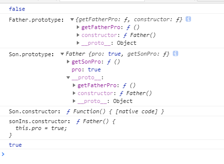
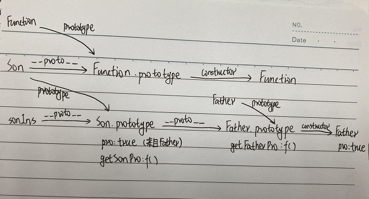

# JS继承方式比较
JS主要依靠原型链来实现继承

## 原型链继承
```js
function Father() {
  this.pro = true;
}
Father.prototype.getFatherPro = function () {
  return this.pro;
};
function Son() {
  this.pro = false;
}
Son.prototype.add = function () {
  return "继承之前子类原型添加的方法";
};
console.log('old Son.prototype: ',Son.prototype)
Son.prototype = new Father(); //继承：父类的实例赋值给子类的原型对象
// Son.prototype.__proto__ = Father.prototype; //a.
// Son.prototype = Father.prototype; //b.

Son.prototype.getSonPro = function () {
  return this.pro;
};
let sonIns = new Son();
console.log(sonIns.getFatherPro()); //false(调用父类的方法)
console.log('Father.prototype：',Father.prototype);
console.log('Son.prototype：', Son.prototype);
console.log('Son.constructor：',Son.constructor); 
console.log('sonIns.constructor：',sonIns.constructor);
console.log(sonIns instanceof Son) //true sonIns.__proto__ === Son.prototype
```
打印如下：<br>
<br>
原型链关系如下图：<br>

可以看出Son.prototype中没有了constructor属性，这是因为在`Son.prototype = new Father()`时Son.prototype已经被
重写了
