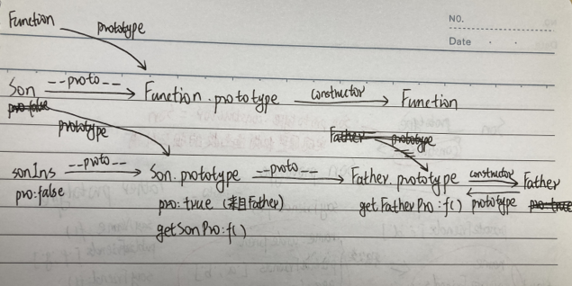

# JS继承方式比较
JS主要依靠原型链来实现继承

## 原型链继承
### 重写子类原型为父类的实例
```js
function Father() {
  this.pro = true;
}
Father.prototype.getFatherPro = function () {
  return this.pro;
};
function Son() {
  this.pro = false;
}
Son.prototype.add = function () {
  return "继承之前子类原型添加的方法";
};
console.log('old Son.prototype: ',Son.prototype)
Son.prototype = new Father(); //a.重写子类原型为父类的实例
// Son.prototype.__proto__ = Father.prototype; //b.
// Son.prototype = Father.prototype; //c.

Son.prototype.getSonPro = function () {
  return this.pro;
};
let sonIns = new Son();
console.log(sonIns.getFatherPro()); //false(调用父类的方法)
console.log('Father.prototype：',Father.prototype);
console.log('Son.prototype：', Son.prototype);
console.log('Son.constructor：',Son.constructor); 
console.log('sonIns.constructor：',sonIns.constructor);
console.log(sonIns instanceof Son) //true sonIns.__proto__ === Son.prototype
```
打印如下：<br>
<br>
原型链关系如下图：<br>
<br>
**缺点**
可以看出Son.prototype中没有了constructor属性，这是因为在`Son.prototype = new Father()`时Son.prototype已经被
重写了，所以sonIns.constructor通过原型链指向了父类Father

### 子类原型的__proto__属性指向父类原型
把第一个例子的继承语句a替换成b，子类原型的__proto__属性指向父类原型
```js
function Father() {
  this.pro = true;
}
Father.prototype.getFatherPro = function () {
  return this.pro;
};
function Son() {
  this.pro = false;
}
Son.prototype.add = function () {
  return "继承之前子类原型添加的方法";
};
console.log('old Son.prototype: ',Son.prototype)
// Son.prototype = new Father(); //a
Son.prototype.__proto__ = Father.prototype; //b 子类原型的__proto__属性指向父类原型
// Son.prototype = Father.prototype; //c

Son.prototype.getSonPro = function () {
  return this.pro;
};
let sonIns = new Son();
console.log('Father.prototype：',Father.prototype);
console.log('Son.prototype：', Son.prototype);
console.log('Son.constructor：',Son.constructor);
console.log('sonIns.constructor：',sonIns.constructor);
```
打印如下：<br>
<br>
原型链关系如下图(红色部分表示与上例的不同)：<br>
<br>
可以看作是不严格的继承，没有重新定义子类的原型对象，所以子类的构造函数不变

### 重写子类原型为父类原型
把第一个例子的继承语句a替换成c，重写子类原型为父类原型
```js
function Father() {
  this.pro = true;
}
Father.prototype.getFatherPro = function () {
  return this.pro;
};
function Son() {
  this.pro = false;
}
Son.prototype.add = function () {
  return "继承之前子类原型添加的方法";
};
console.log('old Son.prototype: ',Son.prototype)
// Son.prototype = new Father(); //a
// Son.prototype.__proto__ = Father.prototype; //b
Son.prototype = Father.prototype; //c 重写子类原型为父类原型

Son.prototype.getSonPro = function () {
  return this.pro;
};
let sonIns = new Son();
console.log('Father.prototype：',Father.prototype);
console.log('Son.prototype：', Son.prototype);
console.log('Son.constructor：',Son.constructor);
console.log('sonIns.constructor：',sonIns.constructor);
```
打印如下：<br>
<br>
原型链关系如下图(红色部分表示与上例的不同)：<br>
<br>
可以看作是直接用父类的原型对象替换子类的原型对象，子类和父类的原型对象指向同一地址，即子类的原型对象就
是父类的 原型对象,子类实例的构造函数指向父类<br>
重新定义了子类的原型对象，子类实例的构造函数指向父类的constructor属性

> **总结**
> 原型链继承在创建子类的实例时，无法向父类构造函数传递参数
