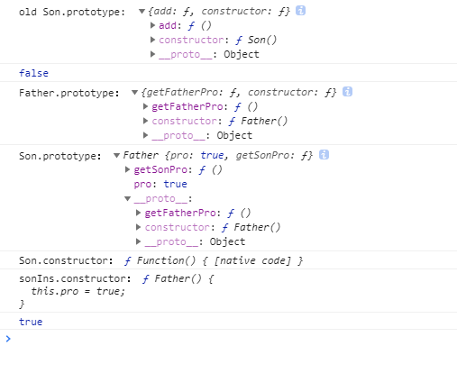
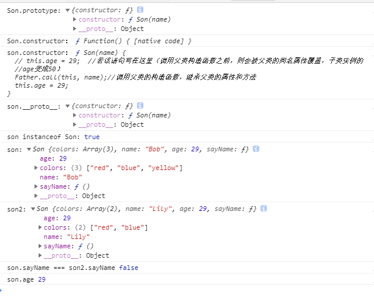

# JS继承方式比较
JS主要依靠原型链来实现继承

## 1 原型链继承
### 1-1 重写子类原型为父类的实例
```js
function Father() {
  this.pro = true;
}
Father.prototype.getFatherPro = function () {
  return this.pro;
};
function Son() {
  this.pro = false;
}
Son.prototype.add = function () {
  return "继承之前子类原型添加的方法";
};
console.log('old Son.prototype: ',Son.prototype)
Son.prototype = new Father(); //a.重写子类原型为父类的实例
// Son.prototype.__proto__ = Father.prototype; //b.
// Son.prototype = Father.prototype; //c.

Son.prototype.getSonPro = function () {
  return this.pro;
};
let sonIns = new Son();
console.log(sonIns.getFatherPro()); //false(调用父类的方法)
console.log('Father.prototype：',Father.prototype);
console.log('Son.prototype：', Son.prototype);
console.log('Son.constructor：',Son.constructor); 
console.log('sonIns.constructor：',sonIns.constructor);
console.log(sonIns instanceof Son) //true sonIns.__proto__ === Son.prototype
```
打印如下：<br>
<br>
原型链关系如下图：<br>
<br>
**缺点**<br>
可以看出Son.prototype中没有了constructor属性，这是因为在`Son.prototype = new Father()`时Son.prototype已经被
重写了，所以sonIns.constructor通过原型链指向了父类Father

### 1-2 子类原型的__proto__属性指向父类原型
把第一个例子的继承语句a替换成b，子类原型的__proto__属性指向父类原型
```js
function Father() {
  this.pro = true;
}
Father.prototype.getFatherPro = function () {
  return this.pro;
};
function Son() {
  this.pro = false;
}
Son.prototype.add = function () {
  return "继承之前子类原型添加的方法";
};
console.log('old Son.prototype: ',Son.prototype)
// Son.prototype = new Father(); //a
Son.prototype.__proto__ = Father.prototype; //b 子类原型的__proto__属性指向父类原型
// Son.prototype = Father.prototype; //c

Son.prototype.getSonPro = function () {
  return this.pro;
};
let sonIns = new Son();
console.log('Father.prototype：',Father.prototype);
console.log('Son.prototype：', Son.prototype);
console.log('Son.constructor：',Son.constructor);
console.log('sonIns.constructor：',sonIns.constructor);
```
打印如下：<br>
<br>
原型链关系如下图(红色部分表示与上例的不同)：<br>
<br>
可以看作是不严格的继承，没有重新定义子类的原型对象，所以子类的构造函数不变

### 1-3 重写子类原型为父类原型
把第一个例子的继承语句a替换成c，重写子类原型为父类原型
```js
function Father() {
  this.pro = true;
}
Father.prototype.getFatherPro = function () {
  return this.pro;
};
function Son() {
  this.pro = false;
}
Son.prototype.add = function () {
  return "继承之前子类原型添加的方法";
};
console.log('old Son.prototype: ',Son.prototype)
// Son.prototype = new Father(); //a
// Son.prototype.__proto__ = Father.prototype; //b
Son.prototype = Father.prototype; //c 重写子类原型为父类原型

Son.prototype.getSonPro = function () {
  return this.pro;
};
let sonIns = new Son();
console.log('Father.prototype：',Father.prototype);
console.log('Son.prototype：', Son.prototype);
console.log('Son.constructor：',Son.constructor);
console.log('sonIns.constructor：',sonIns.constructor);
```
打印如下：<br>
<br>
原型链关系如下图(红色部分表示与上例的不同)：<br>
<br>
可以看作是直接用父类的原型对象替换子类的原型对象，子类和父类的原型对象指向同一地址，即子类的原型对象就
是父类的 原型对象,子类实例的构造函数指向父类<br>
重新定义了子类的原型对象，子类实例的构造函数指向父类的constructor属性

> **总结** <br>
> 原型链继承在创建子类的实例时，无法向父类构造函数传递参数

## 2 借用构造函数
在子类构造函数的内部调用父类的构造函数
> 函数只不过是在特定环境中执行代码的对象，因此通过使用apply()和call()方法可以在新创建的实例上执行构造函数
```js
function Father(name) {
  this.colors = ['red', 'blue'];
  this.name = name;
  this.sayName = function () {
    return this.name;
  };
  this.age = 50;
}
function Son(name) {
  //若该语句写在这里（调用父类构造函数之前，则会被父类的同名属性覆盖，子类实例的age变成50）
  // this.age = 29;  
  
  //通过call()，实际上实在创建子类的环境下调用了父类的构造函数，等于把父类的构造函数拿到此处执行
  Father.call(this, name);
  
  this.age = 29;
}

let son = new Son('Bob');
let son2 = new Son('Lily');
son.colors.push('yellow');

console.log('Son.prototype:',Son.prototype);//Son4 {} //子类的原型对象未变
console.log('Son.constructor：',Son.constructor);
console.log('son.constructor：',son.constructor);
console.log('son.__proto__:',son.__proto__);//Son4 {}  //子类的原型对象和子类构造函数内内调用父类的构造函数无关系
console.log('son instanceof Son:',son instanceof Son) //true sonIns.__proto__ === Son.prototype

console.log('son:', son);
console.log('son2:',son2);
console.log('son.sayName === son2.sayName',son.sayName === son2.sayName);  //false
console.log('son.age',son.age);  //29
```
打印如下：<br>
<br>
原型链关系如下图：<br>
<br>
> **总结借用构造函数方法** <br>
> * 优点：在创建子类的实例时，能向父类构造函数传递参数，创建自己的属性值
> * 缺点：
>   * 1.使子类能继承父类的属性和方法，但是子类的原型对象未改变，没有构造出继承的原型链，不能算是继承
>   * 2.在构造函数中定义的方法不能复用，每个子类实例都要重新创建方法

## 3 组合继承
使用原型链实现对共享属性和方法的继承，通过借用构造函数实现对私有属性的继承
```js
function Father(name) {
  console.log('调用父类构造函数')
  this.name = name;
  this.privateFriends = ['a', 'b'];
  this.age = 60
}

Father.prototype.sayName = function() {
  return this.name;
}

Father.prototype.publicFriends=  ['f', 'g'];

Father.prototype.sayFriend= function () {
  console.log('这是父类的方法');
  return this.privateFriends + this.publicFriends;
}

function Son(name) {
  Father.call(this, name);
  this.privateFriends = ['c', 'd'];//将会覆盖父类的同名属性
}

Son.prototype = new Father(); //调用父类构造函数
Son.prototype.constructor = Son;//实现原型和构造函数的互相指引

Son.prototype.sayFriend = function () { //添加子类的方法,将会覆盖父类的方法
  console.log('这是子类的方法');
  return this.privateFriends + this.publicFriends;
};

let son1 = new Son('Bob'); //调用父类构造函数
let son2 = new Son('Lily');//调用父类构造函数

console.log('Son.prototype:',Son.prototype);
console.log('Son.constructor：',Son.constructor);
console.log('son1.constructor：',son1.constructor);
console.log('son1.__proto__:',son1.__proto__);
console.log('son1 instanceof Son:',son1 instanceof Son) //true sonIns.__proto__ === Son.prototype

son1.privateFriends.push('z');
son1.publicFriends.push('x');
console.log('son2.privateFriends:',son2.privateFriends);  //[ 'c', 'd' ] (未影响到实例二的私有属性)
console.log('son2.publicFriends:',son2.publicFriends);  //[ 'f', 'g', 'x' ] （影响到实例二的共享属性）

console.log('son1.sayFriend === son2.sayFriend:',son1.sayFriend === son2.sayFriend); //true  (做到了函数复用)
console.log('son1.sayFriend():',son1.sayFriend());// 这是子类的方法 c,d,zf,g,x (覆盖了父类的同名方法)
console.log('son1',son1);
```
打印如下：<br>
<br>
<br>
原型链关系如下图：<br>
<br>
> **总结组合继承** <br>
> * 优点：弥补了借用构造函数的两个缺点，能传递参数，复用了父类的方法，且有继承的原型链，是最常用的继承模式
> * 缺点：会调用两次父类构造函数，一次是在子类继承父类创建子类原型的时候调用了父类构造函数，另一次是在实例
>   化子类的时候，在子类构造函数内部调用了父类构造函数，于是实例化的子类对象在其本身和原型对象里都有
>   一份父类构造函数里有的属性和方法

