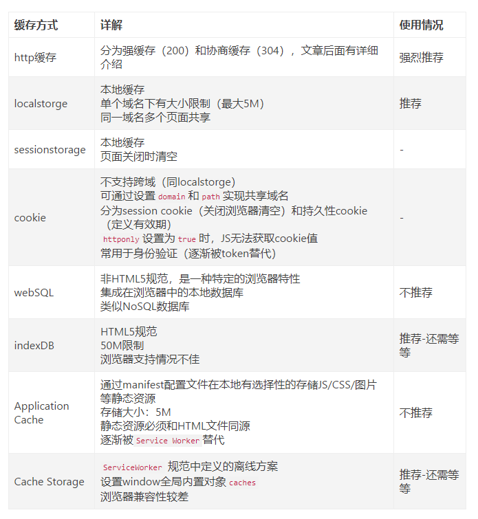
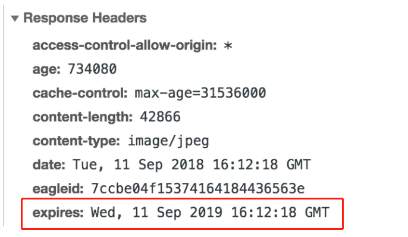

# 浏览器缓存

**目录**
> * [1 HTTP缓存](#1-http缓存)
>   * [1-1 强缓存](#1-1-强缓存)
>       * [1-1-1 expires](#1-1-1-expires)
>       * [1-1-2 cache-control](#1-1-2-cache-control)
>           * [1-1-2-1 max-age](#1-1-2-1-max-age)
>           * [1-1-2-2 s-maxage](#1-1-2-2-s-maxage)
>           * [1-1-2-3 public与private](#1-1-2-3-public与private)
>           * [1-1-2-4 no-store与no-cache](#1-1-2-4-no-store与no-cache)
>   * [1-2 协商缓存](#1-2-协商缓存)
>       * [1-2-1 Last-Modified](#1-2-1-Last-Modified)
>       * [1-2-2 Etag](#1-2-2-etag)
> * [2 HTTP缓存决策](#2-http缓存决策)

浏览器缓存有多种形式，持久化或者会话存储。以chrome为例，打开调试面板，找到Application选项卡，就可以看到它所支持的各种缓存模式<br>
<br>

## 1 HTTP缓存
HTTP缓存分为两大类：
* 强缓存：浏览器直接从自己的缓存中读取资源，不会发请求到服务器；
* 协商缓存：当强缓存没有命中的时候，浏览器一定会发送一个请求到服务器，通过服务器端依据资源的另外一些http header验证这个资源是否命中协商缓存，
  如果协商缓存命中，服务器会将这个请求返回，但是不会返回这个资源的数据，而是告诉客户端可以直接从缓存中加载这个资源，于是浏览器就又会从自己的缓存中去加载这个资源；
两者的区别：强缓存不发请求到服务器，协商缓存会发请求到服务器。<br>
两者的共同点：都是从客户端缓存中加载资源。<br>

我们经常会刷新浏览器，不同的刷新方式对缓存有不同影响：
* 当ctrl+f5强制刷新网页时，直接从服务器加载，跳过强缓存和协商缓存；
* 当f5刷新网页时，跳过强缓存，但是会检查协商缓存；

### 1-1 强缓存
浏览器根据http请求头部的**expires**和**cache-control**来判断该请求是否命中强缓存，若命中则直接从缓存中获取
资源，不会再与服务端发生通信<br>
命中强缓存的情况下，返回的 HTTP 状态码为 200：<br>
<br>
强缓存会有三种命中模式：from memory cache,from disk cache，资源本身的大小(如：1.5k)<br>


### 1-1-1 expires
在过去，服务器把过期时间写入响应头部的expires字段：<br>
<br>
expires是一个时间戳，如果再次向服务器像服务器发送相同的请求，浏览器就会对比本地时间和expires，
如果本地时间小于expires，那么就直接去缓冲中取资源。<br>
expires对本地时间和服务器时间的一致性有很高的要求，若服务器与客户端存在时差，可能会带来错误的结果。

#### 1-1-2 cache-control

##### 1-1-2-1 max-age
expires通过**绝对的时间戳**来控制缓存过期时间，而cache-control中的max-age字段则通过**相对的时间长度**
来控制缓存过期时间<br>
在 HTTP1.1 标准试图将缓存相关配置收敛进 Cache-Control 这样的大背景下， max-age可以视作是对 expires 
能力的补位/替换
```
cache-control: max-age=31536000
```
max-age是一个时间长度，单位是秒，客户端会记下请求该资源的时间点，该资源在距离此时间的时间长度以内是有效的<br>
cache-control的优先级高于expires

#### 1-1-2-2 s-maxage
```
cache-control: max-age=3600, s-maxage=31536000
```
s-maxage 就是用于表示 cache 服务器上（比如 cache CDN）的缓存的有效时间的，并只对 public 缓存有效

#### 1-1-2-3 public与private
如果为资源设置了 public，那么它既可以被浏览器缓存，也可以被代理服务器缓存；如果设置了 private，
则该资源只能被浏览器缓存。private 为默认值.<br>
多数情况下，public 并不需要手动设置，如下：<br>
<br>
设置了 s-maxage，没设置 public，但代理服务器可以缓存这个资源

#### 1-1-2-4 no-store与no-cache
no-cache 绕开了浏览器：我们为资源设置了 no-cache 后，每一次发起请求都不会再去询问浏览器的缓存情况，
而是直接向服务端去确认该资源是否过期（即走我们下文即将讲解的协商缓存的路线）。<br>

no-store 比较绝情，顾名思义就是不使用任何缓存策略。在 no-cache 的基础上，它连服务端的缓存确认也绕开了，
只允许你直接向服务端发送请求、并下载完整的响应

### 1-2 协商缓存
协商缓存机制下，浏览器需要向服务器询问缓存新信息，判断是重新发起请求，还是从本地获取缓存资源。<br>
如果服务器端提示资源未改动，资源会被重定向到浏览器缓存，请求对应的状态码是304：<br>
.png)

#### 1-2-1 Last-Modified
Last-Modified 是一个时间戳，如果我们启用了协商缓存，它会在首次请求时随着 Response Headers 返回<br>
.png)<br>

之后的每次请求，都会再请求头带上一个叫 If-Modified-Since 的时间戳字段，它的值正是上一次 response 
返回给它的 last-modified 值<br>
.png)<br>
服务器接收到这个时间戳后，会比对该时间戳和资源在服务器上的最后修改时间是否一致，从而判断资源是否发生了变化。如果发生了变化，就会返回一个完整的响应
内容，并在 Response Headers 中添加新的 Last-Modified 值；否则，返回如上图的 304 响应，Response Headers 不会再添加 Last-Modified 字
段。<br>
使用 Last-Modified 存在一些弊端，这其中最常见的就是这样两个场景：
* 我们编辑了文件，但文件的内容没有改变。服务端并不清楚我们是否真正改变了文件，它仍然通过最后编辑时间进行判断。因此这个资源在再次被请求时，会被当
  做新资源，进而引发一次完整的响应——不该重新请求的时候，也会重新请求。
* 当我们修改文件的速度过快时（比如花了 100ms 完成了改动），由于 If-Modified-Since 只能检查到以秒为最小计量单位的时间差，所以它是感知不到这
  个改动的——该重新请求的时候，反而没有重新请求了。
  
这两个场景其实指向了同一个 bug——服务器并没有正确感知文件的变化

#### 1-2-2 Etag 
Etag是作为Last-Modified的补充出现的，它是由服务器为每个资源生成的唯一的标识字符串，这个标识字符串是基于文件内容编码的，只要文件内容不同，它们
对应的 Etag 就是不同的，反之亦然。因此 Etag 能够精准地感知文件的变化。<br>
Etag 和 Last-Modified 类似，当首次请求时，我们会在响应头里获取到一个最初的标识符字符串：<br>
.png)<br>
那么下一次请求时，请求头里就会带上一个值相同的、名为 if-None-Match 的字符串供服务端比对了：<br>
.png)<br>
Etag 的生成过程需要服务器额外付出开销，会影响服务端的性能，这是它的弊端。<br>
Etag 在感知文件变化上比 Last-Modified 更加准确，优先级也更高。当 Etag 和 Last-Modified 同时存在时，以 Etag 为准。

## 2 HTTP缓存决策
Chrome 官方图：<br>
.png)<br>
流程如下：
* 当资源不可复用时，直接设置Cache-Control为no-store,拒绝一切形式的缓存;
* 否则考虑是否每次都要需要向服务器进行缓存有效确认，如果需要，设置Cache-Control为no-cache;
* 否则考虑资源是否可以被代理服务器缓存，根据其结果决定是设置为 private 还是 public；
* 然后考虑该资源的过期时间，设置max-age和s-maxage;
* 最后，配置协商缓存需要用到的Etag、Last-Modified

❀ 本文参考[前端网络高级篇（三）浏览器缓存](https://www.jianshu.com/p/82ddd017f79a)<br>
❀ 本文参考[浏览器缓存机制介绍与缓存策略剖析](https://juejin.cn/book/6844733750048210957/section/6844733750106931214)