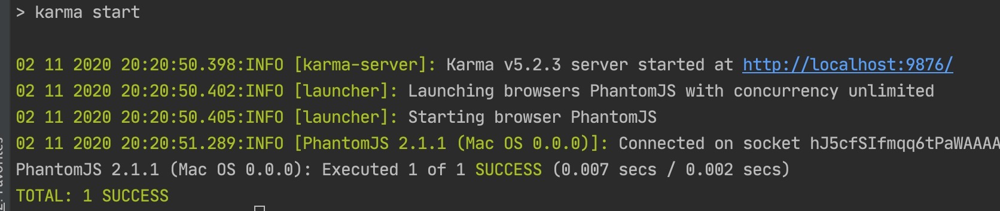
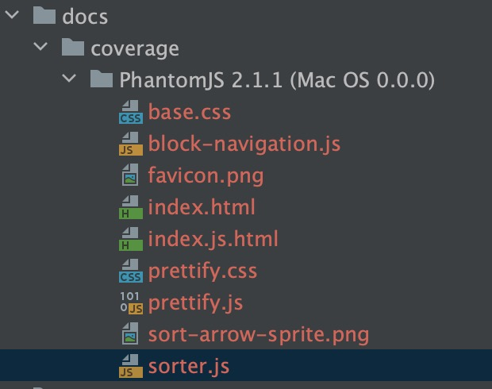
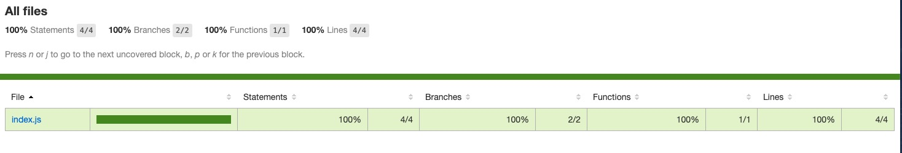
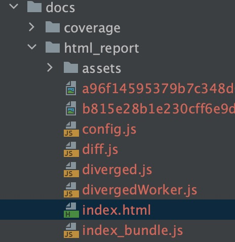
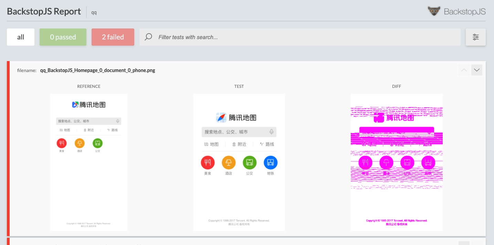
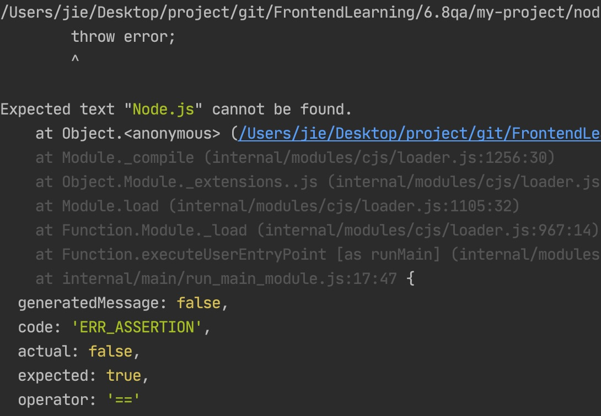
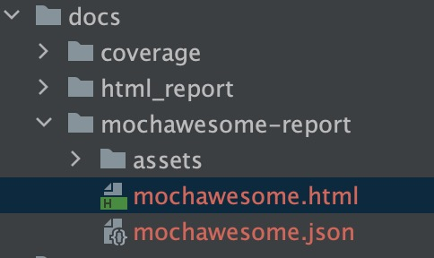
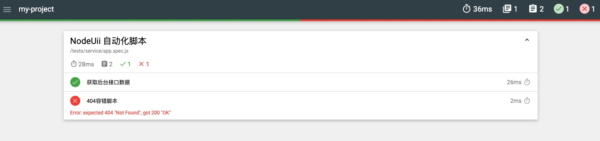

# QA

> * [单元测试karma](#单元测试karma)
> * [UI测试BackstopJs](#UI测试BackstopJs)
> * [e2e测试](#e2e测试)
> * [接口测试Mocha](#接口测试Mocha)

## 单元测试karma
* 新增两个待测试文件：
my-project/src/index.js：
```js
window.add = function(a) {
    if(a==1) {
        return 1
    } else {
        return (a=a+1)
    }
}
```
my-project/tests/unit/index.spec.js：
```js
describe('函数+1基本测试用例', function(){
    it('+1测试函数',function() {
        expect(window.add(1)).toBe(1);
        expect(window.add(2)).toBe(3);
    })
})
```
* 先安装karma:`npm i -D karma karma-cli karma-coverage`,运行`karma init`
* 选择断言库jasmine
* 生成配置文件karma.config.js
```js
// Karma 核心configuration
// Generated on Tue Jun 09 2020 22:03:49 GMT+0800 (GMT+08:00)
module.exports = function(config) {
  config.set({

    // base path that will be used to resolve all patterns (eg. files, exclude)
    basePath: '',  //根路径


    // frameworks to use
    // available frameworks: https://npmjs.org/browse/keyword/karma-adapter
    frameworks: ['jasmine'],  // 断言库，带适配器karma-jasmine


    // list of files / patterns to load in the browser
    files: ['./src/**/*.js', 'tests/unit/**/*.spec.js'], //需要测试的js文件


    // list of files / patterns to exclude
    exclude: [],  //排除测试的js文件


    // preprocess matching files before serving them to the browser
    // available preprocessors: https://npmjs.org/browse/keyword/karma-preprocessor
    preprocessors: {
    },


    // tests results reporter to use
    // possible values: 'dots', 'progress'
    // available reporters: https://npmjs.org/browse/keyword/karma-reporter
    reporters: ['progress', 'coverage'],  //进程， 覆盖率

    preprocessors: {  //测试哪些文件对应的覆盖率
      // source files, that you wanna generate coverage for
      // do not include tests or libraries
      // (these files will be instrumented by Istanbul)
      'src/**/*.js': ['coverage']
    },

    // optionally, configure the reporter
    coverageReporter: {  //配置生成的报表
        type : 'html',  //文件类型
        dir : 'docs/coverage/'  //生成位置
    },

    // web server port
    port: 9876,


    // enable / disable colors in the output (reporters and logs)
    colors: true,


    // level of logging
    // possible values: config.LOG_DISABLE || config.LOG_ERROR || config.LOG_WARN || config.LOG_INFO || config.LOG_DEBUG
    logLevel: config.LOG_INFO,


    // enable / disable watching file and executing tests whenever any file changes
    autoWatch: false,


    // start these browsers
    // available browser launchers: https://npmjs.org/browse/keyword/karma-launcher
    browsers: ['PhantomJS'],  //设置无头浏览器


    // Continuous Integration mode
    // if true, Karma captures browsers, runs the tests and exits
    singleRun: true, //独立运行

    // Concurrency level
    // how many browser should be started simultaneous
    concurrency: Infinity
  })
}
```
* 运行`karma start`<br>

测试代码覆盖率，生成文档<br>

打开index.html，可查看报告,显示分支、语句、函数等的覆盖率：<br>


## UI测试BackstopJs
* npm安装backstopjs,运行`backstop init`
* 生成配置文件backstop.json
```json
{
  "id": "qq",
  "viewports": [
    {
      "label": "phone",
      "width": 320,
      "height": 480
    },
    {
      "label": "tablet",
      "width": 1024,
      "height": 768
    }
  ],
  "onBeforeScript": "puppet/onBefore.js",
  "onReadyScript": "puppet/onReady.js",
  "scenarios": [
    {
      "label": "BackstopJS Homepage",
      "cookiePath": "backstop_data/engine_scripts/cookies.json",
      "url": "https://map.qq.com/m/",  //需要测试的页面
      "referenceUrl": "",
      "readyEvent": "",
      "readySelector": "",
      "delay": 0,
      "hideSelectors": [],
      "removeSelectors": [],
      "hoverSelector": "",
      "clickSelector": "",
      "postInteractionWait": 0,
      "selectors": [],
      "selectorExpansion": true,
      "expect": 0,
      "misMatchThreshold" : 0.1,
      "requireSameDimensions": true
    }
  ],
  "paths": {
    "bitmaps_reference": "backstop_data/bitmaps_reference",  //放置UI图片的地方
    "bitmaps_test": "backstop_data/bitmaps_test",
    "engine_scripts": "backstop_data/engine_scripts",
    "html_report": "docs/html_report", //生成报表位置
    "ci_report": "backstop_data/ci_report"
  },
  "report": ["browser"],
  "engine": "puppeteer",   //无头浏览器
  "engineOptions": {
    "args": ["--no-sandbox"]
  },
  "asyncCaptureLimit": 5,
  "asyncCompareLimit": 50,
  "debug": false,
  "debugWindow": false
}
```
在backstop_data/bitmaps_reference路径里放置如下UI已经设计好的图片：<br>

* 运行`backstop test`
自动生成下面的文件：<br>

打开index.html如下,可以看到两个图片的对比：<br>


## e2e测试
### selenium-webdriver
* 下载`geckodriver.exe'到项目根目录
建立测试文件my-project/tests/unit/index.spec.js
```js
const {Builder, By, Key, until} = require('selenium-webdriver');

(async function example() {
    let driver = await new Builder().forBrowser('firefox').build();
    try {
        await driver.get('http://www.baidu.com/');
        await driver.findElement(By.name('wd')).sendKeys('jie', Key.RETURN);
        await driver.wait(until.titleIs('jie_百度搜索'), 1000);
    } finally {
        await driver.quit();
    }
})();
```
执行 `node ./tests/e2e/baidu.spec.js`，可以看到浏览器自动打开百度搜索页面，完成测试操作

### rize
* 安装puppeter和rize
* 新建测试文件my-project/tests/e2e/github.spec.js
```js
const Rize = require('rize')
const rize = new Rize()
rize
    .goto('https://github.com/')  //github网页
    .type('input.header-search-input', 'node111') //搜索框输入'node111'
    .press('Enter') //输入回车
    .waitForNavigation()
    .assertSee('Node.js')  //页面是否有Node.js
    .end()  // 别忘了调用 `end` 方法来退出浏览器！
```
执行`node ./tests/e2e/github.spec.js `，等待一会，出现如下结果，表示测试失败：<br>

 
## 接口测试Mocha
* 新建my-project/tests/service/app.js
```js
//接口测试
const Koa = require('koa');
const app = new Koa();
app.use(async ctx => {
    ctx.body = {
        data:'jie'
    };
});
app.listen(3000,() => {
    console.log('服务启动成功')
});
module.exports = app
```
* 新建测试文件my-project/tests/service/app.spec.js
```js
const superagent = require('supertest') //代理Http
const app = require('./app')
function request(){
    return superagent(app.listen())
}
describe('NodeUii 自动化脚本',function(){
    it('获取后台接口数据', function(done){
        request()
            .get('/')
            .set('Accept', 'application/json')
            .expect('Content-Type', /json/) //期盼的Content-Type
            .expect(200)
            .end(function(err, res){
                if (err) {
                    done(new Error('请求出错'));
                } else {
                    console.log(res.body);
                    if (res.body.data == 'jie') {
                        done();
                    } else {
                        done(new Error('请求数据出错'));
                    }
                }
            })
    })
    it('404容错脚本', function(done){
        request().get('/user').expect(404, done)
    })
})
```
* 新建mocha启动文件my-project/mochaRunner.js
```js
const Mocha = require('mocha')
const mocha = new Mocha({
    reporter:'mochawesome', //配置报表
    reporterOptions:{
        reportDir:'docs/mochawesome-report'
    }
})
mocha.addFile('./tests/service/app.spec.js')  //添加测试文件
mocha.run(function(){
    process.exit(0) //退出进程
})
```
运行`node mochaRunner.js`，生成报告：<br>

打开mochawesome.html<br>


🌰 [点击这里查看本例demo](./demo/my-project)<br>
📚 此文章系笔者原创，转载请注明来源