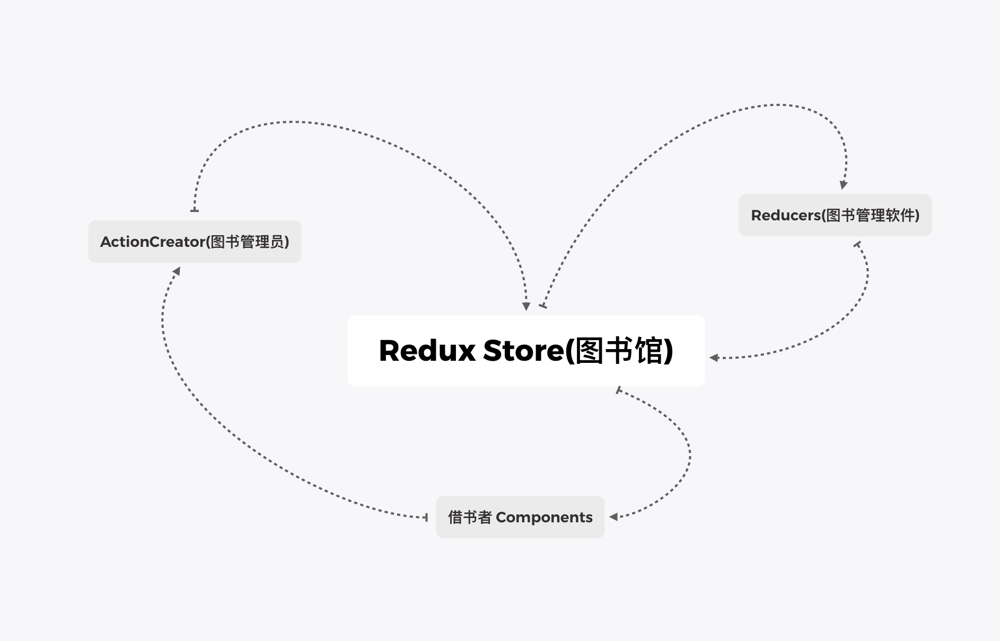
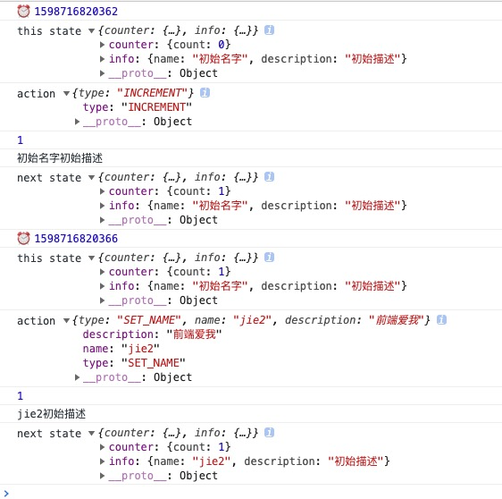

# 手写一个Redux
**目录**
> * [Redux介绍](#Redux介绍)
> * [源码分析](#源码分析)
> * [手写Redux](#手写Redux)
>   * [第一步：增加store基本方法（订阅、获取状态、改变状态）](#第一步)
>   * [第二步：增加reducer，通过派发action改变状态](#第二步)
>   * [第三步：使用combineReducer来合并多个reducer](#第三步)
>   * [第四步：使用reducer管理状态初始值](#第四步)
>   * [第五步：使用replaceReducer动态组合Reducer](#第五步)
>   * [第六步：使用中间件劫持dispatch](#第六步)
>   * [第七步：使用applyMiddleware初始化中间件](#第七步)
>   * [第八步：使用bindActionCreators提取action](#第八步)
>   * [第九步：增加取消订阅方法](#第九步)

## Redux介绍
* Redux 是 JavaScript 状态容器，提供可预测化的状态管理。
* Redux是函数式编程的经典写法，函数式编程首先是一个范畴，它是范畴论的一种应用，函数式编程没有if-else，
只有函子。在写Redux的时候，首先函数式编程有一个container容器，这个容器由map接收一个变形关系，作用于每
一个value，使该容器变成函数。因为有很多函子，但是函数式编程讲究纯，所以要用IO函子进行包裹，解决异步和
脏操作。([点击这里了解函数式编程](/functional-programming/base.md))<br>
* Redux是Flux的升级版本，早期使用React都要配合Flux进行状态管理，但是在使用中，Flux显露了很多
弊端，比如多状态管理的复杂和易错。所以 Redux 就诞生了，还吸取了部分精华，现在已经完全取代了Flux。<br>
举个🌰<br>
<br>
借书者(Components)要去借书。那要先去找管理员(ActionCreator)借书，管理员先去图书馆柜台机上(Store) 用
图书管理软件(Reducers)找,找到了就给这个借阅者(Components)告诉正确的位置，和图书的信息，没找到或者已经
借阅出去了，给反馈信息，还书也是一样

## 源码分析
Redux源码目录和基本功能如下:<br>
> * applyMiddleware.js  中间件（IO函子）
> * bindActionCreators.js  产生action
> * combineReducers.js  合并reducer
> * compose.js  函数组合
> * createStore.js  创建store
> * index.js  导出模块
> * utils工具文件夹，存放一些工具性的文件<br>
>
Redux各部分分析：
> * store -> container
> * currentState -> _value
> * action -> f 变形关系
> * reducer -> map
> * middleware -> IO functor （解决异步和脏操作）<br>
接下来按照源码结构来一步一步实现一个Redux<br>
>
## 手写Redux
### 第一步
在根目录新建Redux文件夹，建立createStore.js,写好store的基本三个方法：订阅、获取状态、改变状态
```js
export default function createStore(initState) {
  let state = initState; //状态
  let listeners = []; //监听队列

  //订阅，状态改变通知订阅者，把订阅者的方法存入到监听队列中
  function subscribe(listener) {
    listeners.push(listener);
  }

  //获取状态
  function getState() {
    return state;
  }

  //改变状态，执行监听队列中订阅者的方法
  function changeState(newState) {
    state = newState;
    for (let i = 0; i < listeners.length; i++) {
      const listener = listeners[i];
      listener();
    }
  }

  return {
    subscribe,
    getState,
    changeState,
  };
}
```
新建index.js,导出CreateStore:
```js
// export {createStore} from './createStore';
import createStore from "./createStore.js";
export { createStore };
```
在根目录建立index.html使用createStore:
```html
<!DOCTYPE html>
<html lang="en">
  <head>
    <meta charset="UTF-8" />
    <title>Title</title>
  </head>
  <body>
    <script type="module">
      import { createStore } from "./redux/index.js";
      let initState = {
        counter: {
          count: 0,
        },
        info: {
          name: "",
          description: "",
        },
      };

      //创建store
      const store = createStore(initState);

      //订阅，状态改变通知订阅者，把订阅者的方法存入到监听队列中
      store.subscribe(() => {
        const state = store.getState();
        console.log(state.counter.count);
      });
      store.subscribe(() => {
        const state = store.getState();
        console.log(state.info.name + state.info.description);
      });

      //改变状态，执行监听队列中订阅者的方法
      store.changeState({
        ...store.getState(),
        info: {
          name: "Jie",
          description: "好好写代码",
        },
      });
      store.changeState({
        ...store.getState(),
        counter: {
          count: 1,
        },
      });

      /* 输出
      0
      Jie好好写代码
      1
      Jie好好写代码
     */
     
    </script>
  </body>
</html>
```
从输出结果可以看出，每一次状态改变会通知到所有的订阅者，执行订阅者提供的方法<br>
🌰 [点击这里查看本例demo](./demo/demo1)

### 第二步
实际使用中不能随便用changeState改变状态，要遵循redux架构，通过一定的规则改变状态<br>
在这一步优化changState,增加reducer,通过派发action改变状态<br>
> 📚 Reducers 指定了应用状态的变化如何响应 actions 并发送到 store 的，记住 actions 只是描述了有事情
> 发生了这一事实，并没有描述应用如何更新 state。<br>

在根目录新建reducer.js:
```js
//负责接收action，根据action的type做具体的事,把状态管理按计划包含在reducer里
export default function reducer(state, action) {
  switch (action.type) {
    case "INCREMENT":
      return {
        ...state,
        count: state.count+1
      };
    case "DECREMENT":
      return {
        ...state,
        count: state.count-1
      };
    default:
      return state;
  }
}
```
createStore修改如下，把changeState改为dispatch方法，并通过传入的reducer更新数据
```js
export default function createStore(reducer, initState) {
  let state = initState; //状态
  let listeners = []; //监听队列

  //订阅
  function subscribe(listener) {
    listeners.push(listener);
  }

  //获取状态
  function getState() {
    return state;
  }

  //改变状态
  function dispatch(action) {
    //reducer负责更新数据
    state = reducer(state, action);
    //通知所有的订阅者
    for (let i = 0; i < listeners.length; i++) {
      const listener = listeners[i];
      listener();
    }
  }

  return {
    subscribe,
    getState,
    dispatch,
  };
}
```
在index.html中创建store的时候引入reducer,通过调用dispatch来派发action改变状态
```html
<!DOCTYPE html>
<html lang="en">
  <head>
    <meta charset="UTF-8" />
    <title>Title</title>
  </head>
  <body>
    <script type="module">
      import { createStore } from "./redux/index.js";
      import reducer from './reducer.js'
      let initState = {
          count: 0,
        info: {
          name: "",
          description: "",
        },
      };

      //创建store,传入reducer
      const store = createStore(reducer,initState);

      //订阅，状态改变通知订阅者，把订阅者的方法存入到监听队列中
      store.subscribe(() => {
        const state = store.getState();
        console.log(state.count);
      });
      store.subscribe(() => {
        const state = store.getState();
        console.log(state.info.name + state.info.description);
      });

      //通过派发改变状态
      store.dispatch({
        type: "INCREMENT",
      });
      store.dispatch({
        type: "DECREMENT",
      });

      /*输出
        1
        
        0
        
       */
    </script>
  </body>
</html>
```
这样我们就能够通过使用特定的action来改变状态，而不是随意改变<br>
🌰 [点击这里查看本例demo](./demo/demo2)

### 第三步
在实际项目中一定有很多的状态需要改变，那么就需要把reducer拆分成多个,在本例子中，拆分成counter.js和
info.js,并使用combineReducer来合并reducer
建立reducers目录，新建counter.js:
```js
//负责接收action，根据action的type做具体的事,把状态管理按计划包含在reducer里
export default function counterReducer(state, action) {
  if(!state) {
    state = initState
  }
  switch (action.type) {
    case "INCREMENT":
      return {
        ...state,
        count: state.count+1
      };
    case "DECREMENT":
      return {
        ...state,
        count: state.count-1
      };
    default:
      return state;
  }
}
```
建立info.js:
```js
export default function infoReducer(state, action) {
  if(!state) {
    state = initState
  }
  switch (action.type) {
    case "SET_NAME":
      return {
        ...state,
        name: action.name
      };
    case "SET_DESCRIPTION":
      return {
        ...state,
        description: action.description
      };
    default:
      return state;
  }
}
```
在redux目录建立combineReducers.js来合并reducer：
```js
//合并Reducer
export default function combineReducers(reducers) {
  const reducerKeys = Object.keys(reducers);

  //返回一个合并的reducer
  return function combineAction(state = {}, action) {
    const nextState = {};
    for (let i = 0; i < reducerKeys.length; i++) {
      const key = reducerKeys[i];
      const reducer = reducers[key];
      const previousStateForKey = state[key]; //现有的状态
      const nextStateForKey = reducer(previousStateForKey, action);
      nextState[key] = nextStateForKey;
    }
    return nextState; //返回更新后的状态
  };
}
```
在index.html中使用合并的reducer传入store:
```html
<!DOCTYPE html>
<html lang="en">
  <head>
    <meta charset="UTF-8" />
    <title>Title</title>
  </head>
  <body>
    <script type="module">
      import { createStore, combineReducers } from "./redux/index.js";
      import counterReducer from "./reducers/counter.js";
      import infoReducer from "./reducers/info.js";

      const reducer = combineReducers({
        counter: counterReducer,
        info: infoReducer,
      });

      let initState = {
        counter:{
          count: 0,
        },
        info: {
          name: "初始名字",
          description: "",
        },
      };

      //创建store,传入reducer
      const store = createStore(reducer, initState);

      //订阅，状态改变通知订阅者，把订阅者的方法存入到监听队列中
      store.subscribe(() => {
        const state = store.getState();
        console.log(state.counter.count);
      });
      store.subscribe(() => {
        const state = store.getState();
        console.log(state.info.name + state.info.description);
      });

      //通过派发改变状态
      store.dispatch({
        type: "INCREMENT",
      });
      store.dispatch({
        type: "SET_NAME",
        name:'前端爱我'
      });

      /*输出
        1
        初始名字
        1
        前端爱我
       */

    </script>
  </body>
</html>
```
🌰 [点击这里查看本例demo](./demo/demo3)

### 第四步
在前面都是在index.html中定义好state的初始值，在这一步中我们把初始状态的定义放在每个reducer中，即state的
初始值的定义个改变规则都交给reducer来管理
修改两个reducer，在里面加入初始状态定义：<br>
counter.js:
```js
//负责接收action，根据action的type做具体的事,把状态管理按计划包含在reducer里
let initState = {
  count: 0,
};

export default function counterReducer(state, action) {
  if(!state) {
    state = initState
  }
  switch (action.type) {
    case "INCREMENT":
      return {
        ...state,
        count: state.count+1
      };
    case "DECREMENT":
      return {
        ...state,
        count: state.count-1
      };
    default:
      return state;
  }
}
```
info.js:
```js
let initState = {
    name: "初始名字",
    description: "初始描述",
};

export default function infoReducer(state, action) {
  if(!state) {
    state = initState
  }
  switch (action.type) {
    case "SET_NAME":
      return {
        ...state,
        name: action.name
      };
    case "SET_DESCRIPTION":
      return {
        ...state,
        description: action.description
      };
    default:
      return state;
  }
}
```
index.html中删掉初始状态定义：
```html
<!DOCTYPE html>
<html lang="en">
  <head>
    <meta charset="UTF-8" />
    <title>Title</title>
  </head>
  <body>
    <script type="module">
      import { createStore, combineReducers } from "./redux/index.js";
      import counterReducer from "./reducers/counter.js";
      import infoReducer from "./reducers/info.js";

      const reducer = combineReducers({
        counter: counterReducer,
        info: infoReducer,
      });

      //创建store,传入reducer
      const store = createStore(reducer);

      //订阅，状态改变通知订阅者，把订阅者的方法存入到监听队列中
      store.subscribe(() => {
        const state = store.getState();
        console.log(state.counter.count);
      });
      store.subscribe(() => {
        const state = store.getState();
        console.log(state.info.name + state.info.description);
      });

      //通过派发改变状态
      store.dispatch({
        type: "INCREMENT",
      });
      store.dispatch({
        type: "SET_NAME",
        name:'改变后的名字',
      });

      /*输出
       1
       初始名字初始描述
       1
       改变后的名字初始描述
      */

      //下一步：替换reducer
    </script>
  </body>
</html>
```
🌰 [点击这里查看本例demo](./demo/demo4)

### 第五步
实际项目中由于需要管理的状态会很多，有时候我们需要替换reducer,这时候我们就需要在store中增加replaceReducer
来动态组合reducer<br>
createStore修改如下：
```js
export default function createStore(reducer, initState) {
  let state = initState; //状态
  let listeners = []; //监听队列

  //订阅
  function subscribe(listener) {
    listeners.push(listener);
  }

  //获取状态
  function getState() {
    return state;
  }

  //改变状态
  function dispatch(action) {
    //reducer负责更新数据
    state = reducer(state, action);
    for (let i = 0; i < listeners.length; i++) {
      const listener = listeners[i];
      listener();
    }
  }

  //替换reducer
  function replaceReducer(nextReducer) {
    reducer = nextReducer;
    //执行一遍listener()
    dispatch({ type: Symbol() });
  }

  dispatch({type:Symbol()})

  return {
    subscribe,
    getState,
    dispatch,
    replaceReducer
  };
}
```
index.html修改如下：
```html
<!DOCTYPE html>
<html lang="en">
  <head>
    <meta charset="UTF-8" />
    <title>Title</title>
  </head>
  <body>
    <script type="module">
      import { createStore, combineReducers } from "./redux/index.js";
      import counterReducer from "./reducers/counter.js";
      import infoReducer from "./reducers/info.js";

      const reducer = combineReducers({
        counter: counterReducer,
      });

      const nextReducer = combineReducers({
        counter: counterReducer,
        info: infoReducer,
      });
      const store = createStore(reducer);

      //替换reducer，动态组合reducer
      store.replaceReducer(nextReducer)

      //订阅，状态改变通知订阅者，把订阅者的方法存入到监听队列中
      store.subscribe(() => {
        const state = store.getState();
        console.log(state.counter.count);
      });
      store.subscribe(() => {
        const state = store.getState();
        console.log(state.info.name + state.info.description);
      });

      //通过派发改变状态
      store.dispatch({
        type: "INCREMENT",
      });
      store.dispatch({
        type: "SET_NAME",
        name:'jie2',
        description:'前端爱我'
      });
    </script>
  </body>
</html>
```
🌰 [点击这里查看本例demo](./demo/demo5)

## 第六步
在这一步中，我们使用中间件在执行订阅者方法前或后加一些额外的操作，在这里我们加错误报告、打印日志、记录
时间三个中间件<br>
在根目录新建middlewares文件夹，建立exceptionMiddleware.js，loggerMiddleware.js，timeMiddleware.js
```js
const exceptionMiddleware = (store) => (next) => (action) => {
  try {
    next(action);
  } catch(e){
    console.log('错误报告',e)
  }
};

export default exceptionMiddleware
```
```js
const loggerMiddleware = (store) => (next) => (action) => {
  console.log('this state', store.getState())
  console.log('action', action)
  next(action)
  console.log('next state', store.getState())
};

export default loggerMiddleware
```
```js
const timeMiddleware = (store) => (next) => (action) => {
 console.log('⏰', new Date().getTime())
  next(action);
};

export default timeMiddleware
```
在index.html中初始化中间件，劫持dispatch方法：
```html
<!DOCTYPE html>
<html lang="en">
  <head>
    <meta charset="UTF-8" />
    <title>Title</title>
  </head>
  <body>
    <script type="module">
      //中间件
      import exceptionMiddleware from "./middlewares/exceptionMiddleware.js";
      import loggerMiddleware from "./middlewares/loggerMiddleware.js";
      import timeMiddleware from "./middlewares/timeMiddleware.js";

      import { createStore, combineReducers } from "./redux/index.js";
      import counterReducer from "./reducers/counter.js";
      import infoReducer from "./reducers/info.js";

      const reducer = combineReducers({
        counter: counterReducer,
      });

      const nextReducer = combineReducers({
        counter: counterReducer,
        info: infoReducer,
      });
      const store = createStore(reducer);

      //初始化中间件
      const next = store.dispatch;
      const logger = loggerMiddleware(store);
      const exception = exceptionMiddleware(store);
      const time = timeMiddleware(store);
      //劫持dispatch方法
      store.dispatch = exception(time(logger(next)));

      //替换reducer，动态组合reducer
      store.replaceReducer(nextReducer);

      //订阅，状态改变通知订阅者，把订阅者的方法存入到监听队列中
      store.subscribe(() => {
        const state = store.getState();
        console.log(state.counter.count);
      });
      store.subscribe(() => {
        const state = store.getState();
        console.log(state.info.name + state.info.description);
      });

      //通过派发改变状态
      store.dispatch({
        type: "INCREMENT",
      });
      store.dispatch({
        type: "SET_NAME",
        name: "jie2",
        description: "前端爱我",
      });

    </script>
  </body>
</html>
```
打印结果：<br>
<br>
🌰 [点击这里查看本例demo](./demo/demo6)

# 第七步
上一步我们使用`exception(time(logger(next)))`来组合中间件，写法太丑陋，这一步我们使用applyMiddleware
来优化中间件的组合写法<br>
在redux目录中新建applyMiddleware.js:
```js
import compose from './compose.js';

const applyMiddleware = function (...middlewares) {
  return function (oldCreateStore) {
    return function (reducer, initState) {
      const store = oldCreateStore(reducer, initState);
      const simpleStore = { getState: store.getState };
      const chain = middlewares.map((middleware) => middleware(simpleStore));
      const dispatch = compose(...chain)(store.dispatch);
      return {
        ...store,
        dispatch,
      };
    };
  };
};
export default applyMiddleware;
```
在这里，使用了函数组合，在redux目录下新建compose.js:
```js
//函数组合
export default function compose(...funcs) {
  if (funcs.length == 0) {
    return (arg) => arg;
  }
  if (funcs.length == 1) {
    return funcs[0];
  }
  return funcs.reduce((a, b) => (...args) => a(b(...args)));
}
```
修改index.html，使用applyMiddleware来初始化中间件：
```html
<!DOCTYPE html>
<html lang="en">
  <head>
    <meta charset="UTF-8" />
    <title>Title</title>
  </head>
  <body>
    <script type="module">
      //中间件
      import exceptionMiddleware from "./middlewares/exceptionMiddleware.js";
      import loggerMiddleware from "./middlewares/loggerMiddleware.js";
      import timeMiddleware from "./middlewares/timeMiddleware.js";

      import {
        createStore,
        combineReducers,
        applyMiddleware,
      } from "./redux/index.js";
      import counterReducer from "./reducers/counter.js";
      import infoReducer from "./reducers/info.js";

      const reducer = combineReducers({
        counter: counterReducer,
      });

      const nextReducer = combineReducers({
        counter: counterReducer,
        info: infoReducer,
      });

      //初始化中间件
      const rewriteCreateStoreFunc = applyMiddleware(
        exceptionMiddleware,
        timeMiddleware,
        loggerMiddleware
      );

      const store = createStore(reducer, {}, rewriteCreateStoreFunc);

      //替换reducer，动态组合reducer
      // store.replaceReducer(nextReducer);

      //订阅，状态改变通知订阅者，把订阅者的方法存入到监听队列中
      store.subscribe(() => {
        const state = store.getState();
        console.log(state.counter.count);
      });
      store.subscribe(() => {
        const state = store.getState();
        console.log(state.info.name + state.info.description);
      });

      //通过派发改变状态
      store.dispatch({
        type: "INCREMENT",
      });
      store.dispatch({
        type: "SET_NAME",
        name: "jie2",
        description: "前端爱我",
      });

    </script>
  </body>
</html>
```
🌰 [点击这里查看本例demo](./demo/demo7)

### 第八步
在实际项目中，我们也会有很多action，这一步中提取出index.html中的action，并使用bindActionCreators来
统一派发action<br>
提取action,在根目录建立actions文件夹，新建counter.js和info.js:
```js
function increment() {
  return {
    type: "INCREMENT",
  };
}

export { increment };
```
```js
function setName() {
  return {
    type: "SET_NAME",
    name: "jie2",
    description: "前端爱我",
  };
}

export { setName };
```
在redux目录中新建boundActionCreators.js:
```js
function bindActionCreator(actionCreator, dispatch) {
  return function () {
    return dispatch(actionCreator.apply(this, arguments));
  };
}

export default function bindActionCreators(actionCreators, dispatch) {
  const boundActionCreators = {};
  for (const key in actionCreators) {
    const actionCreator = actionCreators[key];
    if (typeof actionCreator === 'function') {
      boundActionCreators[key] = bindActionCreator(actionCreator, dispatch);
    }
  }
  return boundActionCreators;
}
```
在index.html中使用bindActionCreators来派发：
```html
<!DOCTYPE html>
<html lang="en">
  <head>
    <meta charset="UTF-8" />
    <title>Title</title>
  </head>
  <body>
    <script type="module">
      //中间件
      import exceptionMiddleware from "./middlewares/exceptionMiddleware.js";
      import loggerMiddleware from "./middlewares/loggerMiddleware.js";
      import timeMiddleware from "./middlewares/timeMiddleware.js";

      import {
        createStore,
        combineReducers,
        applyMiddleware,
        bindActionCreators
      } from "./redux/index.js";
      import counterReducer from "./reducers/counter.js";
      import infoReducer from "./reducers/info.js";

      import { increment } from './actions/counter.js';
      import { setName } from './actions/info.js';

      const reducer = combineReducers({
        counter: counterReducer,
      });

      const nextReducer = combineReducers({
        counter: counterReducer,
        info: infoReducer,
      });

      //初始化中间件
      const rewriteCreateStoreFunc = applyMiddleware(
        exceptionMiddleware,
        timeMiddleware,
        loggerMiddleware
      );

      const store = createStore(reducer, {}, rewriteCreateStoreFunc);

      // //替换reducer，动态组合reducer
      // store.replaceReducer(nextReducer);

      //订阅，状态改变通知订阅者，把订阅者的方法存入到监听队列中
      store.subscribe(() => {
        const state = store.getState();
        console.log(state.counter.count);
      });
      store.subscribe(() => {
        const state = store.getState();
        console.log(state.info.name + state.info.description);
      })(); //取消订阅

      //通过派发改变状态
      // store.dispatch();
      const actions = bindActionCreators(
        { increment, setName },
        store.dispatch
      );

      actions.increment();
      actions.setName();
    </script>
  </body>
</html>
```
🌰 [点击这里查看本例demo](./demo/demo8)

### 第九步
最后一步了，在createStore.js中还需要增加个取消订阅的方法
```js
export default function createStore(
  reducer,
  initState,
  rewriteCreateStoreFunc
) {
  if (rewriteCreateStoreFunc) {
    const newCreateStore = rewriteCreateStoreFunc(createStore);
    return newCreateStore(reducer, initState);
  }

  let state = initState; //状态
  let listeners = []; //监听队列

  function subscribe(listener) {
    listeners.push(listener);
    return function unsubscribe() {
      //取消订阅
      const index = listeners.indexOf(listener);
      listeners.splice(index, 1);
    };
  }

  //获取状态
  function getState() {
    return state;
  }

  //改变状态
  function dispatch(action) {
    //reducer负责更新数据
    state = reducer(state, action);
    for (let i = 0; i < listeners.length; i++) {
      const listener = listeners[i];
      listener();
    }
  }

  //替换reducer
  function replaceReducer(nextReducer) {
    reducer = nextReducer;
    //执行一遍listener()
    dispatch({ type: Symbol() });
  }

  dispatch({ type: Symbol() });

  return {
    subscribe,
    getState,
    dispatch,
    replaceReducer,
  };
}
```
🌰 [点击这里查看本例demo](./demo/demo9)