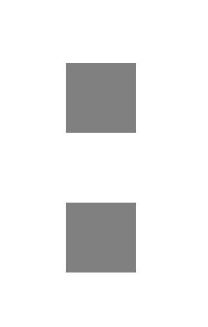
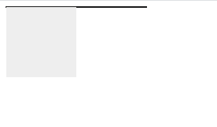
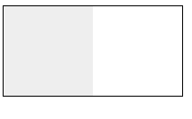
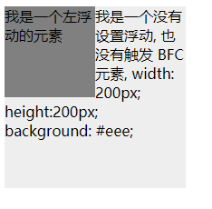
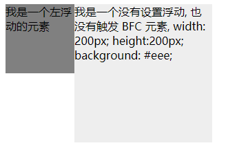

# BFC

## BFC 概念

BFC 即 Block Formatting Contexts (块级格式化上下文)。

具有 BFC 特性的元素可以看作是隔离了的独立容器，**容器里面的元素不会在布局上影响到外面的元素**。

通俗一点来讲，可以把 BFC 理解为一个封闭的大箱子，箱子内部的元素无论如何翻江倒海，都不会影响到外部。

## 触发 BFC

只要元素满足下面任一条件即可触发 BFC 特性：

- body 根元素
- 浮动元素：float 除 none 以外的值
- 绝对定位元素：position (absolute、fixed)
- display 为 inline-block、table-cells、flex
- overflow 除了 visible 以外的值 (hidden、auto、scroll)

## BFC 适用情况

### 边距重叠

同一个 BFC 下外边距会发生折叠, 如果想要避免外边距的重叠，可以将其放在不同的 BFC 容器中

```html
<style>
  p {
    display: block;
    width: 100px;
    height: 100px;
    background: grey;
    margin: 100px;
  }
</style>
<p></p>
<p></p>
```

第一个 p 的下边距和第二个 p 的上边距发生了重叠，所以两个盒子之间距离只有 100px，而不是 200px<br>


把两个 p 元素放在两个不同的 BFC 容器中，就不会相互影响：

```html
<style>
  div {
    overflow: hidden;
  }
  p {
    display: block;
    width: 100px;
    height: 100px;
    background: grey;
    margin: 100px;
  }
</style>
<div><p></p></div>
<div><p></p></div>
```

两个盒子之间的边距就会变成 200px:


### 清除浮动

当容器内部有浮动元素时，容器的高度不能自动伸长以适应内容的高度，使得内容溢出到容器外面而影响（甚至破坏
）布局的现象。这个现象叫浮动溢出，为了防止这个现象的出现而进行的 CSS 处理，就叫 CSS 清除浮动。

```html
<style>
  div {
    border: 1px solid #000;
    width: 200px;
  }
  span {
    display: block;
    width: 100px;
    height: 100px;
    background: #eee;
    float: left;
  }
</style>
<div>
  <span></span>
</div>
```

如图，div 的高度没有被内部的浮动元素撑开：<br>


对容器设置 BFC,可以使容器不会高度塌陷

```html
<style>
  div {
    border: 1px solid #000;
    width: 200px;
    overflow: hidden;
  }
  span {
    display: block;
    width: 100px;
    height: 100px;
    background: #eee;
    float: left;
  }
</style>
<div>
  <span></span>
</div>
```



### 文字环绕

```html
<style>
  .box1 {
    height: 100px;
    width: 100px;
    float: left;
    background: grey;
  }
  .box2 {
    width: 200px;
    height: 200px;
    background: #eee;
  }
</style>

<div class="box1">我是一个左浮动的元素</div>
<div class="box2">
  我是一个没有设置浮动, 也没有触发 BFC 元素, width: 200px; height:200px;
  background: #eee;
</div>
```



可以看到，第一个元素覆盖了第二个元素，但是由于文本元素不会被浮动元素覆盖，所以造成了文字环绕的效果，可以对第二个元素
设置 BFC，使其内部不受第一个元素影响

```html
<style>
  .box1 {
    height: 100px;
    width: 100px;
    float: left;
    background: grey;
  }
  .box2 {
    width: 200px;
    height: 200px;
    background: #eee;
    overflow: hidden;
  }
</style>
<div class="box1">我是一个左浮动的元素</div>
<div class="box2">
  我是一个没有设置浮动, 也没有触发 BFC 元素, width: 200px; height:200px;
  background: #eee;
</div>
```


