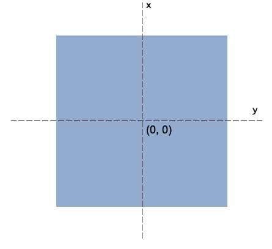
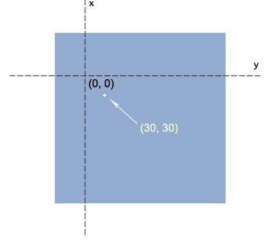
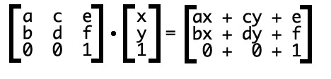

# CSS3 Matrix

## CSS3 中的矩阵

CSS3 中的矩阵指的是一个方法，书写为 matrix()和 matrix3d()，前者是元素 2D 平面的移动变换(transform)，后者
则是 3D 变换。2D 变换矩阵为 3*3, 如上面矩阵示意图；3D 变换则是 4*4 的矩阵

## transform 与坐标系统

transform 旋转默认是绕着中心点旋转的，而这个中心点就是 transform-origin 属性对应的点，也是所有矩阵计算的
一个重要依据点



如果这样设置：

```
transform-origin: 50px 70px;
```
则中心点位置由中间移到了距离左侧 50 像素，顶部 70 像素的地方:<br>


## translate
CSS3 transform 的 matrix()方法写法如下：
```
transform: matrix(a,b,c,d,e,f);
```

假设矩阵参数如下：
```
transform: matrix(1, 0, 0, 1, 30, 30); /* a=1, b=0, c=0, d=1, e=30, f=30 */
```

转换公式为：>br>
<br>
x,y为中心点，这里假设中心点为（0，0），即x=0, y=0

于是，变换后的x坐标就是`ax+cy+e = 1*0+0*0+30 =30`, y坐标就是`bx+dy+f = 0*0+1*0+30 =30`

坐标(0, 0)变成了(30, 30)，相当于往右下方同时偏移了30像素<br>
坐标(1, 1)变成了(31, 31)，也相当于往右下方同时偏移了30像素

可以看出`transform: matrix(1, 0, 0, 1, 30, 30)`就等同于`transform: translate(30px, 30px)`

即`matrix(1, 0, 0, 1, e, f)`等同于`transform: translate(epx, fpx)`

## scale
假设矩阵参数如下：
```
transform: matrix(2, 0, 0, 3, 0, 0); /* a=2, b=0, c=0, d=3 e=0, f=0 */
```
变换后坐标就是：
```
x' = ax+cy+e = 2*x+0*y+0 = 2*x;
y' = bx+dy+f = 0*x+3*y+0 = 3*y;
```
坐标(0, 0)变成了(0, 0)<br>
坐标(1, 1)变成了(2,3)<br>
坐标(2, 2)变成了(4,6)<br>

可以看出每个x坐标被放大了2倍，每个y坐标被放大了3倍

即`matrix(a, 0, 0, d, 0, 0))`等同于`transform: scale(a,d)`

这里注意，scale改变的并不是元素的真实宽高，而是x轴和y轴的刻度，它们被放大或是缩小了

## rotate
(x,y)旋转θ角度到(x',y'),推导过程如下：


即
```
x' = x*cosθ-y*sinθ+0 = x*cosθ-y*sinθ
y' = x*sinθ+y*cosθ+0 = x*sinθ+y*cosθ
```

可以得出rotate的matrix的计算公式为：
```
matrix(cosθ,sinθ,-sinθ,cosθ,0,0)
```
例如，旋转30度写法为：`transform: matrix(cos30,sin30,-sin30,cos30,0,0);`
