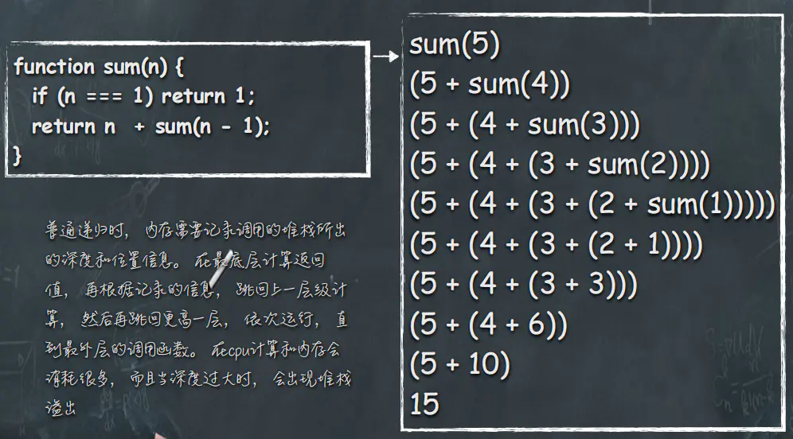
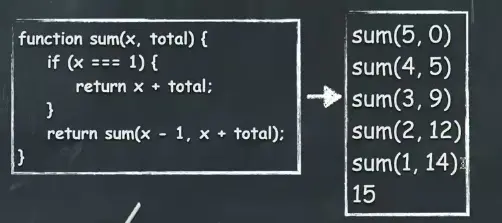

# 函数式编程基本概念
## 函数式编程特点
* 函数是一等公民
* 只用表达式，不用语句
* 没有副作用
* 不修改状态
* 引用透明：相同输入有相同输出
## 纯函数
* 没有副作用，相同输入有相同输出，不依赖外部状态
~~~js
var x = [1,2,3,4,5]
x.slice(0,4) //[1, 2, 3, 4]
x.slice(0,4)  //[1, 2, 3, 4]
x.splice(0,4)  //[1, 2, 3, 4]
x.splice(0,4) //[5]
~~~
* 优点：可缓存性等
## 幂等性
* 执行无数次还具有相同的效果 
如Math.abs(Math.abs(-3))
## bind
~~~js
function list() {
     return Array.prototype.slice.call(arguments);
 }
a
 function addArguments(arg1, arg2) {
     return arg1 + arg2
 }

 var list1 = list(1, 2, 3); // [1, 2, 3]

 var result1 = addArguments(1, 2); // 3

 // 创建一个函数，它拥有预设参数列表。
 var leadingThirtysevenList = list.bind(null, 37);

 // 创建一个函数，它拥有预设的第一个参数
 var addThirtySeven = addArguments.bind(null, 37);

 var list2 = leadingThirtysevenList();
 // [37]

 var list3 = leadingThirtysevenList(1, 2, 3);
 // [37, 1, 2, 3]

 var result2 = addThirtySeven(5);
 // 37 + 5 = 42

 var result3 = addThirtySeven(5, 10);
 // 37 + 5 = 42 ，第二个参数被忽略
~~~
## 偏应用函数
带一个函数和该函数的部分参数
~~~js
const partial = (fn, ...args) => (...args2) => fn(...args, ...args2);
   const add = (a, b, c) => a + b + c;
   const add2 = partial(add, 2, 3);
   console.log(add2(4)); //9
   const add3 = partial(add, 2);
   console.log(add3(3, 4)); //9
~~~
## 柯里化
* 把一个多参数函数转换为一个嵌套一元函数的过程
* 传递给函数的一部分参数来调用它，让它返回一个函数去处理剩下的参数
~~~js
function add(x,y){
 return x + y
}
add(1,2) //3

//柯里化后
function add(x){
 return function(y){
     return x + y
 }
}
add(1)(2) //3
~~~
~~~js
const curry = (fn, arr = []) => {
 return (...args) => {
   return ((arg) =>
     arg.length === fn.length ? fn(...arg) : curry(fn, arg))([
     ...arr,
     ...args,
   ]);
 };
};

let curryTest = curry((a,b,c,d)=>a+b+c+d)
console.log(curryTest(1,2,3)(4))  //10
console.log(curryTest(1)(2)(3)(4))  //10
console.log(curryTest(1,2)(3)(4))  //10
~~~

* 优点：预加载函数，通过传递较少的参数，得到一个已经记住了这些参数的新函数
## 反柯里化
* 扩大适用范围，创建一个适用范围更广的函数，使本来只有特定对象才适用的方法，扩展到更多的对象
~~~js
Function.prototype.uncurring = function () {
     var self = this;
     console.log("self", self);
     return function () {
       var obj = Array.prototype.shift.call(arguments);
       return self.apply(obj, arguments);
     };
   };
   var push = Array.prototype.push.uncurring();
   var obj = {};
   push(obj, "a", "b");
   console.log(obj);
~~~
结果：

## 函数组合
* 拆平洋葱代码f(g(x))
~~~
const compose = (f, g) => (x) => f(g(x));
let first = (arr) => arr[0];
let reverse = (arr) => arr.reverse();
let last = compose(first, reverse);
console.log(last([1, 2, 3, 4, 5]));  //5
~~~
* compose函数只能接受一个参数的函数，接受多个参数不能被直接组合的函数 可以借助偏函数包裹后继续组合
~~~
const toUpperCase = word => word.toUpperCase()
const split = x=>word=>word.split(x)
var f= compose(split(' '), toUpperCase)
console.log(f('123 45'))  //["123", "45"]
~~~
## 高阶函数
以函数作为参数，返回一个新函数
## 递归
* 函数内部最后一个动作是函数调用
* 递归需要保存大量的调用记录，很容易发生栈溢出

## 尾递归
* 函数运行最后一步调用自身
* 函数最后一行调用其它函数并返回是尾调用

* 尾递归调用栈永远都是更新当前的栈帧，避免爆栈,即帧复用，只创建一个sum函数，每次调用只传入参数
* 但是堆栈信息丢失了，开发者难以调试
