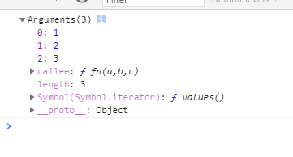

# 类数组对象
类数组对象是一个拥有length和索引属性的对象,可以对它像数组那样进行按索引读写,获取长度和遍历
```js
var arrayLike = {
  0: "a",
  1: "b",
  2: "c",
  length: 3,
};

// 读写
console.log(arrayLike[1]); //b
arrayLike[1] = "d";
console.log(arrayLike[1]); //d

//求长度
console.log(arrayLike.length); //3

//遍历
for (let i = 0; i < arrayLike.length; i++) {
  console.log(arrayLike[i]); // a d c
}
//注意:这样遍历会报错:arrayLike is not iterable
for (const item of arrayLike) {
  console.log(item);
}
```

## 类数组转数组
有一下四种方法:
```js
//1.slice方法
console.log(Array.prototype.slice.call(arrayLike)) //[ 'a', 'd', 'c' ]

console.log(arrayLike)  //{ '0': 'a', '1': 'd', '2': 'c', length: 3 }

//2.splice方法
console.log(Array.prototype.splice.call(arrayLike, 0)) //[ 'a', 'd', 'c' ]

console.log(arrayLike) //{ length: 0 }  slice会改变原数组

var a = [1,2,3]
console.log(a.splice(0))  //[ 1, 2, 3 ]
console.log(a)  //[]


var arrayLike2 = {
  0: "a",
  1: "b",
  2: "c",
  length: 3,
};

//3.contact方法
console.log(Array.prototype.concat.apply([], arrayLike2)) //[ 'a', 'b', 'c' ]

//4.Array.from
console.log(Array.from(arrayLike2)) //[ 'a', 'b', 'c' ]
```
常见的类数组对象有Arguments对象和一些dom方法(document.getElementsByTagName()等)也返回类数组对象。

## Arguments对象
Arguments对象只定义在函数体中，包括了函数的参数和其他属性。在函数体中，arguments 指代该函数的 Arguments 对象。
```js
function fn(a,b,c) {
  console.log(arguments)
}

fn(1,2,3)
```


### length属性
```js
function fn(a,b,c) {
  console.log(arguments.length)  //2  实参的长度
}

fn(1,2)
console.log(fn.length)  // 3 形参的长度
```

###  callee属性: 指向函数自身,可以用在匿名函数中调用自身
```js
const data = [];
for (var i = 0; i < 4; i++) {
  (data[i] = function () {
    console.log(arguments.callee.index); 
  }).index = i;  //给data[i]函数种加属性index来记住i
}

data[0](); //0
data[1](); //1
data[2](); //2
```
❀ 参考文章：[JavaScript深入之类数组对象与arguments](https://github.com/mqyqingfeng/Blog/issues/14)
