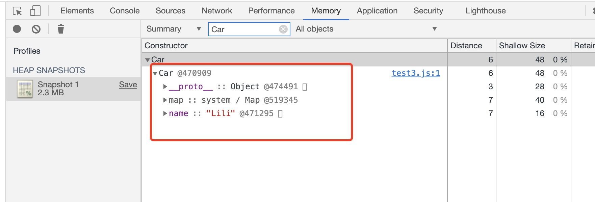
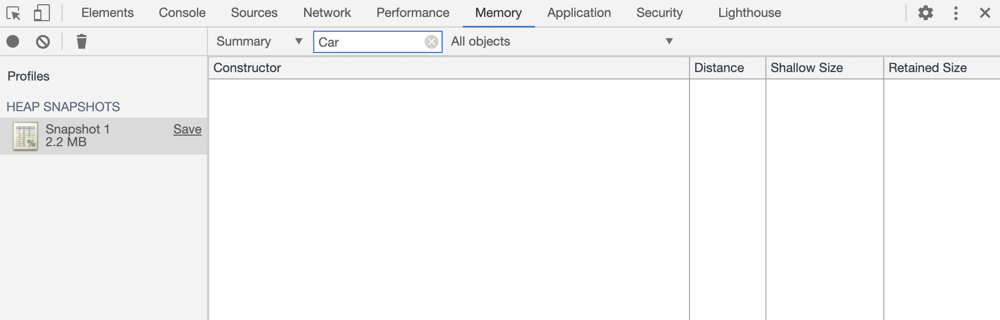
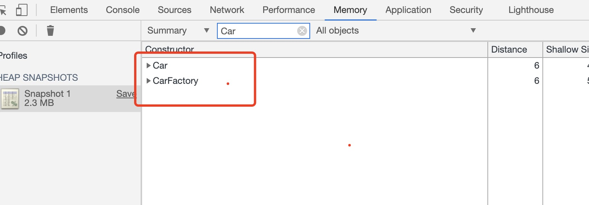

# 闭包

## 概念
* 闭包是指那些能够访问自由变量的函数。
* 自由变量是指在函数中使用的，但既不是函数参数也不是函数的局部变量的变量。
例1
```js
function Foo() {
  var i = 0;
  return function() {
    console.log(i++);
  }
}

var f1 = Foo(),
  f2 = Foo();  // 
f1();  //0
f1();  //1  //f1引用的变量i是同一变量
f2();  //0  和f1引用的变量i是不同的变量
```
例2
```js
var i = 0;
function Foo() {
  return function() {
    console.log(i++);
  }
}

var f1 = Foo(),
  f2 = Foo();
f1();  //0
f1();  //1
f2();  //2  都引用的是同一个全局遍历i
```

## 闭包的执行过程
```js
var scope = "global scope";
function checkscope(){
    var scope = "local scope";
    function f(){
        return scope;
    }
    return f;
}

var foo = checkscope();
foo();
```
下面分析上面这段代码的执行过程：<br>
1.执行全局代码，创建全局执行上下文，全局上下文被被压入执行上下文栈
```js
ECStack = [
  globalContext
]
```
2.全局上下文初始化
```js
globalContext = [
  VO:[global],
  Scope:[globalContext.VO],
  this:globalContext.VO
  
]
```
3.全局上下文初始化的同时，checkscope函数被创建，保存作用域链到函数的内部属性[[scope]]
```js
checkscope.[[scope]] = [
  globalContext.VO
]
```
4.执行checkscope函数，创建checkscope函数执行上下文，checkscope函数执行上下文被压入执行上下文栈
```js
ESTack = [
  checkscopeContext,
  globalContext
]
```
5.checkscope函数执行上下文初始化：
* 复制函数[[scope]]属性创建作用域链
* 用arguments创建活动对象
* 初始化活动对象，即加入形参，函数声明，变量声明
* 将活动对象压入checkscope作用域链顶端
```js
checkscopeContext = {
    AO: {
        arguments: {
            length: 0
        },
        scope: undefined,
        f: reference to function f(){}
    },
    Scope: [AO, globalContext.VO],
    this: undefined
}
```
6.同时 f 函数被创建，保存作用域链到 f 函数的内部属性[[scope]]
```js
f.[[scope]] = [
  checkscopeContext.AO, 
  globalContext.VO
]
```
7.checkscope 函数执行完毕，checkscope 执行上下文从执行上下文栈中弹出
```js
ECStack = [
    globalContext
];
```
8.执行 f 函数，创建 f 函数执行上下文，f 函数执行上下文被压入执行上下文栈
```js
ECStack = [
    fContext,
    globalContext
];
```
9.f 函数执行上下文初始化：
* 复制函数 [[scope]] 属性创建作用域链
* 用 arguments 创建活动对象
* 初始化活动对象，即加入形参、函数声明、变量声明
* 将活动对象压入 f 作用域链顶端
```js
fContext = {
    AO: {
        arguments: {
            length: 0
        }
    },
    Scope: [AO, checkscopeContext.AO, globalContext.VO],
    this: undefined
}
```
10.f 函数执行，沿着作用域链在checkscopeContext.AO查找到 scope 值，返回 scope 值

11.f 函数执行完毕，f 函数上下文从执行上下文栈中弹出
```js
ECStack = [
    globalContext
];
```
思考：当 f 函数执行的时候，checkscope 函数上下文已经被销毁了啊(即从执行上下文栈中被弹出)，怎么还会读
取到 checkscope 作用域下的 scope 值呢？<br>
因为f 执行上下文维护了一个作用域链：
```js
fContext = {
    Scope: [AO, checkscopeContext.AO, globalContext.VO],
}
```
就是因为这个作用域链，f 函数依然可以读取到 checkscopeContext.AO 的值，说明当 f 函数引用了
checkscopeContext.AO 中的值的时候，即使 checkscopeContext 被销毁了，但是 JavaScript 依然会让 
checkscopeContext.AO 活在内存中，f 函数依然可以通过 f 函数的作用域链找到它，正是因为 JavaScript 
做到了这一点，从而实现了闭包这个概念。

所以，让我们再看一遍实践角度上闭包的定义：

* 即使创建它的上下文已经销毁，它仍然存在（比如，内部函数从父函数中返回）
* 在代码中引用了自由变量

## 销毁闭包
```js
function Car(name) {
  this.name = name;
}

let CarFactory = function (name) {
  let c1 = new Car(name);
  return function () {
    console.log(c1);
  };
};

let p1 = new CarFactory("Lili");  
p1();  
```
运行以上代码可以通过Chrome的Memory查看内存情况：<br>
<br>
清空c1，才会在内存中销毁Car<br>
<br>
但是这样，就修改了业务逻辑，打印结果就变成null了<br>
优化点：如果闭包里只用到name的话，则可以进行以下优化，Car也会被回收：
```js
function Car(name) {
  this.name = name;
}

let CarFactory = function (name) {
  let c1 = new Car(name);
  const n  = c1.name   //n相当于变成临时变量了
  c1 = null;
  return function () {
    console.log(n);
  };
};

let p1 = new CarFactory("Lili");
p1();
```
## eval
含义eval的函数会放弃eval环境下所有GC，容易造成内存泄漏，因为不知道eval里写的是什么，
```js
function Car(name) {
  this.name = {
    first: "Lily",
  };
}

let CarFactory = function (name) {
  let c1 = new Car(name);
  return function () {
    eval("");
  };
};

let p1 = new CarFactory("Lili");
p1();
```
查看内存结果：<br>
<br>
但是如果把eval移到window环境下，则Car和CarFactory会被回收
```js
function Car(name) {
  this.name = {
    first: "Lily",
  };
}

let CarFactory = function (name) {
  let c1 = new Car(name);
  return function () {
    window.eval("");
  };
};

let p1 = new CarFactory("Lili");
p1();
```
其他的容易造成内存泄漏的还有：
* try...cache：cache延长了作用域链，cache里的e不会回收，造成内存泄漏<br>
  ES10里cache里不用写e:`try{ }cache{new Error('xxx')}`，可以避免内存泄露
* new Function,
* with
```js
var s = {};
with (s) {
  var a = 1;
}
console.log(a);  // 1  (变量a变成全局的了)
```

❀ 本文参考[JavaScript深入之执行上下文](https://github.com/mqyqingfeng/Blog/issues/8)