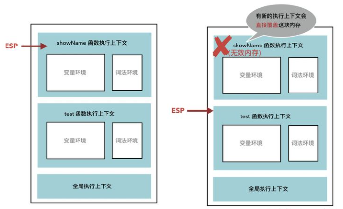
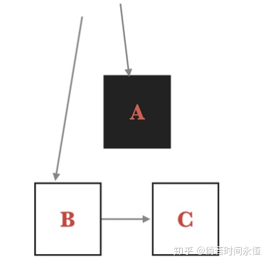
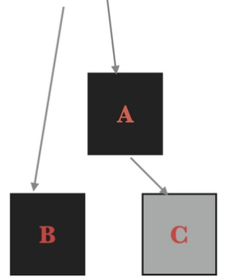

# V8垃圾回收机制

**目录**
> * [JS内存机制](#JS内存机制)
> * [调用栈中的垃圾回收](#调用栈中的垃圾回收)
> * [堆中的垃圾回收](#堆中的垃圾回收)
>   * [新生代](#新生代)
>   * [对象晋升](#对象晋升)
>   * [老生代](#老生代)
>     * [引用计数](#引用计数)
>     * [Mark-Sweep(标记清除)](#Mark-Sweep(标记清除))
>     * [Mark-Compact(标记整理)](#Mark-Compact(标记整理))
>     * [增量回收](#增量回收)

## JS内存机制
在JS中，每一个数据都需要一个内存空间。内存空间又被分为两种，栈内存(stack)与堆内存(heap)。

栈内存：
* 栈内存一般储存基础数据类型
* 可以通过使用变量直接操作保存在栈内存空间的值，因此基础数据类型都是按值访问。
* 数据在栈内存中的存储与使用方式类似于数据结构中的堆栈数据结构，遵循后进先出的原则。

堆内存：
* 堆内存一般储存引用数据类型，即存储对象，值大小不固定
* 不能直接访问堆内存，可以通过变量操作对象的地址引用，从堆中取得我们所需要的数据，因此JS对象是按地址访问的。


## 调用栈中的垃圾回收
如下例：
```js
function test() {
  const a = { name: 'a' };
  function showName() {
    const b = { name: 'b' };
  }
  showName();
}
test();
```
有一个记录当前执行状态的指针(称为 ESP)指向调用栈中的函数执行上下文。当函数执行完成之后， ESP 下移到
后面的函数执行上下文，如果有新的执行上下文会直接覆盖刚刚的那块内存。<br>


>在ES6前，声明变量都是通过var关键词声明的，在ES6中则提倡使用let和const来声明变量，为了兼容var的写法,
>于是使用变量环境来存储var声明的变量

## 堆中的垃圾回收
与栈中的垃圾回收不同的是，栈中无效的内存会被直接覆盖掉，而堆中的垃圾回收需要使用 JavaScript 中的垃圾回收器。

在V8引擎的堆结构组成中,垃圾回收的过程主要出现在新生代和老生代。
* 新生代(new_space)：大多数的对象开始都会被分配在这里，这个区域相对较小但是垃圾回收特别频繁
* 老生代(old_space)：新生代中的对象在存活一段时间后就会被转移到老生代内存区，相对于新生代该内存区域的
垃圾回收频率较低。

### 新生代
新生代主要用于存放存活时间较短的对象,在新生代的垃圾回收过程中主要采用了**Scavenge算法**。

Scavenge算法是一种典型的牺牲空间换取时间的算法：
* 它将新生代内存一分为二，处于激活状态的区域我们称为From空间，未激活的区域我们称为To空间。这两个空间
   中，始终只有一个处于使用状态，另一个处于闲置状态。
* 程序中声明的对象首先会被分配到From空间，当进行垃圾回收时，如果From空间中尚有存活对象，则会被
  复制到To空间进行保存，非存活的对象会被自动回收。
* 当复制完成后，From空间和To空间互换，To空间会变为新的From空间，原来的From空间则变为To空间。

### 对象晋升
当一个对象在新生代中经过多次复制之后依旧存活，那么它会被认为是一个生命周期较长的对象，在下一次进行垃圾回收时，
该对象会被直接转移到老生代中，这种对象从新生代转移到老生代的过程我们称之为**晋升**。

对象晋升的条件主要有以下两个：
* 对象是否经历过一次Scavenge算法
* To空间的内存占比是否已经超过25%

默认情况下，创建的对象都会分配在From空间中，当进行垃圾回收时，在将对象从From空间复制到To空间之前，
会先检查该对象的内存地址来判断是否已经经历过一次Scavenge算法，如果是则会将该对象转移到老生代中，
不会再被复制到To空间；<br>
如果对象没有经历过Scavenge算法，会被复制到To空间，但是如果此时To空间的内存占比已经超过25%，则该对象
依旧会被转移到老生代。

### 老生代

#### 引用计数
老生代中比较早采用的算法是**引用计数**，该算法的是看对象是否还有其他引用指向它，如果没有则该对象会被
垃圾回收器回收

但是如果出现循环引用，就会出现问题：
```js
function foo() {
    let a = {};
    let b = {};
    a.a1 = b;
    b.b1 = a;
}
foo();
```
对象a的a1属性指向对象b，将对象b的b1属性指向对象a，形成两个对象相互引用，在foo函数执行完毕后，
函数的作用域已经被销毁，但是a和b两个变量均存在指向自身的引用，因此依旧无法被回收，导致内存泄漏。

#### Mark-Sweep(标记清除)
垃圾回收器会在内部构建一个根列表（如window全局对象），从跟列表出发开始遍历，能够到达的元素为活动对象，
不能到达的元素可以判断为非活动对象，内存被回收。

由于所清理的对象的内存地址可能不是连续的，所以就会出现内存碎片的问题，导致后面如果需要分配一个大对象而
空闲内存不足以分配，就会提前触发垃圾回收。

#### Mark-Compact(标记整理)
为了解决上面算法的内存碎片的问题，Mark-Compact(标记整理)算法被提了出来。在上面的遍历标记出活动对象和
非活动对象之后，先把活动对象往堆内存的一端移动，再将这整块内存全部回收，至此就完成了一次老生代垃圾回收
的全部过程。

#### 增量回收
由于JS的单线程机制，垃圾回收的过程会阻碍主线程同步任务的执行，待执行完垃圾回收后才会再次恢复执行主任
务的逻辑，这种行为被称为全停顿(stop-the-world)。

增量垃圾回收就是垃圾收集器将标记工作分成更小的块穿插在主线程的不同任务之间执行。这样，垃圾回收器就没
有必要一次执行完整的垃圾回收过程，只要每次执行其中的一小部分工作就可以了。

想要实现增量回收，必须要满足以下两点：
* 垃圾回收可以随时暂停和重启，暂停时需要保存当时扫描的结果，等下一波垃圾回收来了才能继续启动。
* 在暂停期间，如果被标记好的数据被 JavaScript 修改了，那么垃圾回收器需要能够正确的处理。

为了能够实现垃圾回收的暂停和恢复执行。V8 采用了**三色标记法**(黑白灰)来标记数据：
* 黑色表示这个节点被 GC Root 引用到了，而且这个节点的子节点已经标记完成了。
* 灰色表示这个节点被 GC Root 引用到了，但子节点还没有被垃圾回收器处理【目前正在处理这个节点】。
* 白色表示这个节点没有被访问到，如果本轮遍历结束，这个节点还是白色的，就表示这个数据是垃圾数据，对应的内存会被回收。

但是该方法会出现垃圾回收失败的问题，如不该回收的内存被回收：<br>
1.开始扫描 A 时， 只有 B 指向 C，A 扫描完成变为黑色，C 是白色的。<br>
<br>
2. 开始扫描 B 时，变成了只有 A 指向 C， B 扫描完成变成黑色，C 还是白色的<br>
.png)<br>
3. 由于 A 节点已经变成了黑色，无法继续扫描其子节点，之后继续向后扫描。<br>
4. 当遍历完成后，虽然 C 是有用数据，却依然是白色的，就被当做垃圾数据回收了。<br>

为了解决这个问题，增量回收添加了一个约束条件：不能让黑色节点指向白色节点。通常使用写屏障(Write-barrier)机
制来实现这个约束条件：当发生了黑色节点引用了白色节点的情况，写屏障会强制将被引用的白色节点变成灰色，
这种方法也被成为**强三色不变性**。

所以上面的例子，当发生A.C = C 时，会将 C 节点变成灰色，垃圾回收器会继续处理该对象。<br>


❀本文参考：
* [V8 垃圾回收原来这么简单？](https://zhuanlan.zhihu.com/p/146749402)
* [一文搞懂V8引擎的垃圾回收](https://juejin.cn/post/6844904016325902344#heading-4)
* [10分钟了解JS堆、栈以及事件循环的概念](https://juejin.cn/post/6844903618999500808#heading-1)
