# JS继承方式比较

**目录**
> * [1 原型链继承](#1-原型链继承)
>   * [1-1 重写子类原型为父类的实例](#1-1-重写子类原型为父类的实例)
>   * [1-2 子类原型的__proto__属性指向父类原型](#1-2-子类原型的__proto__属性指向父类原型)
>   * [1-3 重写子类原型为父类原型](#1-3-重写子类原型为父类原型)
> * [2 借用构造函数](#2-借用构造函数)
> * [3 组合继承](#3-组合继承)
> * [4 原型式继承](#4-原型式继承)
> * [5 寄生组合式继承](#5-寄生组合式继承)
> * [6 ES6的继承](#6-ES6的继承)
> * [7 可以继承静态属性的ES5的继承](#7-可以继承静态属性的ES5的继承)

JS主要依靠原型链来实现继承

## 1 原型链继承
### 1-1 重写子类原型为父类的实例
```js
function Father() {
  this.pro = true;
}
Father.prototype.getFatherPro = function () {
  return this.pro;
};
function Son() {
  this.pro = false;
}
Son.prototype.add = function () {
  return "继承之前子类原型添加的方法";
};
console.log('old Son.prototype: ',Son.prototype)
Son.prototype = new Father(); //a.重写子类原型为父类的实例
// Son.prototype.__proto__ = Father.prototype; //b.
// Son.prototype = Father.prototype; //c.

Son.prototype.getSonPro = function () {
  return this.pro;
};
let sonIns = new Son();
console.log(sonIns.getFatherPro()); //false(调用父类的方法)
console.log('Father.prototype：',Father.prototype);
console.log('Son.prototype：', Son.prototype);
console.log('Son.constructor：',Son.constructor); 
console.log('sonIns.constructor：',sonIns.constructor);
console.log(sonIns instanceof Son) //true sonIns.__proto__ === Son.prototype
```
打印如下：<br>
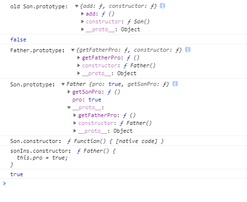<br>
原型链关系如下图：<br>
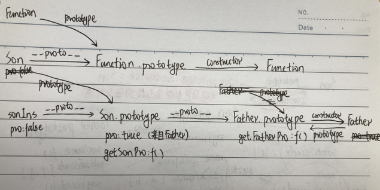<br>
> **缺点:**<br>
>可以看出Son.prototype中没有了constructor属性，这是因为在`Son.prototype = new Father()`时Son.prototype已经被
>重写了，所以sonIns.constructor通过原型链指向了父类Father

### 1-2 子类原型的__proto__属性指向父类原型
把第一个例子的继承语句a替换成b，子类原型的__proto__属性指向父类原型
```js
function Father() {
  this.pro = true;
}
Father.prototype.getFatherPro = function () {
  return this.pro;
};
function Son() {
  this.pro = false;
}
Son.prototype.add = function () {
  return "继承之前子类原型添加的方法";
};
console.log('old Son.prototype: ',Son.prototype)
// Son.prototype = new Father(); //a
Son.prototype.__proto__ = Father.prototype; //b 子类原型的__proto__属性指向父类原型
// Son.prototype = Father.prototype; //c

Son.prototype.getSonPro = function () {
  return this.pro;
};
let sonIns = new Son();
console.log('Father.prototype：',Father.prototype);
console.log('Son.prototype：', Son.prototype);
console.log('Son.constructor：',Son.constructor);
console.log('sonIns.constructor：',sonIns.constructor);
```
打印如下：<br>
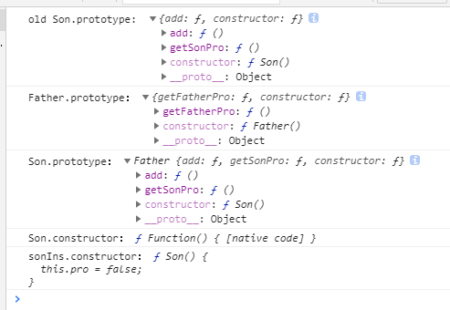<br>
原型链关系如下图(红色部分表示与上例的不同)：<br>
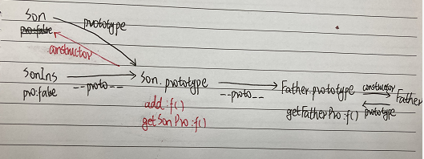<br>
>可以看作是不严格的继承，没有重新定义子类的原型对象，所以子类的构造函数不变

### 1-3 重写子类原型为父类原型
把第一个例子的继承语句a替换成c，重写子类原型为父类原型
```js
function Father() {
  this.pro = true;
}
Father.prototype.getFatherPro = function () {
  return this.pro;
};
function Son() {
  this.pro = false;
}
Son.prototype.add = function () {
  return "继承之前子类原型添加的方法";
};
console.log('old Son.prototype: ',Son.prototype)
// Son.prototype = new Father(); //a
// Son.prototype.__proto__ = Father.prototype; //b
Son.prototype = Father.prototype; //c 重写子类原型为父类原型

Son.prototype.getSonPro = function () {
  return this.pro;
};
let sonIns = new Son();
console.log('Father.prototype：',Father.prototype);
console.log('Son.prototype：', Son.prototype);
console.log('Son.constructor：',Son.constructor);
console.log('sonIns.constructor：',sonIns.constructor);
```
打印如下：<br>
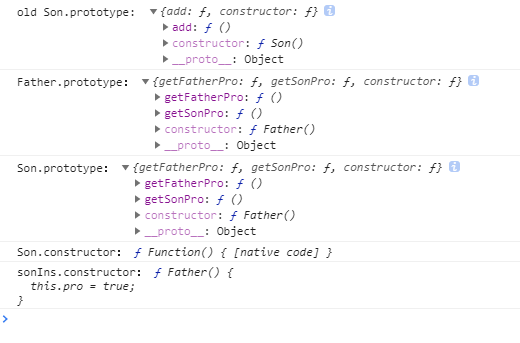<br>
原型链关系如下图(红色部分表示与上例的不同)：<br>
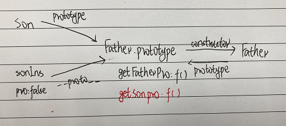<br>
>可以看作是直接用父类的原型对象替换子类的原型对象，子类和父类的原型对象指向同一地址，即子类的原型对象就
>是父类的 原型对象,子类实例的构造函数指向父类<br>
>重新定义了子类的原型对象，子类实例的构造函数指向父类的constructor属性

> **总结** <br>
> 原型链继承在创建子类的实例时，无法向父类构造函数传递参数

## 2 借用构造函数
在子类构造函数的内部调用父类的构造函数
> 函数只不过是在特定环境中执行代码的对象，因此通过使用apply()和call()方法可以在新创建的实例上执行构造函数
```js
function Father(name) {
  this.colors = ['red', 'blue'];
  this.name = name;
  this.sayName = function () {
    return this.name;
  };
  this.age = 50;
}
function Son(name) {
  //若该语句写在这里（调用父类构造函数之前，则会被父类的同名属性覆盖，子类实例的age变成50）
  // this.age = 29;  
  
  //通过call()，实际上实在创建子类的环境下调用了父类的构造函数，等于把父类的构造函数拿到此处执行
  Father.call(this, name);
  
  this.age = 29;
}

let son = new Son('Bob');
let son2 = new Son('Lily');
son.colors.push('yellow');

console.log('Son.prototype:',Son.prototype);//Son4 {} //子类的原型对象未变
console.log('Son.constructor：',Son.constructor);
console.log('son.constructor：',son.constructor);
console.log('son.__proto__:',son.__proto__);//Son4 {}  //子类的原型对象和子类构造函数内内调用父类的构造函数无关系
console.log('son instanceof Son:',son instanceof Son) //true sonIns.__proto__ === Son.prototype

console.log('son:', son);
console.log('son2:',son2);
console.log('son.sayName === son2.sayName',son.sayName === son2.sayName);  //false
console.log('son.age',son.age);  //29
```
打印如下：<br>
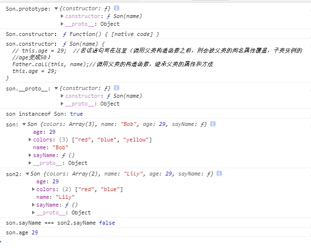<br>
原型链关系如下图：<br>
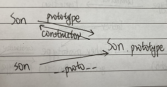<br>
> **总结借用构造函数方法** <br>
> * 优点：在创建子类的实例时，能向父类构造函数传递参数，创建自己的属性值
> * 缺点：
>   * 1.使子类能继承父类的属性和方法，但是子类的原型对象未改变，没有构造出继承的原型链，不能算是继承
>   * 2.在构造函数中定义的方法不能复用，每个子类实例都要重新创建方法

## 3 组合继承
使用原型链实现对共享属性和方法的继承，通过借用构造函数实现对私有属性的继承
```js
function Father(name) {
  console.log('调用父类构造函数')
  this.name = name;
  this.privateFriends = ['a', 'b'];
  this.age = 60
}

Father.prototype.sayName = function() {
  return this.name;
}

Father.prototype.publicFriends=  ['f', 'g'];

Father.prototype.sayFriend= function () {
  console.log('这是父类的方法');
  return this.privateFriends + this.publicFriends;
}

function Son(name) {
  Father.call(this, name);
  this.privateFriends = ['c', 'd'];//将会覆盖父类的同名属性
}

Son.prototype = new Father(); //调用父类构造函数
Son.prototype.constructor = Son;//实现原型和构造函数的互相指引

Son.prototype.sayFriend = function () { //添加子类的方法,将会覆盖父类的方法
  console.log('这是子类的方法');
  return this.privateFriends + this.publicFriends;
};

let son1 = new Son('Bob'); //调用父类构造函数
let son2 = new Son('Lily');//调用父类构造函数

console.log('Son.prototype:',Son.prototype);
console.log('Son.constructor：',Son.constructor);
console.log('son1.constructor：',son1.constructor);
console.log('son1.__proto__:',son1.__proto__);
console.log('son1 instanceof Son:',son1 instanceof Son) //true sonIns.__proto__ === Son.prototype

son1.privateFriends.push('z');
son1.publicFriends.push('x');
console.log('son2.privateFriends:',son2.privateFriends);  //[ 'c', 'd' ] (未影响到实例二的私有属性)
console.log('son2.publicFriends:',son2.publicFriends);  //[ 'f', 'g', 'x' ] （影响到实例二的共享属性）

console.log('son1.sayFriend === son2.sayFriend:',son1.sayFriend === son2.sayFriend); //true  (做到了函数复用)
console.log('son1.sayFriend():',son1.sayFriend());// 这是子类的方法 c,d,zf,g,x (覆盖了父类的同名方法)
console.log('son1',son1);
```
打印如下：<br>
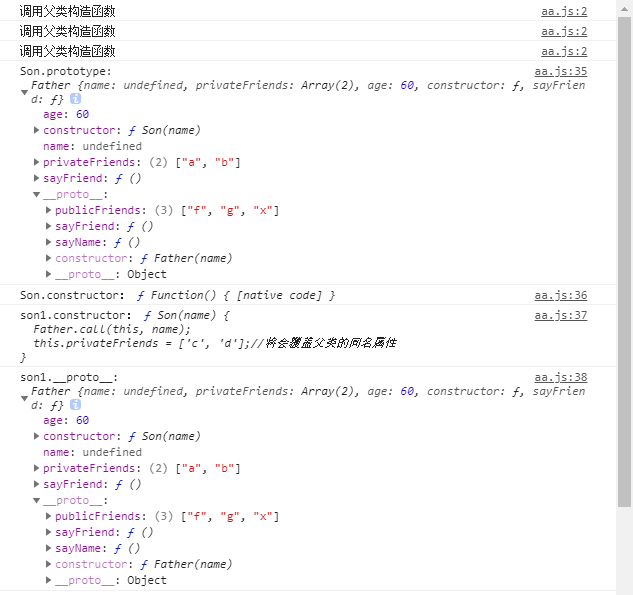<br>
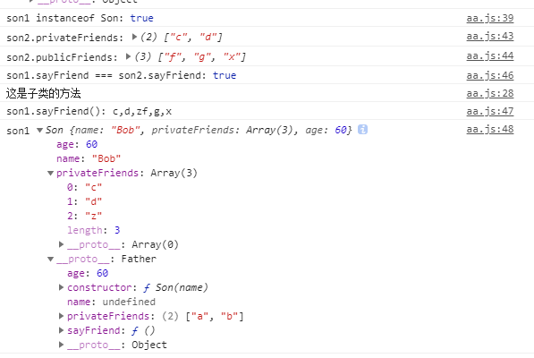<br>
原型链关系如下图：<br>
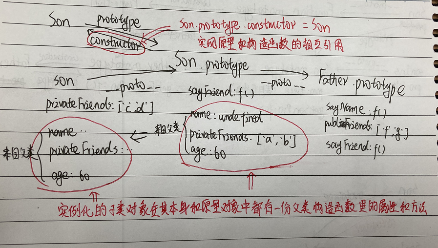<br>
> **总结组合继承** <br>
> * 优点：弥补了借用构造函数的两个缺点，能传递参数，复用了父类的方法，且有继承的原型链，**是最常用的继承模式**
> * 缺点：会调用两次父类构造函数，一次是在子类继承父类创建子类原型的时候调用了父类构造函数，另一次是在实例
>   化子类的时候，在子类构造函数内部调用了父类构造函数，于是实例化的子类对象在其本身和原型对象里都有
>   一份父类构造函数里有的属性和方法

## 4 原型式继承
采用Object.create(protoObj,extendObj)<br>
参数说明：protoObj:用作新对象原型的对象；extendObj:为新对象定义额外属性的对象通过描述符定义（可选）
```js
let father5 = {
  publicFriends: ['f', 'g'],
  name: 'f',
  sayFriend: function () {
    console.log('这是父类的方法');
    return this.privateFriends + this.publicFriends;
  }
};
let friend = 'a';
let son6 = Object.create(father5,{
  privateFriends: {
    configurable: true,
    enumerable: true,
    writable: true,
    value: ['g','h'],
  },
  sayFriend: {
    configurable: true,
    enumerable: true,
    get: function() {
      return friend;
    },
    set: function(newValue) {
      friend = newValue;
    },
  },
  add: () => {  //未报错，但是无效，只能加数据属性和访问器属性
      console.log('新定义的方法');
  }
});
console.log('son6:',son6);
console.log('son6.constructor:',son6.constructor);
console.log('son6.__proto__:',son6.__proto__);


son6.sayFriend = 'z';
console.log('son6.sayFriend:',son6.sayFriend);  //z
console.log('son6.publicFriends:',son6.publicFriends); //[ 'f', 'g' ]

let son7 = Object.create(father5);
son6.publicFriends.push('l');
console.log('son7.publicFriends',son7.publicFriends);  //[ 'f', 'g', 'l' ] (不同对象共享的属性和方法引用地址相同)
```
打印如下：<br>
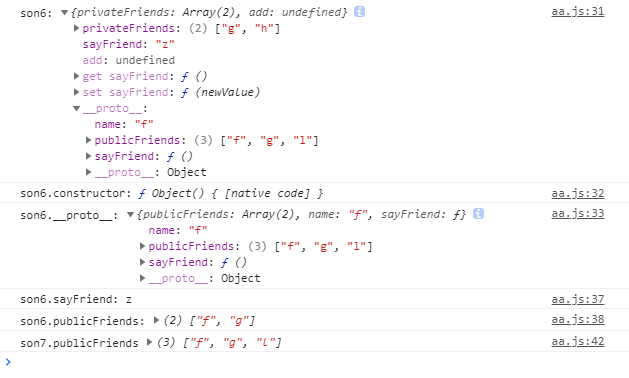<br>
原型链关系如下图：<br>
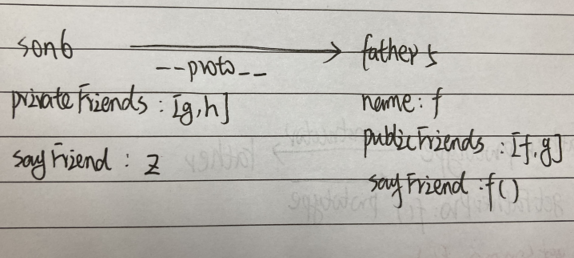<br>
> **总结原型式继承** <br>
> * 优点：如果子类对象与父类对象非常相似，没必要重新构建子类构造函数，可以采用此种模式，把子类新增的属性放create方法的第二个属性中
> * 缺点：
>   * 1.新增的属性只能通过描述符定义，无法直接新增方法
>   * 2.引用类型属性为不同对象的共享属性

## 5 寄生组合式继承
弥补组合继承调用两次父类构造函数的问题
```js
function Father(name) {
  console.log('调用父类构造函数')
  this.name = name;
  this.privateFriends = ['a', 'b'];
  this.age = 60
}
function Son(name) {
  Father.call(this, name);
  this.privateFriends = ['c', 'd'];//将会覆盖父类的同名属性
}

Father.prototype.sayName = function() {
  return this.name;
}

Father.prototype.publicFriends=  ['f', 'g'];

Father.prototype.sayFriend= function () {
  console.log('这是父类的方法');
  return this.privateFriends + this.publicFriends;
}

Son.prototype = Object.create(Father.prototype);  //只把父类的原型对象当做Son.prototype的原型对象
Son.prototype.constructor = Son; //实现原型和构造函数的互相指引

console.log('prototype:',prototype); //Father {}

Son.prototype.sayFriend = function () { //添加子类的方法,将会覆盖父类的方法
  console.log('这是子类的方法');
  return this.privateFriends + this.publicFriends;
};

let son= new Son('Bob');  // 这一句son.__proto__ = Son.prototype

console.log('Son.prototype:',Son.prototype);
console.log('Son.constructor：',Son.constructor);
console.log('son.constructor：',son.constructor);
console.log('son.__proto__:',son.__proto__);  //没有了父类构造函数里的属性和方法
console.log('son instanceof Son:',son instanceof Son) //true sonIns.__proto__ === Son.prototype


console.log('son:',son);
console.log('prototype:',prototype);
console.log('son.publicFriends',son.publicFriends);  //[ 'f', 'g' ] (依然可以根据原型链调到父类原型对象上的方法和属性)

console.log(Son.__proto__ === Father) // false
```
打印如下：<br>
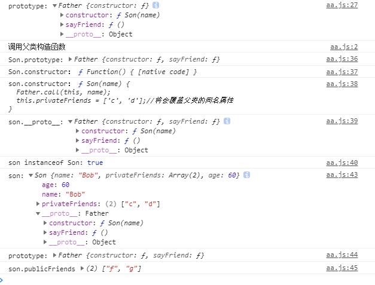<br>
原型链关系如下图：<br>
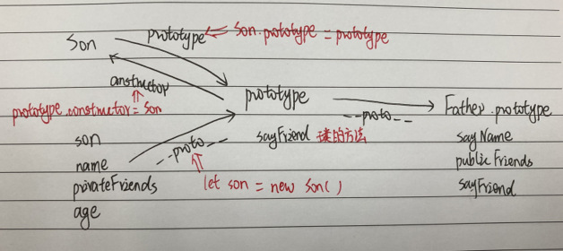<br>
> 可以看出子类的原型对象上没有了父类构造函数里的属性和方法，且继承的原型链存在，**该继承模式是最理想的继承方式**<br>

## 6 ES6的继承
```js
class Car {
  static color = 1;
  constructor(price){
    this.price = price
  }
  test(){
    console.log(this.price)
  }
}

class Cruze extends Car {
  constructor(price){
    super(price)
  }
}

const cruze = new Cruze(3000)

console.log('Car.prototype', Car.prototype)
console.log('Cruze.prototype:',Cruze.prototype);
console.log('Cruze.constructor：',Cruze.constructor);
console.log('cruze.constructor：',cruze.constructor);
console.log('cruze.__proto__:',cruze.__proto__);
console.log('cruze instanceof Son:',cruze instanceof Cruze)
console.log('cruze:',cruze)
console.log('Cruze:',Cruze)
console.log('cruze.__proto__.__proto__ === Car.prototype:',cruze.__proto__.__proto__ === Car.prototype);

console.log(Cruze.__proto__ === Car)  // true
console.log(Cruze.color)  //1 继承静态属性
cruze.test();  //3000
```
打印如下：<br>
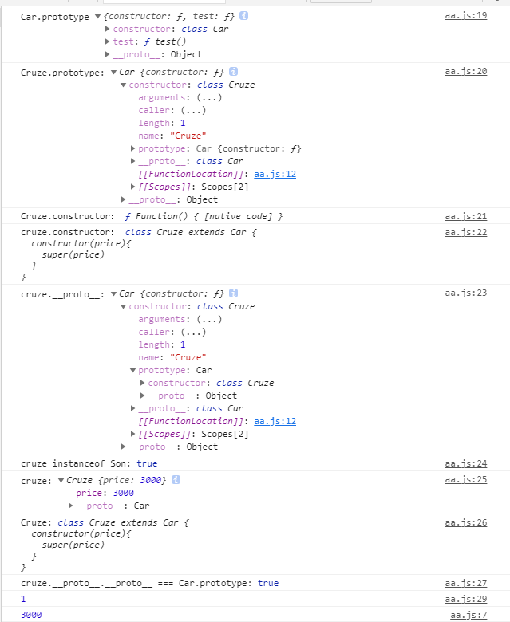<br>
原型链关系如下图：<br>
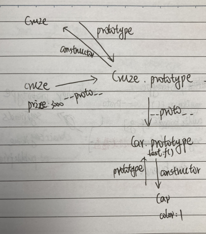<br>
> 可以看出ES6的继承实际上实现的也是基于原型链的继承，但是它多了一个功能，就是**子类可以继承父类的静态
> 属性**，因为子类__proto__是指向父类的，所以子类可以使用父类上的方法和属性
> 这在前面只有基于原型链的继承是无法实现的<br>

## 7 可以继承静态属性的ES5的继承
~~~js
'use strict'
function Car(price){
  this.price = price
}

//静态属性
Car.color = 'red'

//原型上的方法
Car.prototype.test = function(){
  console.log(this.price)
}

function Cruze(price){
  Car.call(this, price)  //严格模式要加this，否则传window
}
~~~

### 继承静态属性
~~~js
var staticKeys = Object.entries(Car)
console.log(staticKeys) //[["color", "red"]] //取到静态属性

for(var i =0; i < staticKeys.length;i++){
  var key = staticKeys[i][0]
  var value = staticKeys[i][1]
  Cruze[key] = value
}

console.log(Cruze.color)  //red 继承静态属性
~~~
* 或者这样写
```js
Cruze.__proto__ = Car

console.log(Cruze.color)  //red 继承静态属性
```

### 继承原型链
* 错误写法
~~~js
Cruze.prototype = Car.prototype  //错误，子类会污染父类
Cruze.prototype = new Car()  //错误，父类构造函数会执行两遍
~~~

* 寄生组合式继承写法
~~~js
Cruze.prototype = Object.create(Car.prototype)
Cruze.prototype.constructor = Cruze  //修正constructor
~~~

* 新写法
~~~js
Cruze.prototype = Object.create(Car.prototype, {
  constructor:{ //直接修正constructor
    value:Cruze,
    writable: false,  //不让别人修正
  },
  test:{  //重写原型链上的test
    value: function(){
      console.log(this.price)
    }
  }
})
Cruze.prototype.constructor = {} // 非严格模式下无效，严格模式下报错 cannot assign to read only property 'constructor' of object '#<Cruze>'

var cruze = new Cruze(3000)

console.log('Car.prototype', Car.prototype)
console.log('Cruze.prototype:',Cruze.prototype);
console.log('Cruze.constructor：',Cruze.constructor);
console.log('cruze.constructor：',cruze.constructor);
console.log('cruze.__proto__:',cruze.__proto__);
console.log('cruze instanceof Son:',cruze instanceof Cruze)
console.log('cruze:',cruze)
console.log('Cruze:',Cruze)
console.log('cruze.__proto__.__proto__ === Car.prototype:',cruze.__proto__.__proto__ === Car.prototype);

console.log(cruze)
cruze.test()
~~~
打印结果：<br>
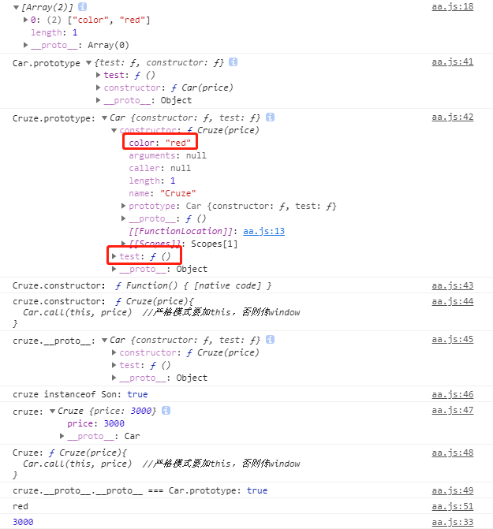<br>
原型链关系如下图：<br>
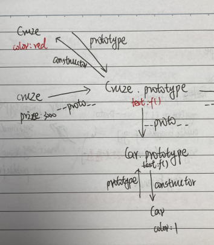<br>
> 可以看出子类构造函数也具有了父类的静态属性color，且子类的原型上也有test方法

### 总结ES5和ES6继承方式不同点
* 两者继承机制不同
  * ES5 中，子类对于父类构造函数的继承时，子类的 this 已经存在，通过 SuperType.call(this, ...args) 
  的方式来修改子类的 this
  * ES6 的子类必须要调用 super(...args) 来生成 this

* 两者构造函数的原型链指向不同
  * ES5 的子类和父类的构造函数函数的原型链都指向 Function.prototype
  * ES6 的子类的构造函数的原型链指向父类的构造函数
 
看看下面这段代码babel编译的ES6类继承为ES5代码是什么样子的：
```js
class Car {
}
class Cruze extends Car {
  constructor(price){
    super(price)
  }
}
```
如图所示, 可以看出babel 也是通过 A.call(this) 来模拟实现 super() 的<br>
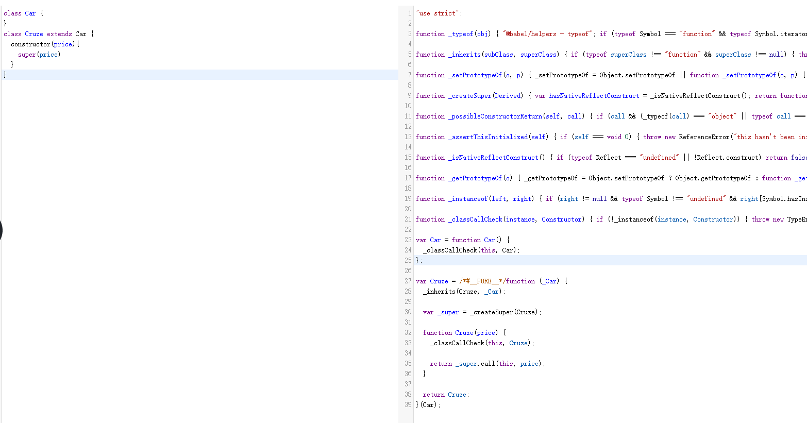


❀ 本文参考:
*《JavaScript高级程序设计》
* [ES6 与 ES5 继承的区别](https://juejin.cn/post/6844903924015120397#heading-2)
* [ES6 与 ES5 的"类"继承机制](https://segmentfault.com/a/1190000023475151)
