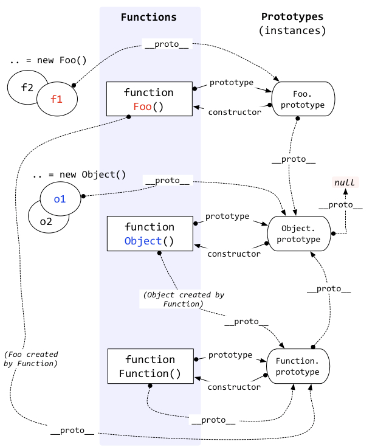

# 原型、原型链
在javascript中，函数可以有属性。 每个函数都有一个特殊的属性叫作原型 prototype

每个对象拥有一个原型对象，对象以其原型为模板、从原型继承方法和属性。原型对象也可能拥有原型，并从中继
承方法和属性，一层一层、以此类推。这种关系常被称为原型链 (prototype chain)
```js
function doSomething(){}
doSomething.prototype.foo = "bar";
console.log( doSomething.prototype );
```
结果如下:
```
{
    foo: "bar",
    constructor: ƒ doSomething(),
    __proto__: {
        constructor: ƒ Object(),
        hasOwnProperty: ƒ hasOwnProperty(),
        isPrototypeOf: ƒ isPrototypeOf(),
        propertyIsEnumerable: ƒ propertyIsEnumerable(),
        toLocaleString: ƒ toLocaleString(),
        toString: ƒ toString(),
        valueOf: ƒ valueOf()
    }
}

```
constructor 属性 :每个实例对象都从原型中继承了一个constructor属性，该属性指向了用于构造此实例对象的构造函数。

所有构造函数都是Function的实例，所有原型对象都是Object的实例除了Object.prototype

万能图：


例子：
```js
const MinStack = function() {
  console.log('print1', this)
  this.arr = [];
  this.min = null;
};

MinStack.name = '111'  //无效，函数的name属性无法被改变

MinStack.name2 = function() {
    console.log('print2', this)
}

/**
 * @param {number} val
 * @return {void}
 */
MinStack.prototype.push = function(val) {
    console.log('print3',this)
    this.arr.push(val);
};


const obj = new MinStack();
obj.push(1);
MinStack.name2()
console.log('print3', MinStack.name)
```
打印如下：<br>

