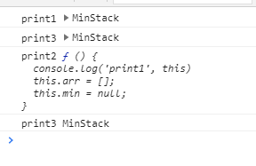

# 原型、原型链
```js
const MinStack = function() {
  console.log('print1', this)
  this.arr = [];
  this.min = null;
};

MinStack.name = '111'  //无效，函数的name属性无法被改变

MinStack.name2 = function() {
    console.log('print2', this)
}

/**
 * @param {number} val
 * @return {void}
 */
MinStack.prototype.push = function(val) {
    console.log('print3',this)
    this.arr.push(val);
};


const obj = new MinStack();
obj.push(1);
MinStack.name2()
console.log('print3', MinStack.name)
```
打印如下：<br>

