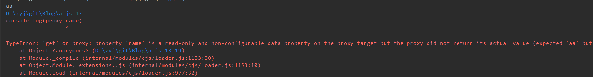

# Proxy

**目录**
> * [定义](#定义)
> * [实例方法](#实例方法)
>   * [get](#get)
>   * [set](#set)
>   * [apply](#apply)
>   * [has](#has)
>   * [其他操作](#其他操作)

## 定义

Proxy提供了一种机制，可以在目标对象之前架设一层“拦截”，外界对该对象的访问，都必须先通过这层拦截，
可以对外界的访问进行过滤。

Proxy语法：
```
let proxy = new Proxy(target, handler)
```
new Proxy()表示生成一个Proxy实例，target参数表示所要拦截的目标对象，handler参数也是一 个对象，用
来定制拦截行为。
 
## 实例方法
 
### get
get(target, property, receiver)拦截属性的读操作，接受三个参数：目标对象、属性、proxy实例本身（可选）
 ```js
let person = {
  name: 'Bob'
};
let proxy = new Proxy(person, {
  get(target, property, proxy){
    if (property in target) {
      return target[property];
    } else {
      return 'not exist';
    }
  },
});
person.sex = 'woman'
console.log(proxy.sex); //woman
console.log(proxy.name); //Bob
console.log(proxy.age);  //not exist  (通过代理访问不存在的属性会打印错误信息)
console.log(person.age);  //undefined (直接通过原对象访问则不会过滤)

let proxy2 = new Proxy({}, {});
console.log(proxy2.age);//undefined  (handler为空对象，表示不做任何拦截)
```

proxy具有继承性
```js
//写法1：
let person2 = Object.create(proxy);//proxy定义在对象的原型对象上，也有拦截效果
console.log(person2.age);  //not exist（person2没有age属性，会去它的原型对象proxy上去找，就会触发
console.log(person2);  //not exist（person2没有age属性，会去它的原型对象proxy上去找，就会触发
// proxy的get方法）

let person3 = {};
//写法2：
person3.__proto__ = proxy;
console.log(person3.age);  //not exist

let person33 = {};
//写法3：
Object.setPrototypeOf(person33, proxy);
console.log(person33.age);  //not exist
```

利用proxyd的get()完成属性的链式操作：
```js
let pipe = (val) => {
  let funcArr = [];
  let proxy = new Proxy(
    {},
    {
      get: (target, property) => {
        if (property === "value") {
          return funcArr.reduce((preVal, curVal) => {
            console.log(preVal, curVal);
            return curVal(preVal);
          }, val);
        }
        funcArr.push(funcObj[property]);
        return proxy; //这里返回代理是为了第二个（pow）及之后的属性能继续用该代理
      },
    }
  );
  return proxy; //这里返回代理是为了第一个属性（double）用该代理
};
let funcObj = {
  double: (val) => val + val,
  pow: (val) => val * val,
  reverse: (val) => Number([...val.toString()].reverse().join("")),
};
let c = pipe(3).double.pow.reverse.value;
//funcArr.reduce调用过程：
//preVal        curVal
// 3      [Function: double]
// 6        [Function: pow]
// 36     [Function: reverse]

console.log(c); //63
```
>数组的reduce方法：<br>
>`reduce(function, val)`<br>
>参数说明：
>* function:作为累加器,数组中的每个值（从左到右）开始缩减，最终为一个值,接受四个参数：上一次的
>值，当前值，当前值的索引，数组本身
>* val:初始值，可选，如果有该值则第一次调用它为previousValue，否则数组第一项为previousValue
```js
//无初始值：
let a = [0, 1, 2, 3, 4].reduce(function (
  previousValue,
  currentValue,
  index,
  array
) {
  console.log(previousValue, currentValue, index);
  return previousValue + currentValue;
});
//当前值从数组的第二项开始，数组第一项作为上一次的值，调用4次
//previousValue  currentValue  index
// 0                  1          1
// 1                  2          2
// 3                  3          3
// 6                  4          4
console.log(a); //10


//有初始值：
let b = [0, 1, 2, 3, 4].reduce(function (
  previousValue,
  currentValue,
  index,
  array
) {
  console.log(previousValue, currentValue, index);
  return previousValue + currentValue;
},
5);
//当前值从数组第一项开始，初始值5作为上一次的值，调用5次
//previousValue  currentValue  index
// 5                  0          0
// 5                  1          1
// 6                  2          2
// 8                  3          3
// 11                 4          4
console.log(b); //15
```

如果一个属性不可配置（configurable）或不可写（writable），则 Proxy 不能修改该属性，否则通过 Proxy
对象访问该属性会报错
```js
const obj = Object.defineProperty({}, 'name', {
  configurable: false,
  value:'aa'
})

const proxy = new Proxy(obj, {
  get(target, property) {
    return 'name被修改'
  }
})

console.log(obj.name)
console.log(proxy.name)
```
打印如下：<br>


### set
set(target, property, value, receiver)拦截属性的赋值操作，参数为目标对象，属性名、属性值、代理本身（可选）
例1：用作参数校验
```js
let validator = {
  set: (target, property, value) => {
    if (property === "age") {
      if (!Number.isInteger(value)) throw new TypeError("not a number");
    }
    target[property] = value; //对于满足条件的age属性和其他属性正常保存
  },
};
let proxy6 = new Proxy({}, validator);
proxy6.age = 6;
proxy6.age = 'a';  //TypeError: not a number
```

例2：对某些以_开头的属性作为内部属性，防止外部直接读写
```js
let privateHandler = {
  get: (target, property) => {
    validatePrivate(property);
    return target[property];
  },
  set: (target, property, value) => {
    validatePrivate(property);
    target[property] = value;
  },
};
function validatePrivate(property) {
  if (property[0] === "_") {
    throw new TypeError(`can't visit private property ${property}`);
  }
}
let proxy7 = new Proxy({}, privateHandler);
proxy7.__proto__;  //TypeError: can't visit private property __proto__
proxy7._name = 'a'; //TypeError: can't visit private property _name
proxy7.name = "a";
```

如果一个属性不可配置（configurable）或不可写（writable），那么set方法将不起作用
```js
const obj = Object.defineProperty({}, 'name', {
  writable: false,
  value:'aa'
})

const proxy = new Proxy(obj, {
  set(target, property, value) {
   target[property] = value
  }
})

proxy.name = 11
console.log(obj.name)  //aa  (未被修改)
console.log(proxy.name)  // aa
```

### apply
apply(target, thisArg, argumentsLis):拦截函数的调用，call和apply操作<br>
接受三个参数，分别是目标对象、目标对象的上下文对象（this）和目标对象的参数数组。
```js
let ff = function (a, b) {
  console.log("调用函数");
};
let proxy8 = new Proxy(ff, {
  apply: function (target, ctx, args) {
    console.log("参数为：", args);
    target();
  },
});
proxy8(6, 7); //参数为： [ 6, 7 ]   调用函数
proxy8.call(null, 6, 7); //参数为： [ 6, 7 ]   调用函数
proxy8.apply(null, [6, 7]); //参数为： [ 6, 7 ]   调用函数
```

### has
has(target, prop):用来拦截对象的属性，参数为目标对象和要拦截的属性名
```js
let obj9 = {
  _name: "aa",
  age: 9,
};
let proxy9 = new Proxy(obj9, {
  has: function (target, property) {
    if (property[0] === "_") {
      return false;
    }
    return property in target;
  },
});
for (let key in proxy9) {
  console.log(key);
} //_name age  (for ... in 循环不生效)

console.log("_name" in proxy9); // false
console.log("age" in proxy9); // true
```

### 其他操作
```
handler.getPrototypeOf()
Object.getPrototypeOf 方法的捕捉器。

handler.setPrototypeOf()
Object.setPrototypeOf 方法的捕捉器。

handler.isExtensible()
Object.isExtensible 方法的捕捉器。

handler.preventExtensions()
Object.preventExtensions 方法的捕捉器。

handler.getOwnPropertyDescriptor()
Object.getOwnPropertyDescriptor 方法的捕捉器。

handler.defineProperty()
Object.defineProperty 方法的捕捉器。

handler.deleteProperty()
delete 操作符的捕捉器。

handler.ownKeys()
Object.getOwnPropertyNames 方法和 Object.getOwnPropertySymbols 方法的捕捉器。

handler.construct()
new 操作符的捕捉器。
```