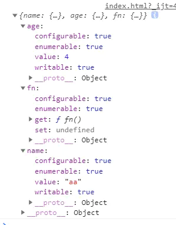
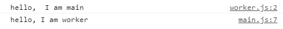
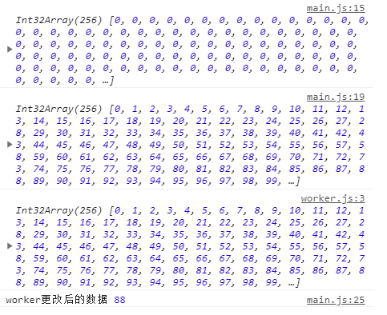

# ES7新增语法
1.includes<br>
2.指数运算：**
```js
  console.log(2**3 )  // Math.power(2,3)
```
# ES8新增语法
### 1.Async/Await:更加语义化
(以前操作异步代码方式：1、嵌套回调 2.Promise 3.Generators)

```js
async function add(num) {  //该函数返回一个promise
	return num + 2
}
add(2).then(res => {
	console.log(res)  // 3
}
```
#### await语法
 
```js
function promiseFn() {
	return new Promise((resolve, reject) => {
		setTimeout(() => {
			reject('error')
		}, 1500)
	});
}
async function fn() {
	try {
		await promiseFn().catch(err => {  //捕获错误第2种方式,提前捕获
			console.log(err)   //err
		});
		console.log('我在错误后面不会执行')
	} catch(err) {  //捕获错误第1种方式
		console.log(err) // error
	}
}
fn()
```

#### 使用Promise.all同步执行

```js
function promiseFn() {
    return new Promise((resolve, reject) => {
        setTimeout(() => {
            resolve('error')
        }, 1000)
    });
}

function promiseFn2() {
    return new Promise((resolve, reject) => {
        setTimeout(() => {
            resolve('error')
        }, 2000)
    });
}

async function fn() {
    console.time('fn1');
    await promiseFn();
    await promiseFn2();
    console.timeEnd('fn1')  //fn1: 3001.0068359375ms //串行执行
}
fn()

async function fn2() {
    console.time('fn2');
    await Promise.all([promiseFn(), promiseFn2()])
    console.timeEnd('fn2')  //fn2: 2000.72705078125ms //同步执行
}
fn2()
```

### 2.Object.values()
和Object.keys()类似

```js
const obj = {name: 'aa', age:4}
console.log(Object.keys(obj).map(key => obj[key]))  //["aa", 4]
console.log(Object.values(obj))  //["aa", 4]
```

### 3.Object.entries()
和for ...in区别：for ...in会枚举原型链中的属性

```js
const obj = {name: 'aa', age:4}
console.log(Object.keys(obj).map(key => obj[key]))  //["aa", 4]
console.log(Object.values(obj))  //["aa", 4]


console.log(Object.entries(obj))  //  [["name", "aa"],["age", 4]]
console.log(Object.entries('abc'))  // [["0", "a"], ["1", "b"], ["2", "c"]]

//遍历对象的键，值
for (const [key, value] of Object.entries(obj)) {
     console.log(key, value)  //name aa age 4
 }

Object.entries(obj).forEach(([key, value]) => {
      console.log(key,value)  //name aa age 4
 })
```
### 4.String.prototype.padStart(targetLength, padString)
在字符串开头添加字符串。<br> 
参数：添加后的字符串的目标长度；添加的字符串
```js
console.log('123'.padStart(5, '555')) //12355
console.log('123'.padStart(10, '555')) //5555555123
```
### 5.String.prototype.padEnd(targetLength, padString)
在字符串末尾添加字符串 

### 6.结尾允许逗号
对象，数组最后一个元素后语序加逗号

### 7.Object.getOwnPropertyDescriptors() 
获取对象自身描述符
```js
const obj = {
    name: 'aa',
    age:4,
    get fn() {
        return 'fn'
    }}
console.log(Object.getOwnPropertyDescriptors(obj))
 ```
输出结果：<br>


### 8.SharedArrayBuffer 与Atomics
给js带来了多线程的功能，高级特性，Js引擎核心改进<br>
共享内存主要思想：把多线程引入Js<br>
新的全局对象SharedArrayBuffer,Js主线程和web-worker线程共享该对象<br>
使用postMessage()来对不同线程之间传递数据<br>
为了避免多线程共享数据产生竞争，使用Atomics来对资源加锁<br>
#### 使用postMessage进行线程之间的通信
main.js
```js
//创建一个worker线程
const worker = new Worker('./worker.js');

//postMessage
worker.postMessage('hello,  I am main')
worker.onmessage = function(e) {
    console.log(e.data)
}
```
worker.js
```js
onmessage = function (e) {
    console.log(e.data)
    postMessage('hello, I am worker')
}
```
输出结果：<br>


使用上述方法，如果数据量很大，来回传递，通讯效率很低

#### 使用SharedArreyBuffer进行数据共享
main.js
```js
//创建一个worker进程
const worker = new Worker('./worker.js');

//新建一个1kb内存
const sharedArrayBuffer = new SharedArrayBuffer(1024)  //1024字节

//建视图
const intArrayBuffer = new Int32Array(sharedArrayBuffer)

//写入数据
console.log( intArrayBuffer)  //长度为256的int32数组
for(let i = 0; i < intArrayBuffer.length; i++){
    intArrayBuffer[i] = i;
}
console.log(intArrayBuffer)

//使用postMessage发送共享内存的地址
worker.postMessage(intArrayBuffer)
worker.onmessage = function(e) {
    console.log('worker更改后的数据', intArrayBuffer[20])  //共享数据已被改变
}
```
worker.js
```js
onmessage = function (e) {
    let arrBuffer = e.data;
    console.log(arrBuffer)

    //更改共享内存数据、
    arrBuffer[20] = 88;
    postMessage('hello. I am worker')  //不用传递共享数据，共享数据即被改变
}
```
输出结果：<br>


#### 给线程加锁
arrBuffer[20] = 88;像这样直接修改内存中的数据，若线程很多，则容易产生冲突<br>
worker.js改成如下：
```js
onmessage = function (e) {
    let arrBuffer = e.data;

    //使用原子操作读数据
    console.log(Atomics.load(arrBuffer,20))

    //使用原子操作更改共享内存数据
    Atomics.store(arrBuffer, 20, 88) //88
    Atomics.exchange(arrBuffer, 20, 99) //88 替换方法

    postMessage('hello. I am worker')  //不用传递共享数据，共享数据即被改变
}
```

线程休眠，唤醒<br>
worker.js
```js
onmessage = function (e) {
    let arrBuffer = e.data;

    //线程满足一定条件进入休眠, 2秒后解除休眠
    Atomics.wait(arrBuffer, 11, 11, 2000)
   console.log('我已经进入休眠')

    postMessage('hello. I am worker')  //不用传递共享数据，共享数据即被改变
}
```
wait函数不传递2秒则不会自动解除休眠，需要主线程唤醒<br>
main.js
```js
setTimeout(() => {
    Atomics.notify(intArrayBuffer,11,1)  //参数：共享内存试图数组，视图数据位置，唤醒的worker进程数，默认Infinity
}, 2000)
```
其他方法
```js
console.log(intArrayBuffer[20])  //20
Atomics.add(intArrayBuffer, 20, 2) //加
console.log(intArrayBuffer[20]) //22
Atomics.sub(intArrayBuffer, 20, 2) //减
console.log(intArrayBuffer[20]) //20
Atomics.and(intArrayBuffer, 20, 0) //与操作
console.log(intArrayBuffer[20]) //0
Atomics.or(intArrayBuffer, 20, 1) //或操作
console.log(intArrayBuffer[20]) //1
Atomics.xor(intArrayBuffer, 20, 0)  //异或操作
console.log(intArrayBuffer[20]) //1
Atomics.compareExchange(intArrayBuffer, 20, 1, 20)  //若第20个元素等于1，则修改成20，否则不修改
console.log(intArrayBuffer[20]) //20
``


