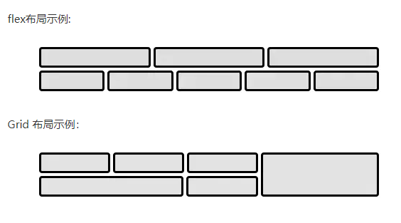
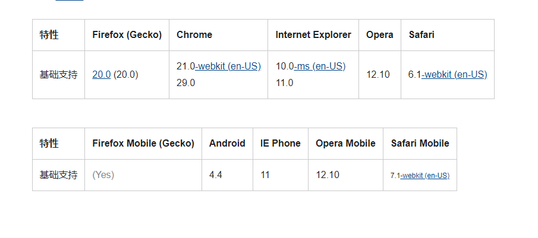
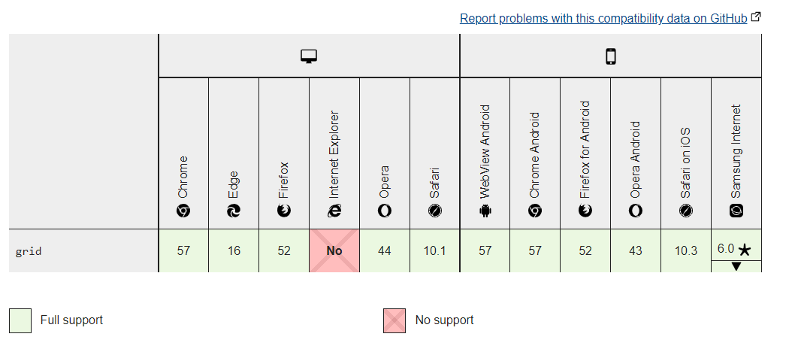

# Flex布局和Grid布局

 * Flex 布局是一维布局，一次只能处理一个维度上的元素布局，一行或者一列。
 * Grid 布局是二维布局,是将容器划分成了“行”和“列”，产生了一个个的网格，我们可以将网格元素放在与这些行和列相关的位
 置上，从而达到我们布局的目的。
 

## Flex布局(弹性布局)

### 容器属性：

| 属性名          | 含义                                | 取值                                                         |
| --------------- | ----------------------------------- | ------------------------------------------------------------ |
| flex-direction  | 元素的排列方向(即主轴的方向)        | row \| row-reverse \| column \| column-reverse               |
| flex-wrap       | 如果一条轴线排不下，如何换行        | nowrap \| wrap \| wrap-reverse                               |
| flex-flow       | flex-direction 和 flex-wrap组合简写 | 默认值为：`row nowrap`                                       |
| justify-content | 项目在主轴上的对齐方式              | flex-start\|flex-end\|center\|space-between\|space-around\|space-evenly |
| align-items     | 项目在交叉轴上的对其方式            | stretch\|flex-start\|flex-end\|center\|baseline              |

### 项目属性

| 属性名      | 含义                                                         | 取值                                              |
| ----------- | ------------------------------------------------------------ | ------------------------------------------------- |
| order       | 项目的排列顺序，数值越小，排列越靠前，                       | 默认为0                                           |
| flex-grow   | 项目的放大比例                                               | 默认为0                                           |
| flex-shrink | 项目的收缩规则，在默认宽度之和大于容器的时候才会发生收缩     | 默认为1                                           |
| flex-basis  | 项目在主轴方向上的初始大小                                   | 默认为auto,使用项目本来的宽度                     |
| flex        | flex-grow,flex-shrink 和 flex-basis的简写,后两个属性可选     | 默认值为`0 1 auto`                                |
| align-self  | 设置单个项目与其他项目不一样的对齐方式，可以覆盖`align-items`属性 | 默认值为`auto`，表示继承父元素的`align-items`属性 |

### 兼容性

## Grid布局（网格布局）

### 容器属性

| 属性名                | 含义                                       | 取值                                                         |
| --------------------- | ------------------------------------------ | ------------------------------------------------------------ |
| grid-template-columns | 设置列宽                                   | 如`50px 50px `,` repeat(2, 50px)`,`repeat(auto-fill, 200px)`,`200px 1fr 2fr`,`100px auto 100px` |
| grid-template-rows    | 设置行高                                   | 同上                                                         |
| grid-row-gap          | 设置行间距                                 | 如`10px`                                                     |
| grid-column-gap       | 设置列间距                                 | 如`20px`                                                     |
| grid-gap              | grid-row-gap和grid-column-gap的简写        | 如`10px 20px`                                                |
| grid-auto-flow        | 指定在网格中被自动布局的元素怎样排列       | 默认值是 `row`，表示先填满第一行，再开始放入第二行,`column`表示先填第一列，再填第二列 |
| justify-items         | 单元格内容的水平位置（左中右）             | stretch：拉伸，占满单元格的整个宽度（默认值） start ：对齐单元格的起始边缘 end：对齐单元格的结束边缘 center：单元格内部居中  end：对齐容器的结束边框 center：容器内部居中  space-around : 每个项目两侧的间隔相等 space-between : 项目与项目的间隔相等，项目与容器边框之间没有间隔 space-evenly :项目与项目的间隔相等，项目与容器边框之间也是同样长度的间隔 stretch :项目大小没有指定时，拉伸占据整个网格容器 |
| align-content         | 整个内容区域的垂直位置（上中下             | 同上                                                         |

### 项目属性

| 属性名       | 含义                               | 取值                                            |
| ------------ | ---------------------------------- | ----------------------------------------------- |
| justify-self | 设置单元格内容的水平位置（左中右） | 同justify-items，start \|end \|center \|stretch |
| align-self   | 设置单元格内容的垂直位置（上中下） | 同align-items，start \|end \|center \|stretch   |

以下四个属性指定网格项目所在的四个边框，分别定位在哪根网格线，从而指定项目的位置

| 属性名            | 含义                   | 取值 |
| ----------------- | ---------------------- | ---- |
| grid-column-start | 左边框所在的垂直网格线 | 数字 |
| grid-column-end   | 右边框所在的垂直网格线 | 数字 |
| grid-row-start    | 上边框所在的水平网格线 | 数字 |
| grid-row-end      | 下边框所在的水平网格线 | 数字 |

### 兼容性

可以看出，grid的布局虽然功能更强，但只支持高版本的浏览器，且IE不支持，flex兼容性好很多，因此使用的更多