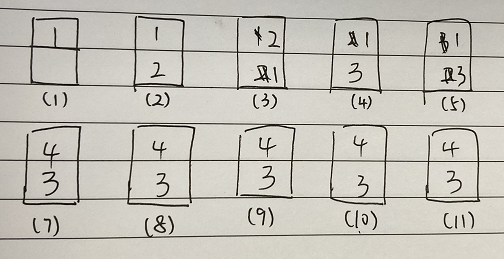
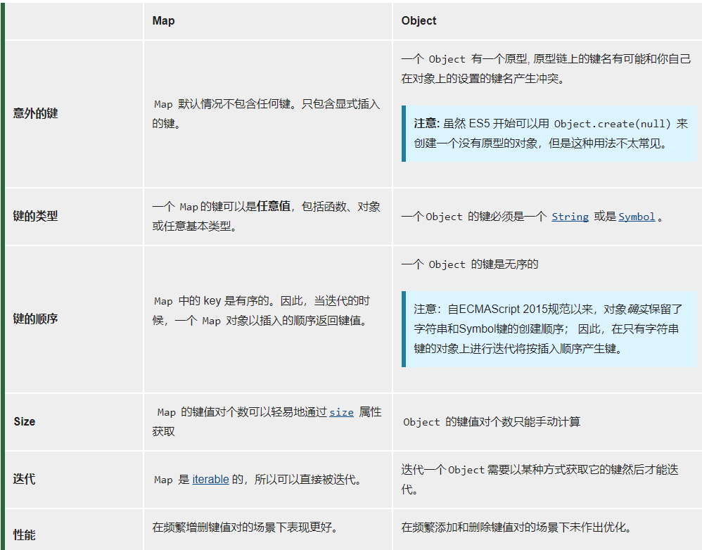

# LRU缓存机制
## 缓存淘汰策略的应用

* 浏览器缓存

当我们打开一个网页时，例如 https://github.com/sisterAn/JavaScript-Algorithms ，它会在发起真正的
网络请求前，查询浏览器缓存，看是否有要请求的文件，如果有，浏览器将会拦截请求，返回缓存文件，并直接结
束请求，不会再去服务器上下载。如果不存在，才会去服务器请求。<br>

其实，浏览器中的缓存是一种在本地保存资源副本，它的大小是有限的，当我们请求数过多时，缓存空间会被用满，
此时，继续进行网络请求就需要确定缓存中哪些数据被保留，哪些数据被移除，这就是浏览器缓存淘汰策略，最常
见的淘汰策略有 FIFO（先进先出）、LFU（最少使用）、LRU（最近最少使用）。<br>

LRU （ Least Recently Used ：最近最少使用 ）缓存淘汰策略，故名思义，就是根据数据的历史访问记录来进
行淘汰数据，其核心思想是 如果数据最近被访问过，那么将来被访问的几率也更高 ，优先淘汰最近没有被访问到的数据。<br>

* vue中的keep-alive

keep-alive 在 vue 中用于实现组件的缓存，当组件切换时不会对当前组件进行卸载。<br>
keep-alive 新增了 max 属性，用于最多可以缓存多少组件实例，一旦这个数字达到了，在新实例被创建之前，
已缓存组件中最久没有被访问的实例会被销毁掉，这里就应用了 LRU 算法。即在 keep-alive 中缓存达到 
max，新增缓存实例会优先淘汰最近没有被访问到的实例

## 算法实现
运用你所掌握的数据结构，设计和实现一个 LRU (最近最少使用) 缓存机制。<br>
它应该支持以下操作： 获取数据 get 和写入数据 put 。<br>
获取数据 get(key) - 如果密钥 ( key ) 存在于缓存中，则获取密钥的值（总是正数），否则返回 -1 。<br>
写入数据 put(key, value) - 如果密钥不存在，则写入数据。当缓存容量达到上限时，它应该在写入新数据之前删除最久未使用的数据，从而为新数据留出空间<br>
你是否可以在 O(1) 时间复杂度内完成这两种操作？
```js
/*
LRUCache cache = new LRUCache( 2  ) //缓存容量
cache.put(1, 1);
cache.put(2, 2);
cache.get(1);       // 返回  1
cache.put(3, 3);    // 该操作会使得密钥 2 作废
cache.get(2);       // 返回 -1 (未找到)
cache.put(4, 4);    // 该操作会使得密钥 1 作废
cache.get(1);       // 返回 -1 (未找到)
cache.get(3);       // 返回  3
cache.get(4);       // 返回  4
*/

function LRUCache(max) {
  this.cache = {}; //实现O(1)时间复杂度，用对象存放数据，方便查找
  this.keys=[];  //用数组存放key，保存访问顺序
  this.max = max;
}

LRUCache.prototype.put = function(key, value) {
  // 先看keys中是否有key，如果有，需要删除(因为要作为新访问的元素重新加入)
  if(this.cache[key] !== undefined) {
    const index = this.keys.indexOf(key)
    this.keys.splice(index, 1)
  }

  // 若已是最大容量，先删除keys中第一个元素
  if(this.keys.length === this.max) {
    const removeKey = this.keys[0]
    delete this.cache[removeKey]
    this.keys.shift()
  }

  // 加入key
  this.cache[key] = value
  this.keys.push(key)  //加入数组尾部
}

LRUCache.prototype.get = function(key) {
  // 如果存在key，删除keys中的key，再把key作为最新访问重新加入，即放入keys尾部
  if(this.cache[key] !== undefined) {
    const index = this.keys.indexOf(key)
    this.keys.splice(index, 1)
    this.keys.push(key)
    return this.cache[key]
  }
  return -1
}


cache = new LRUCache(2)
cache.put(1, 1);             //(1)
cache.put(2, 2);             //(2)
console.log(cache.get(1));   //(3)
cache.put(3, 3);             //(4)
console.log(cache.get(2));   //(5)
cache.put(4, 4);             //(6)
cache.put(3, 3);             //(7)
console.log(cache.get(1));   //(8)
cache.put(3, 3);             //(9)
console.log(cache.get(3));   //(10)
cache.put(3, 3);             //(11)
console.log(cache.get(4));   //(12)
```
keys数组变化如下：<br>


* 用Map实现
```js
function LRUCache(max) {
 this.cache = new Map()
 this.max = max
}

LRUCache.prototype.put = function(key, value) {
  if(this.cache.has(key)) {
    this.cache.delete(key)
  }
  if(this.cache.size === this.max) {
    this.cache.delete(this.cache.keys().next().value)  //this.cache.keys().next().value获取map第一个元素的key
  }
  this.cache.set(key, value)
}

LRUCache.prototype.get = function(key) {
  if(this.cache.has(key)) {
    const value = this.cache.get(key)
    this.cache.delete(key)
    this.cache.set(key, value)
    return value
  }
  return -1
}
```
在leetcode中使用Map要比使用Object的性能好很多，通过查看MDN得知Map'**在频繁增删键值对的场景下表现更好**',
而Object'**在频繁添加和删除键值对的场景下未作出优化**'<br>
下图截自MDN：<br>
<br>

❀ 参考文章：[前端进阶算法3：从浏览器缓存淘汰策略和Vue的keep-alive学习LRU算法](https://github.com/sisterAn/JavaScript-Algorithms/issues/9)
