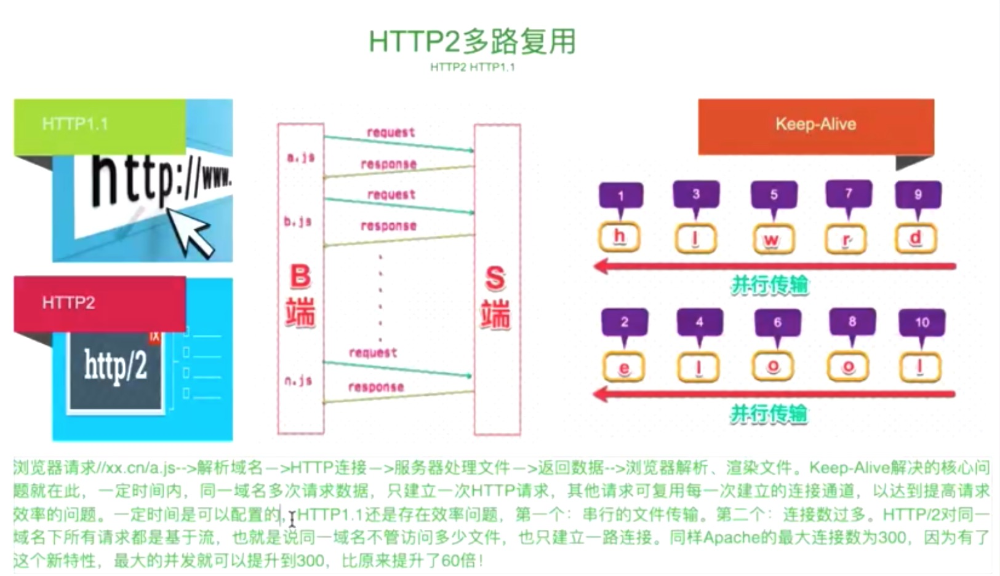
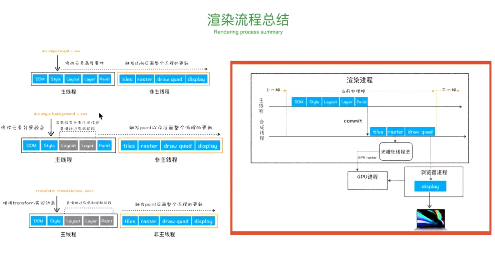
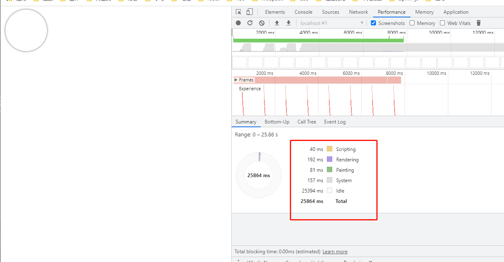
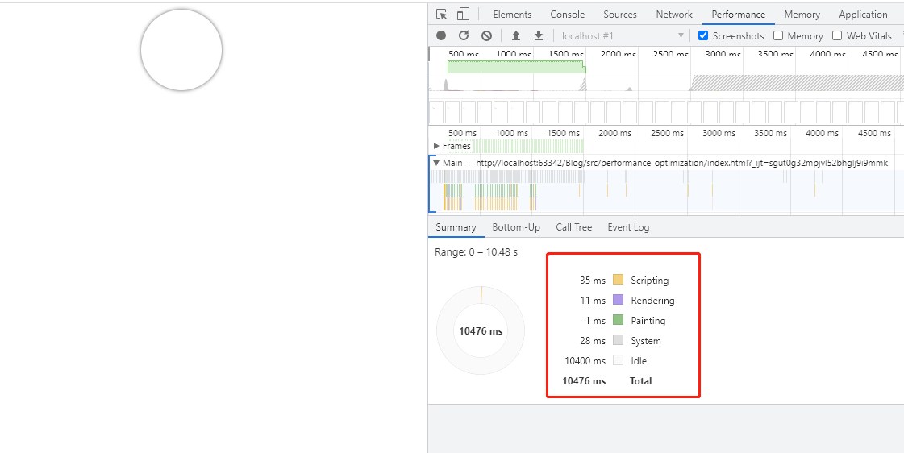

# 性能优化基本概念

为什么要进行性能优化?
* 57%的用户更在乎网⻚在3秒内是否完成加载。
* 52%的在线用户认为网⻚打开速度影响到他们对网站的忠实度。
* 每慢1秒造成⻚面 PV 降低11%，用户满意度也随之降低降低16%。
* 近半数移动用户因为在10秒内仍未打开⻚面从而放弃。

> PV（page view，页面浏览量）:用户每打开1个网站页面，记录1个PV。用户多次打开同一页面，PV值累计多次。
> 主要用来衡量网站用户访问的网页数量。是评价网站流量最常用的指标之一。

## Keep-Alive
Keep-Alive 是一个通用消息头，允许消息发送者暗示连接的状态，还可以用来设置超时时长和最大请求数。

浏览器请求//xx.cn/a.js-->解析域名—>HTTP连接—>服务器处理文件—>返回数据-->浏览器解析、渲染文件。



Keep-Alive解决的核心问题就在此，一定时间内，同一域名多次请求数据，只建立一次HTTP请求，其他请求可复
用每一次建立的连接通道，以达到提高请求 效率的问题。一定时间是可以配置的，HTTP1.1还是存在效率问题，第
一个:串行的文件传输。第二个:连接数过多。HTTP/2对同一 域名下所有请求都是基于流，也就是说同一域名不管访
问多少文件，也只建立一路连接。同样Apache的最大连接数为300，因为有了 这个新特性，最大的并发就可以提升
到300，比原来提升了6倍!

## 测试网速
### HTML5自带
使用navigator.connection，它是只读的，提供一个NetworkInformation 对象来获取设备的网络连接信息
```js
const connection = navigator.connection
// 获取当前网络信息类型
let type = connection.effectiveType  // 3g
// 网络信号的改变
connection.onchange = function (e) {
    console.log(connection.effectiveType);
}
console.log('是否在线', navigator.onLine)
console.log('网速', connection.downlink, 'MB/s')
window.addEventListener("online", () => {
    console.log('网络已连接')
});
window.addEventListener("offline", () => {
    console.log('网络已断开')
});
```

### 资源请求
小 img 实现:在服务器放个 1KB 的图片，并请求，看返回Timer差分区间

bandwidth = file_size/Timer

## 网页整体的渲染过程
* 1.获取dom,分割成多个图层
* 2.对每个图层节点进行样式计算Recalculate Style
* 3.为每个节点生成对应图形和位置Layout
* 4.将每个节点绘制到图层的位图中Paint
* 5.图层作为纹理上传到GPU  （纹理：CPU传到GPU最小的bitmap,GPU能对它进行缩放、旋转、修改透明度等）
* 6.符合多个图层在页面上生成最终的图像Composite Layers（合成层）
   * 1.图层的绘制列表准备好以后，主线程会把绘制列表提交给合成线程
   * 2.合成线程根据视口(viewport)把图层划分为非常小的图块(tile),通常256*256或512*512
   * 3.合成线程把图块优先生成位图（栅格化 raster）
   * 4.DrawQuad提交给最终的浏览器进程
   * 5.浏览器viz组件将页面绘制到内存中，最终显示到屏幕上
   * 6.绘制一张低分辨率的图
 
哪些元素会生成独立层？<br>
根元素，position,transform,半透明，css滤镜，canvas,video,overflow

哪些层GPU会参与加速？<br>
CSS3D，Video,webgl,transform,css滤镜,will-change<br>
> GPU:图形处理器,是一种专门在个人电脑、工作站、游戏机和一些移动设备上做图像和图形相关运算工作的微处理器



重绘(repaint)：某些元素的外观被改变，例如：元素的填充颜色<br>
重排(reflow)：重新生成布局，重新排列元素。

就如上面的概念一样，单单改变元素的外观，肯定不会引起网页重新生成布局，但当浏览器完成重排之后，将会重
新绘制受到此次重排影响的部分。比如改变元素高度，这个元素乃至周边dom都需要重新绘制。

也就是说：重绘不一定导致重排，但重排一定会导致重绘。

重绘的触发: 任何对元素样式,如 color,background-color 等属性的改变,JS和CSS都会引起重绘。

重排的触发:
* 一般来说盒子动了必定必定会 重排,因此建议使用怪异盒模型,固定盒子的大小.
* 添加/删除元素
* 内容发生改变(文字数量或图片大小等等)
* display:none
* 移动元素位置
* 修改浏览器大小,字体大小
* 还有一些读取操作也可能引起重排:
  * offset(Top|Left|Width|Height)
  * scroll(Top|Left|Width|Height)
  * client(Top|Left|Width|Height)

为什么读取也会造成重排?
因为在用JS操作DOM时,浏览器会把操作维护在一个队列中,当达到一定的数量浏览器再统一去执行队列中的操作.当去
查询这些属性时,浏览器就会强制刷新队列。因为如果不立即执行队列中的任务,有可能得到的结果是错误的。相当于
你强制打断了浏览器的优化流程，引起了重排.

看一个例子：
```html
<!DOCTYPE html>
<html lang="en">
<head>
  <meta charset="UTF-8">
  <title>Title</title>
  <style>
    .container{
      position:relative;
      min-height:400px;
    }
    .ball{
      position:absolute;
      top:0;
      left:0;
      width:100px;
      height:100px;
      border-radius: 50%;
      box-shadow: 0 0 5px 0 rgba(0, 0, 0, 0.75);
    }
    .ball-running{
      animation: run-around 4s infinite;
    }
    @keyframes run-around {
      0% {
        top:0;
        left:0;
      }
      25% {
        top:0;
        left:200px;
      }
      50% {
        top:200px;
        left:200px;
      }
      75% {
        top:200px;
        left:0;
      }
      100% {
        top:0;
        left:0;
      }
    }
  </style>
</head>
<body>
<div class="container">
  <div class="ball" id="ball"></div>
</div>
<script>
  var ball = document.getElementById('ball')
  ball.classList.add('ball-running')
</script>
</body>
</html>
```
上面代码渲染了一个不断运动的小球,用Chrome的Peformance工具查看性能分析：<br>
<br>
> Tip:<br>
> scripting:JavaScript语句执行所占用时间<br>
> rendering:重排<br>
> paint:重绘<br>
> idle:空闲时间<br>

由于使用transform GPU会参与加速，用transform改写一下：
```html
<!DOCTYPE html>
<html lang="en">
<head>
  <meta charset="UTF-8">
  <title>Title</title>
  <style>
    .container{
      position:relative;
      min-height:400px;
    }
    .ball{
      position:absolute;
      /*top:0;*/
      /*left:0;*/
      width:100px;
      height:100px;
      border-radius: 50%;
      box-shadow: 0 0 5px 0 rgba(0, 0, 0, 0.75);
    }
    .ball-running{
      animation: run-around 4s infinite;
    }
    @keyframes run-around {
      0% {
        /*top:0;*/
        /*left:0;*/
        transform: translate(0,0);  //改成transform，使用GPU加速
      }
      25% {
        /*top:0;*/
        /*left:200px;*/
        transform: translate(200px,0);
      }
      50% {
        /*top:200px;*/
        /*left:200px;*/
        transform: translate(200px,200px);
      }
      75% {
        /*top:200px;*/
        /*left:0;*/
        transform: translate(0,200px);
      }
      100% {
        /*top:0;*/
        /*left:0;*/
        transform: translate(0,0);
      }
    }
  </style>
</head>
<body>
<div class="container">
  <div class="ball" id="ball"></div>
</div>
<script>
  var ball = document.getElementById('ball')
  ball.classList.add('ball-running')
</script>
</body>
</html>
```
再用性能工具查看一下：<br>
<br>
可以看到重排和重绘的时间变少了，空闲的时间变多了
