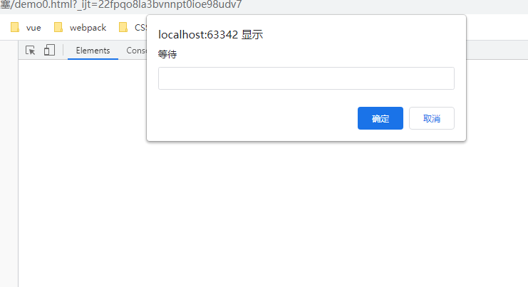
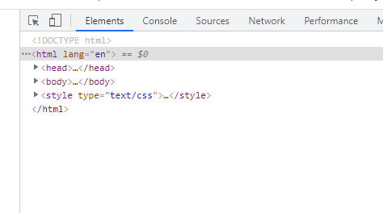
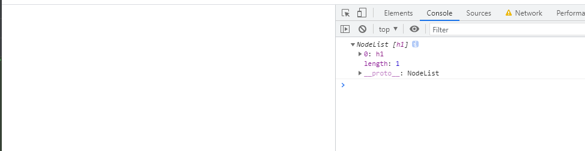
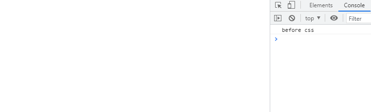

# CSS阻塞

> * [js会影响dom解析](#js会影响dom解析)
> * [css加载不会影响dom树的解析，但是会影响dom树的渲染](#css加载不会影响dom树的解析，但是会影响dom树的渲染)
> * [css加载会阻塞后面JS语句执行](#css加载会阻塞后面JS语句执行)
> * [DOMContentLoaded真的不会被css阻塞吗](#DOMContentLoaded真的不会被css阻塞吗)

## js会影响dom解析
看如下代码：
```html
<!DOCTYPE html>
<html lang="en">
<head>
  <meta charset="UTF-8">
  <title>SCRIPT 脚本影响 DOM 解析</title>
</head>
<body>
<script type="text/javascript">
  prompt('等待')
</script>
</body>
</html>
```
运行结果先弹出对话框再渲染dom：<br>


点击确定才显示dom元素：<br>


所以js会影响 DOM 解析

## css加载不会影响dom树的解析，但是会影响dom树的渲染
看如下代码：
```html
<!DOCTYPE html>
<html lang="en">
<head>
  <meta charset="UTF-8">
  <title></title>
  <style>
    h1{
      color:red!important;
    }
  </style>
  <script type="text/javascript">
    function h(){
      console.log(document.querySelectorAll('h1'))
    }
    setTimeout(h,0)// 先打印出来
  </script>
  <link href="https://cdn.bootcdn.net/ajax/libs/twitter-bootstrap/5.0.2/css/bootstrap.min.css" rel="stylesheet">
</head>
<body>
<h1>标题</h1>
</body>
</html>
```
把网速调成1kb/s，可以看到dom没显示出来，但是确能打印出dom元素：<br>


所以css加载不会影响dom树的解析，但是会影响dom树的渲染

## css加载会阻塞后面JS语句执行
看如下代码：
```html
<!DOCTYPE html>
<html lang="en">
<head>
  <meta charset="UTF-8">
  <title></title>
  <style>
    h1{
      color:red!important;
    }
  </style>
  <script type="text/javascript">
    console.log('before css')  // 只打印这个
    var startDate = new Date()
  </script>
  <link href="https://cdn.bootcdn.net/ajax/libs/twitter-bootstrap/5.0.2/css/bootstrap.min.css" rel="stylesheet">
</head>
<body>
<h1>标题</h1>
<script type="text/javascript">
  console.log('after css')  //这个没打印
  var endDate = new Date()
  console.log(endDate-startDate)
</script>
</body>
</html>
```
依旧把网速调成1kb/s，可以看到打印了'before css'：<br>


所以CSS加载会阻塞后面JS语句执行，因为后面的js可能会操作css，所以需要等待

## DOMContentLoaded真的不会被css阻塞吗
MDN上说：当初始的 HTML 文档被完全加载和解析完成之后，DOMContentLoaded 事件被触发，而无需等待样式表、
图像和子框架的完全加载。

看如下代码：
```html
<!DOCTYPE html>
<html lang="en">
<head>
  <meta charset="UTF-8">
  <title></title>
  <script type="text/javascript">
    document.addEventListener('DOMContentLoaded', function(){
      console.log('DOMContentLoaded') //1
    })
  </script>
  <link href="https://cdn.bootcdn.net/ajax/libs/twitter-bootstrap/5.0.2/css/bootstrap.min.css" rel="stylesheet">
</head>
<body>
<h1>标题</h1>
</body>
</html>
```
依旧把网速调成1kb/s，会正常打印‘DOMContentLoaded’：<br>

在body里加一段js：
```html
<!DOCTYPE html>
<html lang="en">
<head>
  <meta charset="UTF-8">
  <title></title>
  <script type="text/javascript">
    document.addEventListener('DOMContentLoaded', function(){
      console.log('DOMContentLoaded')
    })
  </script>
  <link href="https://cdn.bootcdn.net/ajax/libs/twitter-bootstrap/5.0.2/css/bootstrap.min.css" rel="stylesheet">
</head>
<body>
<h1>标题</h1>
<script>
  console.log('到我没')
</script>
</body>
</html>
```
依旧把网速调成1kb/s，控制台没有任何打印

这说明如果页面中同时存在css和js，并且存在js在css后面，DOMContentLoaded就会在加载css后执行，如果js
在css前面，则DOMContentLoaded不会等待css，也不会等待图片，资源，视频加载
