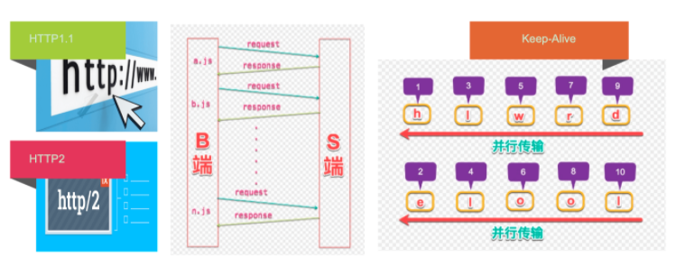

百度地图的localStorage:
key： '/mobile/simple/static/common/pkg/common_sync_js_0_2232954.js'
md5:2232954

文件的缓存
用激活的js拉取key,判断key的md5和线上的是否一致，如果一致，直接从缓存中取，不用从线上取
如果不一致，缓存过期了：
1.直接从线上加载文件
2.再次重新写入缓存，更新md5，清空原来的缓存
没有这个key，直接去线上加载文件，写入缓存

http2多路复用


测网速：navigator.connection

RTT往返时间
多普勒测速


FRS网页渲染所以性能的指标
layer border网页分层
rendering重排
paint重绘
idle空闲时间

重排和重绘的原理
网页整体的渲染过程:Layout, Paint, Composite Layers
 1.获取dom,分割成多个图层
 2.对每个图层节点进行样式计算Recalculate Style
 3.为每个节点生成对应图形和位置Layout
 4.将每个节点绘制到图层的位图中Paint
 5.图层作为纹理上传到GPU  （纹理：CPU传到GPU最小的bitmap,GPU能对它进行缩放、旋转、修改透明度等）
 6.符合多个图层在页面上生成最终的图像Composite Layers（合成层）
   1. 图层的绘制列表准备好以后，主线程会把绘制列表提交给合成线程
   2.合成线程根据视口(viewport)把图层划分为非常小的图块(tile),通常256*256或512*512
   3.合成线程把图块优先生成位图（栅格化 raster）
   4.DrawQuad提交给最终的浏览器进程
   5.浏览器viz组件将页面绘制到内存中，最终显示到屏幕上
   6.绘制一张低分辨率的图


哪些元素会生成独立层？
根元素，position,transform,半透明，css滤镜，canvas,video,overflow

哪些层GPU会参与加速？
CSS3D，Video,webgl,transform,css滤镜,will-change


引起重排：盒模式变化，读取offset，scroll,client属性， width ，height
浏览器优化:维护一个队列放所有重排重绘操作，到达一定时间或数量进行批处理，这样多次重排和重绘就变成一次
但是读取到上述属性时浏览器会立马放弃优化，重排一次

```js
const h1 = el.clientHeight; //马上进行重排
requestAnimationFrame(function(){  //或者用fastdom
//下一帧时再写
})

const h2 =   //不能保证读写放在一起
```