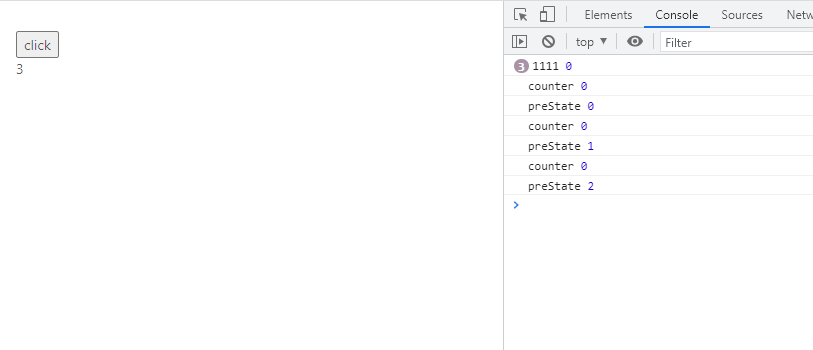

# 手写React Hook防抖和节流

## 防抖函数
当持续触发事件时，一定时间段内没有再触发事件，事件处理函数才会执行一次，如果设定的时间到来之前，又一次
触发了事件，就重新开始延时。

> 比如用户连续点击新增按钮时，只在点击结束后新增一条数据
```js
function debounce(fn, time) {
  let timeout;
  return function (args) {
    if (timeout) {
      clearTimeout(timeout);
    }
    const context = this;
    timeout = setTimeout(() => {
      fn.apply(context, args);
    }, time);
  };
}
```

带防抖的Hook:
````js
export default function () {
  const [counter, setCounter] = useState(0);

  const handleClick = useDebounce(function () {
    setCounter(counter + 1);
  }, 1000);

  return (
    <div style={{ padding: 30 }}>
      <button onClick={handleClick}>click</button>
      <div>{counter}</div>
    </div>
  );
}

function useDebounce(fn, time) {
  return debounce(fn, time);
}
````
但是注意防抖函数只能放在只执行一次的地方调用，比如类组件的constructor里，在函数式组件里debounce会执行多次，
这样timeout就每次执行的时候都会初始化，就失去了防抖函数的意义

那么就需要保证每次渲染时，绑定到组件上的函数是同一个防抖函数,就可以使用useCallback来缓存函数：
```js
function useDebounce(fn, delay) {
  return useCallback(debounce(fn, delay), [])
}

export default function() {
  const [counter, setCounter] = useState(0);

  const handleClick = useDebounce(function() {
   console.log('counter',counter)  //这里会一直打印0
    setCounter(counter + 1)
  }, 1000)

  return <div style={{ padding: 30 }}>
    <button onClick={handleClick}>click<button>
    <div>{counter}</div>
  </div>
}
```
上面函数的执行结果是counter从0变到1后就不会再改变了

原因是由于我们的useCallback依赖为空数组，所以组件初始化完成后，handleClick函数永远为初始化时的函数
快照，也就是后续组件重新渲染时不会更新handleClick，同时，handleClick持有的counter也为本次函数创建时
的快照，即永远为0,所以，哪怕防抖函数保持不变，也没法使程序正常运行。

可以使用`setCounter(preState=>preState + 1});`来避免这个问题,但不适用其他场景：
```js
function useDebounce(fn, delay) {
  return useCallback(debounce(fn, delay), []);
}

export default function () {
  const [counter, setCounter] = useState(0);

  const handleClick = useDebounce(function () {
    console.log('counter',counter)
    setCounter(preState=>{
      console.log('preState', preState)
      return preState + 1
    });
  }, 1000);

  return (
    <div style={{ padding: 30 }}>
      <button onClick={handleClick}>click</button>
      <div>{counter}</div>
    </div>
  );
}
```
打印如下:<br>
  
   

还有什么能保证数据唯一性呢？用useRef
 
上面方法的问题在于，要么没法保证防抖函数唯一，致使timeout失去效果;
要么没法保证调用函数是最新的，使调用函数失去效果，中和一下两种方法，结果就出来了：
```js
function useDebounce(fn, time,dep=[]) {
  console.log('debounce初始化');

  // 使用useRef存储保证fn和timeout的唯一性
  const {current} = useRef({fn,timeout:null})

  // 确保调用函数是最新的
  useEffect(function(){
    console.log('fn变化');
    current.fn = fn
  }, [fn])

  return useCallback(function f(args){
    if(current.timeout){
      clearTimeout(current.timeout)
    }
    const context = this;
    current.timeout = setTimeout(() => {
      current.fn.apply(context, args);
    }, time);
  },dep);
}

export default function LuckySheetDesigner(props) {
  const [counter1, setCounter1] = useState(0);

  const handleClick = useDebounce(function () {
    console.log('counter',counter1) // 0 1 2
    setCounter1(counter1 + 1);
  }, 1000);

  return (
    <div style={{ padding: 30 }}>
      <button onClick={handleClick}>click</button>
      <div>{counter1}</div>
    </div>
  );
}
```

## 节流函数
当持续触发事件时，保证一定时间段内只调用一次事件处理函数,同样节流函数只能放在只执行一次的地方调用

> 比如用户连续点击新增按钮时,在点击期间每间隔1s新增一条数据
```js
function throttle(fn, time) {
  let timeout;
  return function (...args) {
    if(!timeout) {
      fn(...args);
      timeout = setTimeout(()=>{
        timeout = null
      }, time)
    }
  };
}
```
带节流的Hook:
```js
function useThrottle(fn, time, dep = []) {
  const { current } = useRef({ fn, timeout: null });

  useEffect(() => {
    current.fn = fn;
  }, fn);

  return useCallback((...args) => {
    if (!current.timeout) {
      current.fn(...args);
      current.timeout = setTimeout(() => {
        current.timeout = null;
      }, time);
    }
  }, dep);
}

export default function () {
  const [counter, setCounter] = useState(0);

  const handleClick = useThrottle(function () {
    console.log('counter', counter);
    setCounter((preState) => {
      console.log('preState', preState);
      return preState + 1;
    });
  }, 1000);

  return (
    <div style={{ padding: 30 }}>
      <button onClick={handleClick}>click</button>
      <div>{counter}</div>
    </div>
  );
}
```