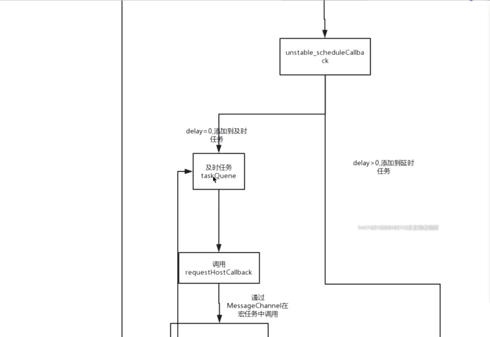

# React17源码分析

**目录**
> * [整体架构](#整体架构)
>   * [React15](#React15)
>   * [React16](#React16)
>   * [React17](#React17)
> * [Scheduler(调度器)](#Scheduler(调度器))
>   * [Fiber的结构](#Fiber的结构)
>   * [Fiber Tree](#Fiber-Tree)
>   * [调度逻辑](#调度逻辑)
> * [Reconciler(协调器)](#Reconciler(协调器))
>   * [双缓存结构](#双缓存结构)
>   * [构建Fiber Tree](#构建Fiber-Tree)
>   * [beginWork](#beginWork)
>     * [diff算法](#diff算法)
>       * [单节点diff](#单节点diff)
>       * [多节点diff](#多节点diff)
>   * [completeUnitOfWork](#completeUnitOfWork)
> * [commit阶段](#commit阶段)
>   * [commitBeforeMutationEffects(DOM操作前)](#commitbeforemutationeffectsdom操作前)
>   * [commitMutationEffects(执⾏DOM操作)](#commitmutationeffects执dom操作)
>   * [recursivelyCommitLayoutEffects(DOM操作后)](#recursivelycommitlayouteffectsdom操作后))
> * [ReactDOM.render流程](#ReactDOMrender流程)

## 整体架构
### React15


由Reconciler(协调器)、Render(渲染器)这两个机制负责Dom的更新和渲染。
* Reconciler: 本次更新中哪些节点需要更新，在相应的虚拟DOM打上标记，然后交给Render渲染器，Diff算法就
是发生在这个阶段。这里指虚拟DOM节点的更新，并不是视图层的更新
* Renderer 负责渲染更新的虚拟DOM，根据不同的内容或环境使用不同的渲染器。如渲染jsx内容使用ReactTes
t渲染器，虚拟DOM使用浏览器V8引擎或SSR渲染

渲染流程：对于当前组件需要更新内容是依次更新，Reconciler发现一个需要更新的节点后就交给Renderer渲染器渲染。
完成后Reconciler又发现下个需要更新的节点，再交给Renderer渲染器...直到此次更新内容全部完成，整个更新流程是同步执行的

**batchUpdate机制**<br>
React15默认用batchUpdate做了批处理优化，如下代码，同时执行两次setState操作，只会触发一次render更新，
但是可以用unBatchUpdate来强制更新，比如第一次执行ReactDOM.render()时，页面初始换渲染时，就不需要用
批处理，因为此时页面还是白的，希望能立刻渲染出来

```js
this.setState({
"a": ""
});
this.setState({
"b": ""
 });
```
* 在 react 的 event handler 内部同步的多次 setState 会被 batch 为一次更新
* 在一个异步的事件循环里面多次 setState，react 不会 batch

**React15架构的缺点**<br>
React15是同步更新节点，Reconciler更新一个DOM节点，Renderer更新一次视图，且通过递归的方式进行渲染，
使用的是 JS 引擎自身的函数调用栈，它会一直执行到栈空为止，因此如果是⼀个⻓任务，会导致阻塞⽤⼾后续交互，
会卡顿<br>


### React16
React16实现了自己的组件调用栈，它以链表的形式遍历组件树，可以灵活的暂停、继续和丢弃执行的任务

React16的Reconciler被称为Fiber Reconciler,Fiber其实指的是一种数据结构,为了加以区分，以前的 
Reconciler 被命名为Stack Reconciler， Fiber Reconciler利用分片的思想，把一个耗时长的任务分成很
多小片，在每个小片执行完之后每执行一段时间，都会将控制权交回给浏览器，可以分段执行：<br>


为了达到这种效果，就需要有一个调度器 (Scheduler) 来进行任务分配,因此，React16新增了Scheduler模块，
来调度任务的优先级,优先级高的任务（如键盘输入）可以打断优先级低的任务（如Diff）的执行，从而更快的生效

react⾥的优先级：
* ⽣命周期⽅法：同步执⾏
* 受控的⽤⼾输⼊：⽐如输⼊框内输⼊⽂字，同步执⾏
* 交互事件：⽐如动画，⾼优先级执⾏
* 其他：⽐如数据请求，低优先级执⾏

可以在自己的代码中手动更新优先级，在ReactDom中暴露了unstable_runWithPriority方法来更新优先级，可以
像下面这样使用：
```js
import ReactDOM from 'react-dom';
ReactDOM.unstable_runWithPriority(
  1000, // 优先级,
  () => {
    // 要做的更新
  }
)
```

### React17
React17承接了React16的Fiber架构，做了以下两个优化：
* 对优先级的扩展
为了解决react16的不⾜：<br>
1.⾼优先级IO操作会阻塞低优先级CPU操作<br>
2.只能指定⼀个优先级<br>
React17升级为从指定⼀个优先级到指定到指定⼀个连续的优先级区间，避免出现一个很高优先级但运行时间很长的
任务一直执行的情况，如果有低优先级但是在同一个优先级区间的任务，且耗时较少，就可以和该任务同批执行。

优先级区间：
```js
export const NoLanes: Lanes = /*                        */ 0b0000000000000000000000000000000;
export const NoLane: Lane = /*                          */ 0b0000000000000000000000000000000;

export const SyncLane: Lane = /*                        */ 0b0000000000000000000000000000001;
export const SyncBatchedLane: Lane = /*                 */ 0b0000000000000000000000000000010;

export const InputDiscreteHydrationLane: Lane = /*      */ 0b0000000000000000000000000000100;
const InputDiscreteLanes: Lanes = /*                    */ 0b0000000000000000000000000011000;

const InputContinuousHydrationLane: Lane = /*           */ 0b0000000000000000000000000100000;
const InputContinuousLanes: Lanes = /*                  */ 0b0000000000000000000000011000000;

export const DefaultHydrationLane: Lane = /*            */ 0b0000000000000000000000100000000;
export const DefaultLanes: Lanes = /*                   */ 0b0000000000000000000111000000000;

const TransitionHydrationLane: Lane = /*                */ 0b0000000000000000001000000000000;
const TransitionLanes: Lanes = /*                       */ 0b0000000001111111110000000000000;

const RetryLanes: Lanes = /*                            */ 0b0000011110000000000000000000000;

export const SomeRetryLane: Lanes = /*                  */ 0b0000010000000000000000000000000;

export const SelectiveHydrationLane: Lane = /*          */ 0b0000100000000000000000000000000;

const NonIdleLanes = /*                                 */ 0b0000111111111111111111111111111;

export const IdleHydrationLane: Lane = /*               */ 0b0001000000000000000000000000000;
const IdleLanes: Lanes = /*                             */ 0b0110000000000000000000000000000;

export const OffscreenLane: Lane = /*                   */ 0b1000000000000000000000000000000;
```
通过位运算的与操作、或操作来快速得到是属于哪个区间，也可以减少if else操作：
```
DefaultLanes: 0b0000000000000000000111000000000
lane:         0b0000000000000000000100000000000
DefaultLanes & lane 
DefaultLanes | lane
```
> vue编译时优化，react运行时优化

* 剥离了JSX
剥离了JSX,参考[介绍全新的 JSX 转换](https://zh-hans.reactjs.org/blog/2020/09/22/introducing-the-new-jsx-transform.html)

## Scheduler(调度器)
调度任务的优先级，高优先级任务优先进入Reconciler(performSyncWorkOnRoot)

调度器流程图(React16)：
<br>
<br>
<br>
(scheduleUpdateOnFiber是React16的scheduleWork)

### Fiber的结构
Fiber是一个包含很多属性的对象
```js
function FiberNode() {
  // Fiber对应组件的类型 Function/Class/Host
  this.tag = tag;

  // 标志这个节点的唯⼀性，dom diff时使用
  this.key = key;
  this.elementType = null;

  // 对于 FunctionComponent，指函数本⾝，对于ClassComponent，指class，对于HostComponent，指DOM节点tagName。
  this.type = null;

  // Fiber对应的真实DOM节点 <div></div>
  this.stateNode = null;

  // Fiber ⽤于连接其他Fiber节点形成Fiber树
  this.return = null; //父节点
  this.child = null; //子节点
  this.sibling = null; //兄弟节点

  // 保存本次更新造成的状态改变相关信息
  this.pendingProps = pendingProps;
  this.memoizedProps = null;
  this.updateQueue = null;
  this.memoizedState = null;
  this.dependencies = null;

  // 以前是SideEffects, 标志副作用/更新的类型:删除，新增，更改属性
  this.flags = NoFlags;
  this.subtreeFlags = NoFlags;
  this.deletions = null;

  // 调度优先级相关,以前这⾥是expirationTime.较之于优先级系统，有两个优势：
  // 1. 即较⾼优先级的IO约束任务会阻⽌较低优先级的CPU约束任务⽆法完成
  // 2. 能代表有限的⼀组的多个不同任务
  this.lanes = NoLanes;
  this.childLanes = NoLanes;
  // 指向 workInProgress Fiber，其实就是上⼀次构建的Fiber镜像。
  this.alternate = null;
}
```

### Fiber Tree
可以看到Fiber 与 Fiber之间是以链表的形式来连接的，这种结构可以⽅便中断<br>


### 调度逻辑
* 1.根据优先级区分同步任务和异步任务，同步任务⽴即同步执⾏，最快渲染出来。异步任务⾛scheduler
* 2.计算得到expirationTime，expirationTime = currentTime(当前时间) + timeout (不同优先级的时
间间隔，时间越短，优先级越⼤)
* 3.对⽐startTime和currentTime，将任务分为及时任务和延时任务。
* 4.及时任务当即执⾏
* 5.延时任务需要等到currentTime >= expirationTime的时候才会执⾏。
* 6.及时任务执⾏完后，也会去判断是否有延时任务到了该执⾏之时，如果是，就执⾏延时任务
* 7.每⼀批任务的执⾏在不同的宏任务中，不阻塞⻚⾯⽤⼾的交互

**具体代码分析：**<br>
1.根据优先级区分同步任务和异步任务，同步任务⽴即同步执⾏，最快渲染出来。异步任务⾛scheduler
```js
export const NoContext = /*             */ 0b0000000;
const BatchedContext = /*               */ 0b0000001;
const EventContext = /*                 */ 0b0000010;
const DiscreteEventContext = /*         */ 0b0000100;
const LegacyUnbatchedContext = /*       */ 0b0001000;
const RenderContext = /*                */ 0b0010000;
const CommitContext = /*                */ 0b0100000;
```
```js
export function scheduleUpdateOnFiber(fiber, lane, eventTime) {
  //...
  // 获得当前更新的优先级
  const priorityLevel = getCurrentPriorityLevel();
  // 同步任务，⽴即更新(React16的判断为expiration === Sync)
  if (lane === SyncLane) {
    if (
      // 处于unbatchedUpdates， 且不在Renderer渲染阶段， ⽴即执⾏
      // Check if we're inside unbatchedUpdates
      // executionContext: 执⾏上下⽂,执行时动态赋值
      // LegacyUnbatchedContext: 非批处理
      (executionContext & LegacyUnbatchedContext) !== NoContext &&

      // Check if we're not already rendering
      // CommitContext: 表⽰渲染到⻚⾯的那个逻辑
      (executionContext & (RenderContext | CommitContext)) === NoContext
    ) {
      // Register pending interactions on the root to avoid losing traced
      //interaction data.
      schedulePendingInteractions(root, lane);
      // This is a legacy edge case. The initial mount of a ReactDOM.render-ed
      // root inside of batchedUpdates should be synchronous, but layout updates
      // should be deferred until the end of the batch.
      performSyncWorkOnRoot(root); //立即执行
    } else {
      // ...
      // 包含异步调度逻辑，和中断逻辑
      ensureRootIsScheduled(root, eventTime);
    }
  } else {
    //...
    // Schedule other updates after in case the callback is sync.
    ensureRootIsScheduled(root, eventTime);
    schedulePendingInteractions(root, lane);
  }
  //mostRecentlyUpdatedRoot = root;
}

function ensureRootIsScheduled(root, currentTime) {
  // root.callbackNode的存活周期是从ensureRootIsScheduled开始——>到commitRootImpl截⽌
// A: ensureRootIsScheduled root.callbackNode已被赋值
// B: ensureRootIsScheduled existingCallbackNode = root.callbackNode 已经存在
  const existingCallbackNode = root.callbackNode;

  // 检查是否存在现有任务。 我们也许可以重⽤它。
  // Check if there's an existing task. We may be able to reuse it.
  if (existingCallbackNode !== null) {
    const existingCallbackPriority = root.callbackPriority;

    // 优先级没有改变。 我们可以重⽤现有任务, 现有任务的优先级和下⼀个任务的优先级相同。
    // ⽐如input连续的输⼊，优先级相同，可以执⾏⽤之前的任务
    // 由于获取更新是从root开始，往下找到在这个优先级内的所有update.
    // ⽐如存在连续的setState，会执⾏这个逻辑，不会新建⼀个新的update
    // this.setState({
    // "a": ""
    // });
    // this.setState({
    // "b": ""
    // });
    // 不需要重新发起⼀个调度，⽤之前那个就可以了（React16这块判断优先级的逻辑不在这里）
    if (existingCallbackPriority === newCallbackPriority) {
      // The priority hasn't changed. We can reuse the existing task. Exit.
      return;
    }
    // React16是判断优先级的⾼低，React17是判断优先级是否相同,用lane
    // 优先级变了，先cancel掉，后续重新发起⼀个
    // 用意是把cancel掉的任务和其他相同优先级的任务合并，再一起执行
    // The priority changed. Cancel the existing callback. We'll schedule a new
    // one below.
    cancelCallback(existingCallbackNode);
  }
  // Schedule a new callback.
  // 发起⼀个新callBack
  let newCallbackNode;
  // ...
  newCallbackNode = scheduleCallback(
    schedulerPriorityLevel,
    performConcurrentWorkOnRoot.bind(null, root)
  );
  root.callbackPriority = newCallbackPriority;
  // root.callbackNode的存活周期是从ensureRootIsScheduled开始——>到commitRootImpl截⽌
  root.callbackNode = newCallbackNode;
}
```

2.计算得到expirationTime，expirationTime = currentTime(当前时间) + timeout (不同优先级的时
间间隔，时间越短，优先级越⼤)<br>
```js
var currentTime = getCurrentTime();
// 得到startTime, 根据优先级的不同分别加上不同的间隔时间，构成expirationTime；
// 当expirationTime越接近真实的时间，优先级越⾼
// 根据startTime 是否⼤于当前的currentTime，将任务分为了及时任务和延时任务。延时任务还不
// 会⽴即执⾏，它会在currentTime接近startTime的时候，才会执⾏
var startTime;
if (typeof options === "object" && options !== null) {
  var delay = options.delay;
  if (typeof delay === "number" && delay > 0) {  //延时任务，该任务在delay时间后执行
    startTime = currentTime + delay;
  } else {
    startTime = currentTime;  //及时任务
  }
} else {
  startTime = currentTime;  //及时任务
}

var timeout;
// 根据优先级增加不同的时间间隔
switch (priorityLevel) {
  case ImmediatePriority:  //立即执行，优先级最高
    timeout = IMMEDIATE_PRIORITY_TIMEOUT;  // -1，加上它比当前时间还小
    break;
  case UserBlockingPriority:
    timeout = USER_BLOCKING_PRIORITY_TIMEOUT;
    break;
  case IdlePriority:
    timeout = IDLE_PRIORITY_TIMEOUT;
    break;
  case LowPriority:
    timeout = LOW_PRIORITY_TIMEOUT;
    break;
  case NormalPriority:
  default:
    timeout = NORMAL_PRIORITY_TIMEOUT;
    break;
}
var expirationTime = startTime + timeout;  //过期时间
```
**优先级**
* Immediate (-1) - 这个优先级的任务会同步执⾏, 或者说要⻢上执⾏且不能中断
& UserBlocking (250ms) 这些任务⼀般是⽤户交互的结果, 需要即时得到反馈
* Normal (5s) 应对哪些不需要⽴即感受到的任务，例如⽹络请求
* Low (10s) 这些任务可以放后，但是最终应该得到执⾏. 例如分析通知
* Idle (没有超时时间) ⼀些没有必要做的任务 (e.g. ⽐如隐藏的内容), 可能会被饿死
```js
// Times out immediately
var IMMEDIATE_PRIORITY_TIMEOUT = -1;
// Eventually times out
var USER_BLOCKING_PRIORITY_TIMEOUT = 250;
var NORMAL_PRIORITY_TIMEOUT = 5000;
var LOW_PRIORITY_TIMEOUT = 10000;
// Never times out
var IDLE_PRIORITY_TIMEOUT = maxSigned31BitInt;
```

3.对⽐startTime和currentTime，将任务分为及时任务和延时任务<br>
```js
if (startTime > currentTime) {
  push(timerQueue, newTask);
  // 当没有及时任务的时候
  // Schedule a timeout.
  // 在间隔时间之后，调⽤⼀个handleTimeout，主要作⽤是把timerQueue的任务加到
  // taskQueue队列⾥来，然后调⽤requestHostCallback

  // 执⾏那个延时任务
  // setTimeOut(handleTimeout, startTime - currentTime)
  requestHostTimeout(handleTimeout, startTime - currentTime);
} else {
  push(taskQueue, newTask);
  // Schedule a host callback, if needed. If we're already performing work,
  // wait until the next time we yield.
  if (!isHostCallbackScheduled && !isPerformingWork) {
    isHostCallbackScheduled = true;
    // 这⾥会调度及时任务
    requestHostCallback(flushWork);
  }
}
return newTask;
}
```

4.及时任务当即执⾏,但是为了不阻塞⻚⾯的交互，因此在宏任务中执⾏
```js
// 模拟任务调度流程：
// 一.第⼀次调⽤ scheduleCallback
// 1. 把任务放在timeQueue 不会⽴即执⾏,等待
// 二.第⼆次调⽤ scheduleCallback
// 1. 把任务放在TaskQuene
// 2. 执⾏new MessageChannel() 的 port.postMessage。如果主线程还有任务，那就还不
//    会到performWorkUntilDeadline。
// 三.第三次调⽤ scheduleCallback
// 1. 把任务放在TaskQuene
// 2. 执⾏new MessageChannel() 的 port.postMessage
// 四. 主线程没有任务
// 五. 执⾏微任务列表
// 六. 执⾏宏任务列表
// 七. 执⾏第⼆次调⽤发起的performWorkUntilDeadline
// 八. performWorkUntilDeadline 去取得TaskQuene中的任务，发起 PerformanceSyncWorkOnRoot
// 九. 判断TimeQueue中是否有到期的任务，如果有就加到TaskQuene来
// 十. 主线程
// 十一. 微任务
// 十二. 下⼀个宏任务，执⾏第三次调⽤发起的performWorkUntilDeadline（两个宏任务之间间隔主线程、微任务调用）

const channel = new MessageChannel();  //创建一个消息通道，并可以通过port1和port2两个通道发送数据
const port = channel.port2;
channel.port1.onmessage = performWorkUntilDeadline; //workLoop 
// 在MessageChannel宏任务⾥执⾏真正的调度逻辑，等主线程执行完了再来执行，可以保证任务与任务之间不是连续执⾏的，这样就
// 不会因为要⼀次性执⾏的任务多⽽阻塞⽤⼾的操作
requestHostCallback = function (callback) {
  scheduledHostCallback = callback;
  if (!isMessageLoopRunning) {
    isMessageLoopRunning = true;
    port.postMessage(null);  //在宏任务中调用performWorkUntilDeadline，也可用setTimeout来进入宏任务
    // setTimeout(() => {
    // 进⼊宏任务
    // }, 0)
  }
};
```

附一段MessageChannel使用的使用方法：<br>


5.延时任务需要等到currentTime >= expirationTime的时候才会执⾏。每次调度及时任务的时候，
  都会去判断延时任务的执⾏时间是否到了，如果判断为true，则添加到及时任务中来。
```js
function advanceTimers(currentTime) {
  // Check for tasks that are no longer delayed and add them to the queue.
  let timer = peek(timerQueue);
  while (timer !== null) {
    if (timer.callback === null) {
      // Timer was cancelled.
      pop(timerQueue);
    } else if (timer.startTime <= currentTime) {
      // Timer fired. Transfer to the task queue.
      pop(timerQueue);
      timer.sortIndex = timer.expirationTime;
      // 把timerQueue中的添加到taskQueue中来
      push(taskQueue, timer);
      if (enableProfiling) {
        markTaskStart(timer, currentTime);
        timer.isQueued = true;
      }
    } else {
      // Remaining timers are pending.
      return;
    }
    timer = peek(timerQueue);
  }
}
```

## Reconciler(协调器)
Reconciler的主要作⽤是负责找出变化的组件，这个阶段可以被打断。

在react16以上，为了⽅便打断，数据结构⼏乎都是链表的格式，会做dom-diff，也会把dom元素⽣成，
但是并不会渲染到⻚⾯，⽽是先打上⼀个标记，等在下⼀个commit阶段才会真正的渲染到⻚⾯，commit阶段不能被打
断，因为渲染到dom是昂贵的。

找出变化的组件：<br>
react发⽣⼀次更新的时候，⽐如ReactDOM.render/setState，都会从Fiber Root开始从上往下遍历,
然后逐⼀找到变化的节点。构建完成会形成⼀颗Fiber Tree。<br>

协调器流程图：<br>
<br>
<br>

### 双缓存结构
在 React 中最多会同时存在两棵 Fiber树 。当前屏幕上显⽰内容对应的 Fiber树 称为 current
Fiber树 ，正在内存中构建的 Fiber树 称为 workInProgress Fiber树 。

current Fiber树 中的 Fiber节点 被称为 current fiber ， workInProgress Fiber树
中的 Fiber节点 被称为 workInProgress fiber ，他们通过 alternate 属性连接。

如果之前没有Fiber Tree就逐级创建Fiber Tree；如果存在Fiber Tree，会构建⼀个WorkInProgress
Tree, 这个tree的Fiber节点可以复⽤Current Tree上没有发⽣变化的节点数据。


为什么是双缓存结构？
* 可以很快的找到之前对应的Fiber
* 在某些情况下可以直接复⽤fiber
* 更新完毕后 current直接指向workInProgress root，完成了Fiber tree的更新

### 构建Fiber Tree
```
return (
  <div>
    i am
    <span>KaSong</span>
  </div>
);
```
这段代码的FiberTree如下：<br>


Reconciler的代码大致从rendererRootSync函数开始，从优先级最高的Fiber Root开始递归
```js
function workLoopSync() {
   // Already timed out, so perform work without checking if we need to yield.
   // 开始用一个循环构建一棵树
   // workInProgress:指的是当前正在处理的节点
   while (workInProgress !== null) {
    performUnitOfWork(workInProgress);
     // if (next === null) {   //双层循环构建fiber tree
          // If this doesn't spawn new work, complete the current work.
     //   completeUnitOfWork(unitOfWork);
     //     do{
     //       sibliing存在的时候， return
     //       xxx
     //   } while (completedWork !== null);
     //  }
  }
}

function performUnitOfWork(unitOfWork: Fiber): void {
  // The current, flushed, state of this fiber is the alternate. Ideally
  // nothing should rely on this, but relying on it here means that we don't
  // need an additional field on the work in progress.
  const current = unitOfWork.alternate;
  // ...
  // 会创建⼀个Fiber节点，赋值给workInProgress.child
  // 注意，此处暂时还没处理sibilig Fiber，
  // beginWork(current, unitOfWork, subtreeRenderLanes)会返回workInProgress.child;
  // 即 next = workInProgress.child
  next = beginWork(current, unitOfWork, subtreeRenderLanes);
  // ...
  unitOfWork.memoizedProps = unitOfWork.pendingProps;
  if (next === null) {
    // 没有next节点(子节点)， 在completeUnitOfWork中处理sibling节点(兄弟节点)
    // 即先beginWork深度遍历，再completeUnitOfWork广度遍历
    // If this doesn't spawn new work, complete the current work.
    completeUnitOfWork(unitOfWork);
  } else {
    workInProgress = next;  //指向下一个节点
  }
  ReactCurrentOwner.current = null;
}
```
在beginWork函数⾥：只创建了这副图中的App， div， i am 3个Fiber。当没有⼦节点时，进⼊到
completeUnitOfWork⾥执⾏，执⾏completeUnitOfWork后如果存在兄弟Fiber节点，就从兄弟Fiber
节点这⾥接着执⾏BeginWork.执⾏完了，⼜接着执⾏completeUnitOfWork。这就是Fiber Tree构建
的整体流程。

### beginWork
* 1.判断Fiber 节点是否可以复⽤，能够复用的话打上didReceiveUpdate为true的tag
* 2.根据不同的Tag，⽣成不同的Fiber节点（调⽤reconcileChildren）
    * a.Mount 阶段：创建Fiber 节点
    * b.Update阶段 和现在的Fiber节点做对⽐，⽣成新的Fiber节点
        * 单节点Diff
        * 多节点Diff
* 3.给存在变更的Fiber节点打上标记 newFiber.flags = Placement|Update|Deletion|...
* 4.创建的Fiber节点赋给WorkInProgress.child,返回WorkInProgress.child. 继续下⼀次的循环
```js
function beginWork(
  current: Fiber | null,
  workInProgress: Fiber,
  renderLanes: Lanes
): Fiber | null {
  const updateLanes = workInProgress.lanes;
  // current tree 存在，不是初次构建；第一次渲染页面时，curren为Null
  // 在这里根据curren值打上didReceiveUpdate标记，是否需要更新
  if (current !== null) {
    const oldProps = current.memoizedProps;
    const newProps = workInProgress.pendingProps;
    if (oldProps !== newProps || hasLegacyContextChanged()) {
      // If props or context changed, mark the fiber as having performed work.
      // This may be unset if the props are determined to be equal later (memo).
      // props变了，需要更新
      didReceiveUpdate = true;  
    } else if (!includesSomeLane(renderLanes, updateLanes)) {
      // 更新的优先级和current tree的优先级是否有⼀致的，不⼀致才触发bailout，表示不需要更新，
      // 可以缓存这个fiber,放入堆栈以便复用
      didReceiveUpdate = false;
      // This fiber does not have any pending work. Bailout without entering
      // the begin phase. There's still some bookkeeping we that needs to be done
      // in this optimized path, mostly pushing stuff onto the stack.
      //...
      // 例子1：
      //   const extra = <div> extra </div>;
      //   render() => {
      //     return (
      //       <div>
      //         i'm
      //         {this.extra}   //这样使用，是使用变量，不需要更新，且可以下次复用复用
      //       </div>
      //   )}
      // 例子2：
      //    function Extra(){
      //       return <div> extra </div>;
      //    }
      //   render() => {
      //     return (
      //       <div>
      //         i'm
      //         <Extra/>   //这样使用，是调用React.createElement方法，会创建一个新的对象，就不是走这个分支条件
      //       </div>
      //   )}
      return bailoutOnAlreadyFinishedWork(current, workInProgress, renderLanes);
    } else {
      if ((current.flags & ForceUpdateForLegacySuspense) !== NoFlags) {
        // This is a special case that only exists for legacy mode.
        // See https://github.com/facebook/react/pull/19216.
        didReceiveUpdate = true;
      } else {
        // An update was scheduled on this fiber, but there are no new props
        // nor legacy context. Set this to false. If an update queue or context
        // consumer produces a changed value, it will set this to true. Otherwise,
        // the component will assume the children have not changed and bail out.
        didReceiveUpdate = false;
      }
    }
  } else {
    didReceiveUpdate = false;
  }
  // Before entering the begin phase, clear pending update priority.
  // TODO: This assumes that we're about to evaluate the component and process
  // the update queue. However, there's an exception: SimpleMemoComponent
  // sometimes bails out later in the begin phase. This indicates that we should
  // move this assignment out of the common path and into each branch.
  workInProgress.lanes = NoLanes; 
  // 根据不同的Tag，⽣成不同的Fiber节点
  switch (workInProgress.tag) {
    case IndeterminateComponent:
    //...
    case LazyComponent:
    //...
    // 这里着重看函数式组件和类组件
    // 函数式组件
    case FunctionComponent:
      const Component = workInProgress.type;
      const unresolvedProps = workInProgress.pendingProps;
      const resolvedProps =
        workInProgress.elementType === Component
          ? unresolvedProps
          : resolveDefaultProps(Component, unresolvedProps);
      // 1. 调⽤renderWithHooks⽅法，注⼊hooks上下⽂, 执⾏function函数体
      // 2. 判断节点是否可以复⽤，能复⽤则调bailoutHooks⽅法复⽤节点
      // 3. 设置flags
      // 4. 调⽤ reconcileChildren，得到⼦Fiber
      return updateFunctionComponent(
        current,
        workInProgress,
        Component,
        resolvedProps,
        renderLanes
      );
    // 类组件
    case ClassComponent: {
      const Component = workInProgress.type;
      const unresolvedProps = workInProgress.pendingProps;
      const resolvedProps =
        workInProgress.elementType === Component
          ? unresolvedProps
          : resolveDefaultProps(Component, unresolvedProps);
      // 执⾏render()等⽣命周期，调用reconcileChildren
      return updateClassComponent(
        current,
        workInProgress,
        Component,
        resolvedProps,
        renderLanes
      );
    }
    // ReactDOM.render(<App />)会走到这里
    case HostRoot:
      // 会调到reconcileChildren，
      return updateHostRoot(current, workInProgress, renderLanes);
  }
  // ...
  function updateClassComponent(
    current: Fiber | null,
    workInProgress: Fiber,
    Component: any,
    nextProps: any,
    renderLanes: Lanes,
  ) {
    // Push context providers early to prevent context stack mismatches.
    // During mounting we don't know the child context yet as the instance doesn't exist.
    // We will invalidate the child context in finishClassComponent() right after rendering.
    // 检测有没有context，context可以跨组件传递数据。
    let hasContext;
    if (isLegacyContextProvider(Component)) {
      hasContext = true;
      pushLegacyContextProvider(workInProgress);
    } else {
      hasContext = false;
    }
    prepareToReadContext(workInProgress, renderLanes);
  
    // stateNode 里存储的是真正的Dom元素，如果有则不是第一次执行
    const instance = workInProgress.stateNode;
    let shouldUpdate;
    // 第一次执行，执行contructor
    if (instance === null) {
      if (current !== null) {
        // 这个节点之前从未存在过，flags设置为Placement，也就是新增
        // A class component without an instance only mounts if it suspended
        // inside a non-concurrent tree, in an inconsistent state. We want to
        // treat it like a new mount, even though an empty version of it already
        // committed. Disconnect the alternate pointers.
        current.alternate = null;
        workInProgress.alternate = null;
        // Since this is conceptually a new fiber, schedule a Placement effect
        workInProgress.flags |= Placement;
      }
      // In the initial pass we might need to construct the instance.
      // 执行constructor 生命周期
      // class A extends Component {
      //   constructor(){
      //   }
      // }
      constructClassInstance(workInProgress, Component, nextProps);
      // 1. 调用getDerivedStateFromProps
      // 2. 调用UNSAFE_componentWillMount
      mountClassInstance(workInProgress, Component, nextProps, renderLanes);
      shouldUpdate = true;
    } else if (current === null) {
      // 不是第一次执行但current === null，走特殊的复用方式
      // In a resume, we'll already have an instance we can reuse.
      // 会执行willMount，shouldComponentUpdate等等生命周期
      shouldUpdate = resumeMountClassInstance(
        workInProgress,
        Component,
        nextProps,
        renderLanes,
      );
    } else {
      // 不是第一次执行但current !== null, 更新阶段
      // 执行下面的生命周期
      // 1.执行componentWillReceiveProps。父级传递的props变化了，componentWillReceiveProps会执行
      // 2.如果componentDidUpdate存在，打上Flags： （因为这个生命周期要在dom渲染完毕后执行，所以先打上标记，不执行）
      //        `workInProgress.flags |= Update  //按位或，打上update标记`
      // 3.执行getDerivedStateFromProps，每次都会执行
      // 4.执行shouldComponentUpdate：shouldUpdate为true，子组件才会更新，才会执行componentWillUpdate生命周期
      // 5.执行componentWillUpdate
      shouldUpdate = updateClassInstance(
        current,
        workInProgress,
        Component,
        nextProps,
        renderLanes,
      );
    }
    // 执行 render() 生命周期。子Fiber从Render得来
    const nextUnitOfWork = finishClassComponent(
      current,
      workInProgress,
      Component,
      shouldUpdate,
      hasContext,
      renderLanes,
    );
    return nextUnitOfWork;
  }
}

// 真正做dom diff的地方，上面所有不同类型的fiber节点，处理完自己的逻辑最后都会进入这里，做diff
export function reconcileChildren(
  current: Fiber | null,
  workInProgress: Fiber,
  nextChildren: any,
  renderLanes: Lanes
) {
  if (current === null) {
    // If this is a fresh new component that hasn't been rendered yet, we
    // won't update its child set by applying minimal side-effects. Instead,
    // we will add them all to the child before it gets rendered. That means
    // we can optimize this reconciliation pass by not tracking side-effects.
    // Mount阶段，创建Fiber节点
    workInProgress.child = mountChildFibers(
      workInProgress,
      null,
      nextChildren,
      renderLanes
    );
  } else {
    // If the current child is the same as the work in progress, it means that
    // we haven't yet started any work on these children. Therefore, we use
    // the clone algorithm to create a copy of all the current children.
    // If we had any progressed work already, that is invalid at this point so
    // let's throw it out.
    // Update阶段，diff后更新Fiber节点，返回更新后的新节点
    workInProgress.child = reconcileChildFibers(
      workInProgress,
      current.child,
      nextChildren,
      renderLanes
    );
  }
}

// reconcileChildFibers⾥会判断变更的类型是什么？⽐如有新增，删除，更新等类型。每⼀种类型
// 的变更，调⽤不同的⽅法，赋予flags⼀个值.
// 在commit阶段，会直接根据flags来做dom操作。
function placeSingleChild(newFiber: Fiber): Fiber {
  // This is simpler for the single child case. We only need to do a
  // placement for inserting new children.
  if (shouldTrackSideEffects && newFiber.alternate === null) {
    newFiber.flags = Placement;  //Placement表示新增
  }
  return newFiber;
}
```
有以下几种类型：
```js
// You can change the rest (and add more).
export const Placement = /*                    */ 0b000000000000000010;
export const Update = /*                       */ 0b000000000000000100;
export const PlacementAndUpdate = /*           */ 0b000000000000000110;
export const Deletion = /*                     */ 0b000000000000001000;
export const ContentReset = /*                 */ 0b000000000000010000;
export const Callback = /*                     */ 0b000000000000100000;
export const DidCapture = /*                   */ 0b000000000001000000;
export const Ref = /*                          */ 0b000000000010000000;
export const Snapshot = /*                     */ 0b000000000100000000;
export const Passive = /*                      */ 0b000000001000000000;
```

#### diff算法
React Diff 会预设⼏个规则（React15到React17 dom diff大体一致）：
* 1.只对同级节点，进⾏⽐较(双缓存可以瞬间找到同级节点)
* 2.节点变化，直接删除，然后重建
* 3.存在key值，对⽐key值⼀样的节点
```js
// 代码在ReactChildFiber.new.js 下 reconcileChildFibers函数
// 判断节点是不是react 节点
// Handle object types
const isObject = typeof newChild === "object" && newChild !== null;  //是对象走单节点diff
if (isObject) {
  // 根据不同的类型，处理不同的节点对⽐
  switch (newChild.$$typeof) {
    case REACT_ELEMENT_TYPE:
      return placeSingleChild(
        reconcileSingleElement(returnFiber, currentFirstChild, newChild, lanes)
      );
    //...
  }
}
if (typeof newChild === "string" || typeof newChild === "number") {  //是string或number走单节点diff
  return placeSingleChild(
    reconcileSingleTextNode(
      returnFiber,
      currentFirstChild,
      "" + newChild,
      lanes
    )
  );
}
// 数组走多节点diff
if (isArray(newChild)) {
  return reconcileChildrenArray(
    returnFiber,
    currentFirstChild,
    newChild,
    lanes
  );
}
```

##### 单节点diff
* 1.判断存在对应节点，key值是否相同，节点类型⼀致，可以复⽤
* 2.存在对应节点，key值是否相同，节点类型不⼀致，标记删除
* 3.存在对应节点，key值不同，标记删除
* 4.不存在对应节点，创建新节点
```js
function reconcileSingleElement(
  returnFiber: Fiber,
  currentFirstChild: Fiber | null,
  element: ReactElement,
  lanes: Lanes
): Fiber {
  const key = element.key;
  let child = currentFirstChild;
  // 是否存在对应节点
  while (child !== null) {
    // ⽐较key是否相同
    if (child.key === key) {
      switch (child.tag) {
        default: {
          // 节点类型⼀致，可以复⽤节点
          if (child.elementType === element.type) {
            deleteRemainingChildren(returnFiber, child.sibling);
            const existing = useFiber(child, element.props);
            existing.ref = coerceRef(returnFiber, child, element);
            existing.return = returnFiber;
            return existing;
          }
          break;
        }
      }
      // div变成p
      // 节点类型不⼀致，标记为删除
      // Didn't match.
      deleteRemainingChildren(returnFiber, child);
      break;
    } else {
      // key不同，将该fiber标记为删除
      deleteChild(returnFiber, child);
    }
    child = child.sibling;
  }
  // 不存在对应节点，创建
  const created = createFiberFromElement(element, returnFiber.mode, lanes);
  created.ref = coerceRef(returnFiber, currentFirstChild, element);
  created.return = returnFiber;
  return created;
}
```

##### 多节点diff
* 1. 对⽐新旧children相同index的对象的key是否相等, 如果是，返回该对象，如果不是，返回null
* 2. key值不等，不⽤对⽐下去了，节点不能复⽤，跳出
* 3. 判断节点是否存在移动，存在则返回新位置
* 4. 可能存在新的数组⼩于⽼数组的情况，即⽼数组后⾯有剩余的，所以要删除老数组后面剩余的
* 5. 新数组存在新增的节点，创建新阶段
* 6. 创建⼀个existingChildren代表所有剩余没有匹配掉的节点，然后新的数组根据key从这个 map
⾥⾯查找，如果有则复⽤，没有则新建
```js
function reconcileChildrenArray(
  returnFiber: Fiber,
  currentFirstChild: Fiber | null,
  newChildren: Array<*>,
  lanes: Lanes
): Fiber | null {
  let resultingFirstChild: Fiber | null = null;
  let previousNewFiber: Fiber | null = null;
  let oldFiber = currentFirstChild;
  let lastPlacedIndex = 0;
  let newIdx = 0;
  let nextOldFiber = null;
  for (; oldFiber !== null && newIdx < newChildren.length; newIdx++) {
    // oldIndex ⼤于 newIndex，那么需要旧的 fiber 等待新的 fiber，⼀直等到位置相同
    if (oldFiber.index > newIdx) {
      nextOldFiber = oldFiber;
      oldFiber = null;
    } else {
      nextOldFiber = oldFiber.sibling;
    }
    // 对⽐新旧children相同index的对象的key是否相等, 如果是，返回该对象，如果不是，返回null
    const newFiber = updateSlot(
      returnFiber,
      oldFiber,
      newChildren[newIdx],
      lanes
    );
    // key值不等，不⽤对⽐下去了，节点不能复⽤，跳出
    if (newFiber === null) {
      if (oldFiber === null) {
        oldFiber = nextOldFiber;
      }
      break;
    }
    // 判断节点是否存在移动，存在则返回新位置
    lastPlacedIndex = placeChild(newFiber, lastPlacedIndex, newIdx);
    oldFiber = nextOldFiber;
  }
  // 第⼀个循环完毕
  // newIdx === newChildren.length 说明上个循环中途没有跳出的情况
  // 新的数组遍历完
  // 但可能存在新的数组个数⼩于⽼数组的情况，即⽼数组后⾯有剩余的，所以要删除
  if (newIdx === newChildren.length) {
    // We've reached the end of the new children. We can delete the rest.
    deleteRemainingChildren(returnFiber, oldFiber);
    return resultingFirstChild;
  }
  // oldFiber === null 说明数组中所有的都可以复⽤，新的数组之后的节点全部重新创建
  if (oldFiber === null) {
    // 新数组存在新增的节点，创建新节点
    for (; newIdx < newChildren.length; newIdx++) {
      const newFiber = createChild(returnFiber, newChildren[newIdx], lanes);
      if (newFiber === null) {
        continue;
      }
      // 添加到sibiling62 lastPlacedIndex = placeChild(newFiber, lastPlacedIndex, newIdx);
    }
    return resultingFirstChild;
  }
  // 创建⼀个existingChildren代表所有剩余没有匹配掉的节点，然后新的数组根据key从这个
  //map ⾥⾯查找，如果有则复⽤，没有则新建
  const existingChildren = mapRemainingChildren(returnFiber, oldFiber);
  // Keep scanning and use the map to restore deleted items as moves.
  for (; newIdx < newChildren.length; newIdx++) {
    // 对⽐是否还有可以复⽤的
    const newFiber = updateFromMap(
      existingChildren,
      returnFiber,
      newIdx,
      newChildren[newIdx],
      lanes
    );
    if (newFiber !== null) {
      // 判断节点是否存在移动，存在则返回新位置
      lastPlacedIndex = placeChild(newFiber, lastPlacedIndex, newIdx);
    }
  }
  return resultingFirstChild;
}
```

### completeUnitOfWork
流程：
*  1. 向上递归completedWork
*  2. 创建DOM节点，更新Dom节点，Dom节点赋值给stateNode属性
*  3. 把子节点的side Effect附加到父节点的sideEffect链之上，在commit节点使用
*  4. 存在兄弟节点，将workInProgress指向兄弟节点，并return,执行兄弟节点的beginWork过程
*  5. 不存在兄弟节点，返回父节点。继续执行父节点的completeUnitOfWork<br>
即构建整个Fiber Tree处于2重循环中的
```js
function completeUnitOfWork(unitOfWork: Fiber): void {
  // Attempt to complete the current unit of work, then move to the next
  // sibling. If there are no more siblings, return to the parent fiber.
  let completedWork = unitOfWork;
  do {
    // The current, flushed, state of this fiber is the alternate. Ideally
    // nothing should rely on this, but relying on it here means that we don't
    // need an additional field on the work in progress.
    const current = completedWork.alternate;
    const returnFiber = completedWork.return;

    // Check if the work completed or if something threw.
    if ((completedWork.flags & Incomplete) === NoFlags) {
      setCurrentDebugFiberInDEV(completedWork);
      let next;
      if (
        !enableProfilerTimer ||
        (completedWork.mode & ProfileMode) === NoMode
      ) {
        // 1. Mount时，创建DOM节点，将子孙DOM节点插入刚生成的DOM节点中，DOM节点赋值给stateNode保存备用
        // 2. Update时，由于DOM节点已经创建过，只需要更新一些属性
        next = completeWork(current, completedWork, subtreeRenderLanes);
      } else {
        startProfilerTimer(completedWork);
        next = completeWork(current, completedWork, subtreeRenderLanes);
        // Update render duration assuming we didn't error.
        stopProfilerTimerIfRunningAndRecordDelta(completedWork, false);
      }
      resetCurrentDebugFiberInDEV();

      if (next !== null) {
        // Completing this fiber spawned new work. Work on that next.
        // 完成这种Fiber催生了新的工作
        workInProgress = next;
        return;
      }

      resetChildLanes(completedWork);

      if (
        returnFiber !== null &&
        // Do not append effects to parents if a sibling failed to complete
        (returnFiber.flags & Incomplete) === NoFlags
      ) {
        // Append all the effects of the subtree and this fiber onto the effect
        // list of the parent. The completion order of the children affects the
        // side-effect order.
        if (returnFiber.firstEffect === null) {
          returnFiber.firstEffect = completedWork.firstEffect;
        }
        if (completedWork.lastEffect !== null) {
          if (returnFiber.lastEffect !== null) {
            // 把当前子节点的副作用添加到父节点的副作用链的最后一个
            returnFiber.lastEffect.nextEffect = completedWork.firstEffect;
          }
          // 把子节点的副作用添加到父节点的副作用链上
          // 这样一直向上传递就会把完整的副作用链挂到根节点上
          returnFiber.lastEffect = completedWork.lastEffect;
        }
 
        // If this fiber had side-effects, we append it AFTER the children's
        // side-effects. We can perform certain side-effects earlier if needed,
        // by doing multiple passes over the effect list. We don't want to
        // schedule our own side-effect on our own list because if end up
        // reusing children we'll schedule this effect onto itself since we're
        // at the end.
        const flags = completedWork.flags;

        // Skip both NoWork and PerformedWork tags when creating the effect
        // list. PerformedWork effect is read by React DevTools but shouldn't be
        // committed.
        if (flags > PerformedWork) {
          if (returnFiber.lastEffect !== null) {
            returnFiber.lastEffect.nextEffect = completedWork;
          } else {
            returnFiber.firstEffect = completedWork;
          }
          returnFiber.lastEffect = completedWork;
        }
      }
    } else {
      // This fiber did not complete because something threw. Pop values off
      // the stack without entering the complete phase. If this is a boundary,
      // capture values if possible.
      const next = unwindWork(completedWork, subtreeRenderLanes);

      // Because this fiber did not complete, don't reset its expiration time.

      if (next !== null) {
        // If completing this work spawned new work, do that next. We'll come
        // back here again.
        // Since we're restarting, remove anything that is not a host effect
        // from the effect tag.
        next.flags &= HostEffectMask;
        workInProgress = next;
        return;
      }

      if (
        enableProfilerTimer &&
        (completedWork.mode & ProfileMode) !== NoMode
      ) {
        // Record the render duration for the fiber that errored.
        stopProfilerTimerIfRunningAndRecordDelta(completedWork, false);

        // Include the time spent working on failed children before continuing.
        let actualDuration = completedWork.actualDuration;
        let child = completedWork.child;
        while (child !== null) {
          actualDuration += child.actualDuration;
          child = child.sibling;
        }
        completedWork.actualDuration = actualDuration;
      }

      if (returnFiber !== null) {
        // Mark the parent fiber as incomplete and clear its effect list.
        returnFiber.firstEffect = returnFiber.lastEffect = null;
        returnFiber.flags |= Incomplete;
      }
    }

    // 存在兄弟节点，将workInProgress指向兄弟节点，并return,执行兄弟节点的beginWork过程
    const siblingFiber = completedWork.sibling;
    if (siblingFiber !== null) {
      // If there is more work to do in this returnFiber, do that next.
      workInProgress = siblingFiber;
      return;
    }
    // Otherwise, return to the parent
    // 不存在兄弟节点，返回父节点。继续执行父节点的completeUnitOfWork
    completedWork = returnFiber;
    // Update the next thing we're working on in case something throws.
    workInProgress = completedWork;
  } while (completedWork !== null);

  // We've reached the root.
  if (workInProgressRootExitStatus === RootIncomplete) {
    workInProgressRootExitStatus = RootCompleted;
  }
}  

function completeWork(
  current: Fiber | null,
  workInProgress: Fiber,
  renderLanes: Lanes,
): Fiber | null {
  // 创建DOM节点
  const instance = createInstance(
    type,
    newProps,
    rootContainerInstance,
    currentHostContext,
    workInProgress,
  );
  // 将子孙DOM节点插入刚生成的DOM节点中
  appendAllChildren(instance, workInProgress, false, false);
  // DOM节点赋值给stateNode保存备用
  workInProgress.stateNode = instance;

  // Certain renderers require commit-time effects for initial mount.
  // (eg DOM renderer supports auto-focus for certain elements).
  // Make sure such renderers get scheduled for later work.
  if (
    finalizeInitialChildren(
      instance,
      type,
      newProps,
      rootContainerInstance,
      currentHostContext,
    )
  ) {
    markUpdate(workInProgress);
  }
}
``` 
由此可见，beginWork和completeUnitOfWork共同构建了Fiber Tree
```
return (
  <div>
    i am
    <span>KaSong</span>
    <span></span>
  </div>
  <span></span>
);
```
这段代码的FiberTree如下,其中粉色箭头为beginWork,蓝色箭头为completeUnitOfWork，可以看出beginWork是
从上往下遍历，completeUnitOfWork是找到兄弟节点后从下往上遍历<br>


## commit阶段
commit阶段负责将变化的组件渲染到⻚⾯上
分为下面三个阶段

### commitBeforeMutationEffects(DOM操作前)
* 1.处理 DOM节点 渲染/删除后的 autoFocus 、 blur 逻辑。
* 2.调⽤ getSnapshotBeforeUpdate ⽣命周期钩⼦。
* 3.调度 useEffect。
```js
function commitBeforeMutationEffects(firstChild: Fiber) {
  let fiber = firstChild;
  while (fiber !== null) {
    // 处理需要删除的fiber,处理autoFocus、blur 逻辑。
    if (fiber.deletions !== null) {
      commitBeforeMutationEffectsDeletions(fiber.deletions);
    }
    // 递归调⽤处理⼦节点
    if (fiber.child !== null) {
      commitBeforeMutationEffects(fiber.child);
    }
    try {
      // 调⽤ getSnapshotBeforeUpdate ⽣命周期
      // 异步调度useEffect
      commitBeforeMutationEffectsImpl(fiber);
      //例子：
      // class A extrends Component{
      //  getSnapshotBeforeUpdate(){   //执行这个生命周期立马渲染到页面
      //    console.log(1);
      //  }
      //  render(){
      //    return <B> </B>
      //  }
      // }
      // class B extrends Component{
      //   getSnapshotBeforeUpdate(){
      //     console.log(2);
      //   }
      //   render(){
      //    return <div> </div>
      //  }
      // }
      // 问：会先调用哪个节点的getSnapshotBeforeUpdate？
      // 会先调用子节点B的，从源码可以看出会先处理子节点的getSnapshotBeforeUpdate
    } catch (error) {
      captureCommitPhaseError(fiber, fiber.return, error);
    } // 返回兄弟节点，接着循环
    fiber = fiber.sibling;
  }
}

// 在beginWork⾥，存在getSnapshotBeforeUpdate的时候，fiber.flags |= Snapshot;
function commitBeforeMutationEffectsImpl(fiber: Fiber) {
  const current = fiber.alternate;
  const flags = fiber.flags;
  if ((flags & Snapshot) !== NoFlags) {
    // 存在getSnapshotBeforeUpdate的时候，调⽤ getSnapshotBeforeUpdate ⽣命周期
    commitBeforeMutationEffectOnFiber(current, fiber);
  }
 
  if ((flags & Passive) !== NoFlags) {
    // If there are passive effects, schedule a callback to flush at
    // the earliest opportunity.
    if (!rootDoesHavePassiveEffects) {
      rootDoesHavePassiveEffects = true;
      // 异步调度 useEffect 的回调，在这里并不执行，是做了异步调用在宏任务中执行，因为它并不是在dom渲染前执行的
      scheduleCallback(NormalSchedulerPriority, () => {
        flushPassiveEffects();
        return null;
      });
      // useLayoutEffect和useEffect区别：
      // useLayoutEffect：在dom操作后同步执⾏回调
      // useEffect：异步执⾏回调。因为不想阻塞主线程。
      // 任何时候可以先尝试使⽤useEffect，不⾏的话再使⽤useLayoutEffect，因为useLayoutEffect会阻塞主线程
    }
  }
}
```

### commitMutationEffects(执⾏DOM操作)
* 1.遍历finishedWork，执⾏DOM操作
* 2.对于删除的组件，会执⾏componentWillUnMount⽣命周期
```js
// 结构和commitBeforeMutationEffects的⼀样
function commitMutationEffects(
  firstChild: Fiber,
  root: FiberRoot,
  renderPriorityLevel: ReactPriorityLevel
) {
  let fiber = firstChild;
  while (fiber !== null) {
    const deletions = fiber.deletions;
    if (deletions !== null) {
      // 需要卸载的组件，会调⽤componentWillUnMount
      commitMutationEffectsDeletions(
        deletions,
        fiber,
        root,
        renderPriorityLevel
      );
    }
    if (fiber.child !== null) {
      // 仍然是递归调⽤处理⼦Fiber
      commitMutationEffects(fiber.child, root, renderPriorityLevel);
    }
    try {
      // 区分不同情Flag 执⾏不同的Dom操作：新增，删除，替换
      // 已经构造好了dom元素了，存放在stateNode节点
      commitMutationEffectsImpl(fiber, root, renderPriorityLevel);
      // ⻚⾯就终于渲染出来了
    } catch (error) {
      captureCommitPhaseError(fiber, fiber.return, error);
    }
    // 处理兄弟节点
    fiber = fiber.sibling;
  }
}
```

调用commitMutationEffects后，就把root.current 指向了work-in-progress tree
```js
// 把DOM元素渲染到页面上
// The next phase is the mutation phase, where we mutate the host tree.
commitMutationEffects(finishedWork, root, renderPriorityLevel);

if (shouldFireAfterActiveInstanceBlur) {
  afterActiveInstanceBlur();
}
resetAfterCommit(root.containerInfo);

// The work-in-progress tree is now the current tree. This must come after
// the mutation phase, so that the previous tree is still current during
// componentWillUnmount, but before the layout phase, so that the finished
// work is current during componentDidMount/Update.
// 在此之后，root.current 指向了work-in-progress tree
root.current = finishedWork;

// The next phase is the layout phase, where we call effects that read
// the host tree after it's been mutated. The idiomatic use case for this is
// layout, but class component lifecycles also fire here for legacy reasons.

if (__DEV__) {
  if (enableDebugTracing) {
    logLayoutEffectsStarted(lanes);
  }
}
if (enableSchedulingProfiler) {
  markLayoutEffectsStarted(lanes);
}

if (__DEV__) {
  setCurrentDebugFiberInDEV(finishedWork);
  invokeGuardedCallback(
    null,
    recursivelyCommitLayoutEffects,
    null,
    finishedWork,
    root,
  );
  if (hasCaughtError()) {
    const error = clearCaughtError();
    captureCommitPhaseErrorOnRoot(finishedWork, finishedWork, error);
  }
  resetCurrentDebugFiberInDEV();
} else {
  try {
    recursivelyCommitLayoutEffects(finishedWork, root);
  } catch (error) {
    captureCommitPhaseErrorOnRoot(finishedWork, finishedWork, error);
  }
}

```

### recursivelyCommitLayoutEffects(DOM操作后)
在这个阶段前current tree也发⽣变化了，指向了最新构建的workInProgress tree。
* 1.layout阶段 也是深度优先遍历 effectList ，调⽤⽣命周期，didMount/didUpdate；执⾏useEffect
* 2.赋值 ref
* 3.处理ReactDom.render 回调
```js
// 例子1：
// A,B两个组件，⽣命周期getSnapshotBeforeUpdate，componentDidMount，componentWillMount,
// componentWillUnMount 问整体的执⾏顺序？
// 哪⼏个是在commit阶段执⾏的？哪⼏个是在BeginWork⾥执⾏的？
// class A extrends Component{
//   componentDidMount(){
//     console.log(1);
//   }
//   componentDidUpdate(){
//     console.log(1);
//   }
//   render(){
//    return <B> </B>
//   }
//  }
//
// class B extrends Component{
//  componentDidMount(){
//   console.log(2);
//  }
//  componentDidUpdate(){
//   console.log(2);
//  }
//  render(){
//   return <div> </div>
//  }
// }
// getSnapshotBeforeUpdate(dom操作前)，componentDidMount（dom操作后,componentWillUnMount（dom操作后）在commit阶段执行
// componentWillMount在BeginWork⾥执⾏的

// 例子2：
// ReactDOM.render(<App/>, $("#app"), () => {
//  console.log('');  //在这里的回调和写在componentDidMount效果一样
// });

function recursivelyCommitLayoutEffects(
  finishedWork: Fiber,
  finishedRoot: FiberRoot
) {
  const { flags, tag } = finishedWork;
  switch (tag) {
    //...
    default: {
      let child = finishedWork.child;
      while (child !== null) {
        //...
        try {
          // 仍然是递归
          recursivelyCommitLayoutEffects(child, finishedRoot);
        } catch (error) {
          captureCommitPhaseError(child, finishedWork, error);
        }
        child = child.sibling;
      }
      const primaryFlags = flags & (Update | Callback);
      if (primaryFlags !== NoFlags) {
        switch (tag) {
          case FunctionComponent:
          case ForwardRef:
          case SimpleMemoComponent:
          case Block: {
            //...
            // 执⾏useEffect的回调
            commitHookEffectListMount(HookLayout | HookHasEffect, finishedWork);
            break;
          }
          case ClassComponent: {
            // 执⾏componentDidMount/didUpdate ⽣命周期
            // NOTE: Layout effect durations are measured within this function.69 commitLayoutEffectsForClassComponent(finishedWork);
            break;
          }
        }
        //...
        // 赋值ref
        if (flags & Ref && tag !== ScopeComponent) {
          commitAttachRef(finishedWork);
        }
        break;
      }
    }
  }
}
```

## ReactDOM.render流程
在render函数里调用了legacyRenderSubtreeIntoContainer方法
```js
export function render(
  element: React$Element<any>,
  container: Container,
  callback: ?Function,
) {
  invariant(
    isValidContainer(container),
    'Target container is not a DOM element.',
  );
  if (__DEV__) {
    const isModernRoot =
      isContainerMarkedAsRoot(container) &&
      container._reactRootContainer === undefined;
    if (isModernRoot) {
      console.error(
        'You are calling ReactDOM.render() on a container that was previously ' +
          'passed to ReactDOM.createRoot(). This is not supported. ' +
          'Did you mean to call root.render(element)?',
      );
    }
  }
  return legacyRenderSubtreeIntoContainer(
    null,
    element,
    container,
    false,
    callback,
  );
}
```
下面来看legacyRenderSubtreeIntoContainer方法:
* 1. 创建 reactRoot，在dom元素上挂载, FiberRoot
* 2. 调用 unbatchUpdate 非批处理
* 3. 调用 updateContainer
```js
function legacyRenderSubtreeIntoContainer(
  parentComponent: ?React$Component<any, any>,
  children: ReactNodeList,
  container: Container,
  forceHydrate: boolean,
  callback: ?Function,
) {
  if (__DEV__) {
    topLevelUpdateWarnings(container);
    warnOnInvalidCallback(callback === undefined ? null : callback, 'render');
  }

  // TODO: Without `any` type, Flow says "Property cannot be accessed on any
  // member of intersection type." Whyyyyyy.
  // dom元素
  let root: RootType = (container._reactRootContainer: any);
  let fiberRoot;
  if (!root) {
    // Initial mount
    // 创建 reactRoot，在dom元素上挂载, FiberRoot
    root = container._reactRootContainer = legacyCreateRootFromDOMContainer(
      container,
      forceHydrate,
    );
    fiberRoot = root._internalRoot;
    // ReactDOM.render(<App/>, $('#app'), () => {// })
    // callback是callback第三个参数
    if (typeof callback === 'function') {
      const originalCallback = callback;
      callback = function() {
        const instance = getPublicRootInstance(fiberRoot);
        originalCallback.call(instance);
      };
    }
    // Initial mount should not be batched.
    // react里class Component 默认的批处理逻辑。
    // 这里是期望不批处理，立刻就最高优先级渲染出来的，设置unBatchUpdateContext
    unbatchedUpdates(() => {
      updateContainer(children, fiberRoot, parentComponent, callback);
    });
  } else {
    fiberRoot = root._internalRoot;
    if (typeof callback === 'function') {
      const originalCallback = callback;
      callback = function() {
        const instance = getPublicRootInstance(fiberRoot);
        originalCallback.call(instance);
      };
    }
    // Update
    updateContainer(children, fiberRoot, parentComponent, callback);
  }
  return getPublicRootInstance(fiberRoot);
}
```
从updateContainer进入scheduleUpdateOnFiber，进入调度流程
```js
export function updateContainer(
  element: ReactNodeList,
  container: OpaqueRoot,
  parentComponent: ?React$Component<any, any>,
  callback: ?Function,
): Lane {
  if (__DEV__) {
    onScheduleRoot(container, element);
  }
  const current = container.current;
  const eventTime = requestEventTime();
  if (__DEV__) {
    // $FlowExpectedError - jest isn't a global, and isn't recognized outside of tests
    if ('undefined' !== typeof jest) {
      warnIfUnmockedScheduler(current);
      warnIfNotScopedWithMatchingAct(current);
    }
  }
  // 获取优先级通道
  const lane = requestUpdateLane(current);

  if (enableSchedulingProfiler) {
    markRenderScheduled(lane);
  }

  const context = getContextForSubtree(parentComponent);
  if (container.context === null) {
    container.context = context;
  } else {
    container.pendingContext = context;
  }

  const update = createUpdate(eventTime, lane);
  // Caution: React DevTools currently depends on this property
  // being called "element".
  update.payload = {element};

  callback = callback === undefined ? null : callback;

  enqueueUpdate(current, update);
  scheduleUpdateOnFiber(current, lane, eventTime);

  return lane;
}
```
在scheduleUpdateOnFiber中，是⾛的unBatchUpdate ，所以是没有⾛schedule调度的，直接就到了Reconciler阶段了。
* unBatchUpdate 不批处理
* batchUpdate 批处理

render()流程图（React16），可以看到render之后就进入了调度流程:<br>

(scheduleUpdateOnFiber是React16的scheduleWork)

## useState
hooks模拟类组件的生命周期：<br>


useState流程：
*  1. mountState 得到初始化的state
*  2. dispatchAction => setName 会创建一个update，
    *  会判断当前当前有没有任务存在？没有的话，就先执行setName的回调，把值放在eagerState的属性上
    *  然后发起performanceSyncWorkOnRoot
*  3. 导致function A 会重新执行
*  4. useState => updateState, 才执行出setName的回调，把memorizeState更新了

useState的3个阶段：
* mountState 初始化
* dispatchAction  更改，比如setName
* updateState  得到更新后的state

useState源码入口：
```js
export function useState<S>(
  initialState: (() => S) | S,
): [S, Dispatch<BasicStateAction<S>>] {
  const dispatcher = resolveDispatcher();
  // mount阶段，返回onMount
  // update阶段， 返回onUpdate
  return dispatcher.useState(initialState);
}
```
```js
function resolveDispatcher() {
  // 这个是动态赋值的，在beginWork的updateFunctionComponent里会给ReactCurrentDispatcher.current赋值
  const dispatcher = ReactCurrentDispatcher.current; // ?
  invariant(
    dispatcher !== null,
    'Invalid hook call. Hooks can only be called inside of the body of a function component. This could happen for' +
      ' one of the following reasons:\n' +
      '1. You might have mismatching versions of React and the renderer (such as React DOM)\n' +
      '2. You might be breaking the Rules of Hooks\n' +
      '3. You might have more than one copy of React in the same app\n' +
      'See https://reactjs.org/link/invalid-hook-call for tips about how to debug and fix this problem.',
  );
  return dispatcher;
}
```

### mountState
第一次执行函数体的时候，调用useState会执行mountState，它主要做了以下几件事情:
* 1.默认值是function，执行function，得到初始state
* 2. state是存放在memoizedState属性中
* 3.新建一个quene
* 4.把queue传递给dispatch, setName
* 5.返回默认值和dispatch
```js
function mountState<S>(
  initialState: (() => S) | S,
): [S, Dispatch<BasicStateAction<S>>] {
  const hook = mountWorkInProgressHook();
  // 1.默认值是function，执行function,得到初始state
  if (typeof initialState === 'function') {
    // $FlowFixMe: Flow doesn't like mixed types
    initialState = initialState();
  }
  // 2.state是存放在memoizedState属性中
  hook.memoizedState = hook.baseState = initialState;
  // 3.新建一个queue,存储update的，一整次的更新
  const queue = (hook.queue = {
    pending: null,
    dispatch: null,
    lastRenderedReducer: basicStateReducer,
    lastRenderedState: (initialState: any),
  });
  // 4.把queue传递给dispatch
  const dispatch: Dispatch<
    BasicStateAction<S>,
  > = (queue.dispatch = (dispatchAction.bind(
    null,
    currentlyRenderingFiber,
    queue,
  ): any));
  // 5.返回默认值和dispatch（name,setName）
  return [hook.memoizedState, dispatch];
}
```

### dispatchAction
* 1. 创建一个update
* 2. update添加到quene里
* 3. 如果当前有时间，提前计算出最新的state，保存在eagerState
* 4. 进入调度流程scheduleUpdateOnFiber
```js
function dispatchAction<S, A>(
  fiber: Fiber,
  queue: UpdateQueue<S, A>,
  action: A,
) {
  if (__DEV__) {
    if (typeof arguments[3] === 'function') {
      console.error(
        "State updates from the useState() and useReducer() Hooks don't support the " +
          'second callback argument. To execute a side effect after ' +
          'rendering, declare it in the component body with useEffect().',
      );
    }
  }

  const eventTime = requestEventTime();
  const lane = requestUpdateLane(fiber);
  // 1.创建一个update
  const update: Update<S, A> = {
    lane,
    action,
    eagerReducer: null,
    eagerState: null, //3. 如果当前有时间，提前计算出最新的state,保存在eagerState
    next: (null: any),
  };

  // Append the update to the end of the list.
  // 2. update添加到quene里
  const pending = queue.pending;
  if (pending === null) {
    // This is the first update. Create a circular list.
    update.next = update;
  } else {
    update.next = pending.next;
    pending.next = update;
  }
  queue.pending = update;

  const alternate = fiber.alternate;
  if (
    fiber === currentlyRenderingFiber ||
    (alternate !== null && alternate === currentlyRenderingFiber)
  ) {
    // This is a render phase update. Stash it in a lazily-created map of
    // queue -> linked list of updates. After this render pass, we'll restart
    // and apply the stashed updates on top of the work-in-progress hook.
    didScheduleRenderPhaseUpdateDuringThisPass = didScheduleRenderPhaseUpdate = true;
  } else {
    if (
      fiber.lanes === NoLanes &&
      (alternate === null || alternate.lanes === NoLanes)
    ) {
      // The queue is currently empty, which means we can eagerly compute the
      // next state before entering the render phase. If the new state is the
      // same as the current state, we may be able to bail out entirely.
      // 队列当前为空，这意味着我们可以在进入渲染阶段之前提前地计算下一个状态。 
      // 如果新状态与当前状态相同，我们可能可以完全复用。
      const lastRenderedReducer = queue.lastRenderedReducer;
      if (lastRenderedReducer !== null) {
        let prevDispatcher;
        if (__DEV__) {
          prevDispatcher = ReactCurrentDispatcher.current;
          ReactCurrentDispatcher.current = InvalidNestedHooksDispatcherOnUpdateInDEV;
        }
        try {
          const currentState: S = (queue.lastRenderedState: any);
          const eagerState = lastRenderedReducer(currentState, action);
          // Stash the eagerly computed state, and the reducer used to compute
          // it, on the update object. If the reducer hasn't changed by the
          // time we enter the render phase, then the eager state can be used
          // without calling the reducer again.
          update.eagerReducer = lastRenderedReducer;
          update.eagerState = eagerState;
          if (is(eagerState, currentState)) {
            // Fast path. We can bail out without scheduling React to re-render.
            // It's still possible that we'll need to rebase this update later,
            // if the component re-renders for a different reason and by that
            // time the reducer has changed.
            return;
          }
        } catch (error) {
          // Suppress the error. It will throw again in the render phase.
        } finally {
          if (__DEV__) {
            ReactCurrentDispatcher.current = prevDispatcher;
          }
        }
      }
    }
   
    // 4.进入调度流程
    scheduleUpdateOnFiber(fiber, lane, eventTime);
  }
}
```

### updateState
* 1.递归执行quene里的update
* 2.计算最新的state赋值给，memoizedState
```js
 // Process this update.
// eagerReducer是预先处理的state
if (update.eagerReducer === reducer) {
  // If this update was processed eagerly, and its reducer matches the
  // current reducer, we can use the eagerly computed state.
  newState = ((update.eagerState: any): S);
} else {
  // 执行action,得到新的state，赋值给newState
  const action = update.action;
  newState = reducer(newState, action);
}
```

## useEffect
useEffect流程：
* 初始化:
*  1. mountEffect: 是在beginWork执行的，打上flags标记，推入一个Effect的链表
*  2. 在commit阶段的dom更新完毕后，才会执行useEffect的回调，并把create的返回值赋值给distory
*  state变化了:
*  3. updateEffect 是在beginWork执行的,对比依赖是否发生变化，如不一样，设置EffectTag，则重新push一个新的Effect，
*  依赖发生变化：
*  4. commit阶段开始，在flushPassiveEffects 执行distory
*  5. 在commit阶段dom更新完毕后才会又执行useEffect的回调

useEffect的2个阶段:
* MountEffect
* UpdateEffect

### MountEffect
* 1. 处理依赖数组
* 2. 设置effectTag
* 3. 新增一个Effect到currentlyRenderingFiber.updateQueue 中参与到compleleRoot中
```js
function mountEffectImpl(fiberFlags, hookFlags, create, deps): void {
  const hook = mountWorkInProgressHook();
  // 依赖数组
  const nextDeps = deps === undefined ? null : deps;
  // 设置effectTag
  currentlyRenderingFiber.flags |= fiberFlags;
  hook.memoizedState = pushEffect(
    HookHasEffect | hookFlags,
    create,
    undefined,
    nextDeps,
  );
}
```
MountEffect执行时机:<br>
在commitRoot =>commitLayoutEffects =>commitLifeCycles =>commitHookEffectListMount里执行MountEffect
```js
function commitHookEffectListMount(flags: HookFlags, finishedWork: Fiber) {
  const updateQueue: FunctionComponentUpdateQueue | null = (finishedWork.updateQueue: any);
  const lastEffect = updateQueue !== null ? updateQueue.lastEffect : null;
  // 有更新队列
  if (lastEffect !== null) {
    const firstEffect = lastEffect.next;
    let effect = firstEffect;
    // 遍历所有的effect
    do {
      if ((effect.tag & flags) === flags) {
        // Mount
        // create是useEffect的回调函数,即useEffect的第一个参数
        const create = effect.create;
        // 回调的返回值赋值给effect.destroy,该值一开始是没有的
        effect.destroy = create();

        if (__DEV__) {
          const destroy = effect.destroy;
          if (destroy !== undefined && typeof destroy !== 'function') {
            let addendum;
            if (destroy === null) {
              addendum =
                ' You returned null. If your effect does not require clean ' +
                'up, return undefined (or nothing).';
            } else if (typeof destroy.then === 'function') {
              addendum =
                '\n\nIt looks like you wrote useEffect(async () => ...) or returned a Promise. ' +
                'Instead, write the async function inside your effect ' +
                'and call it immediately:\n\n' +
                'useEffect(() => {\n' +
                '  async function fetchData() {\n' +
                '    // You can await here\n' +
                '    const response = await MyAPI.getData(someId);\n' +
                '    // ...\n' +
                '  }\n' +
                '  fetchData();\n' +
                `}, [someId]); // Or [] if effect doesn't need props or state\n\n` +
                'Learn more about data fetching with Hooks: https://reactjs.org/link/hooks-data-fetching';
            } else {
              addendum = ' You returned: ' + destroy;
            }
            console.error(
              'An effect function must not return anything besides a function, ' +
                'which is used for clean-up.%s',
              addendum,
            );
          }
        }
      }
      effect = effect.next;
    } while (effect !== firstEffect);
  }
}
```
### UpdateEffect
* 设置EffectTag
* 对比依赖是否发生变化，如不一样，则重新push一个新的Effect
```js
function updateEffectImpl(fiberFlags, hookFlags, create, deps): void {
  const hook = updateWorkInProgressHook();
  const nextDeps = deps === undefined ? null : deps;
  let destroy = undefined;

  if (currentHook !== null) {
    const prevEffect = currentHook.memoizedState;
    // useEffect返回的回调函数
    destroy = prevEffect.destroy;
    if (nextDeps !== null) {
      const prevDeps = prevEffect.deps;
      // seEffect依赖的对比，变化了才pushEffect
      if (areHookInputsEqual(nextDeps, prevDeps)) {
        pushEffect(hookFlags, create, destroy, nextDeps);
        return;
      }
    }
  }
```

destroy: 在commitUnmount阶段卸载组件，这时distory方法会被调用
```js
function commitHookEffectListUnmount(
  flags: HookFlags,
  finishedWork: Fiber,
  nearestMountedAncestor: Fiber | null,
) {
  const updateQueue: FunctionComponentUpdateQueue | null = (finishedWork.updateQueue: any);
  const lastEffect = updateQueue !== null ? updateQueue.lastEffect : null;
  if (lastEffect !== null) {
    const firstEffect = lastEffect.next;
    let effect = firstEffect;
    do {
      if ((effect.tag & flags) === flags) {
        // Unmount
        const destroy = effect.destroy;
        effect.destroy = undefined;
        if (destroy !== undefined) {
          // 执行destory
          safelyCallDestroy(finishedWork, nearestMountedAncestor, destroy);
        }
      }
      effect = effect.next;
    } while (effect !== firstEffect);
  }
}
```

react hook实用小技巧：
```js
import { unstable_batchedUpdates as batchedUpdates} from 'react-dom';
 useEffect(() => {
    console.log('12');
    // 调用两次setName会做两次更新， 在hooks里暂时没有批处理
    // 可以这样手动调用批处理
    batchedUpdates(() => {
      setName("二灯");
      setName((name) => {
        // name就是上一次的name的值
        return '新name'
      })
    });
  }, []);
```