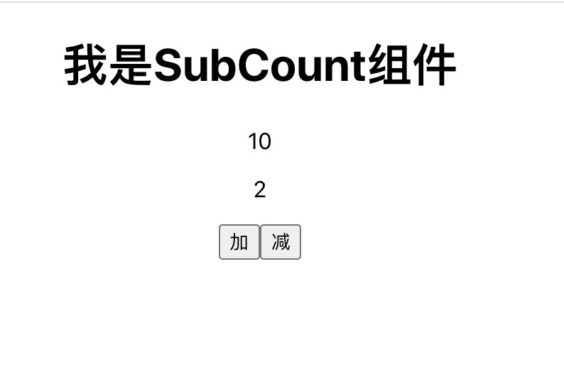
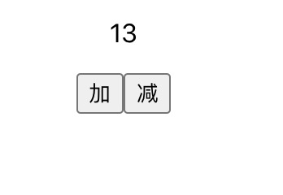
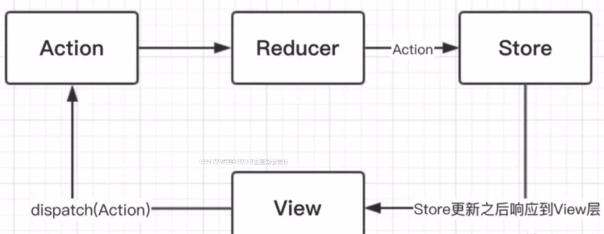
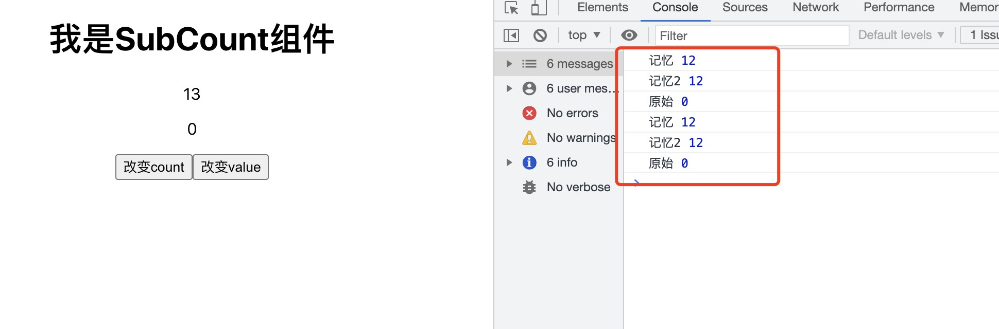
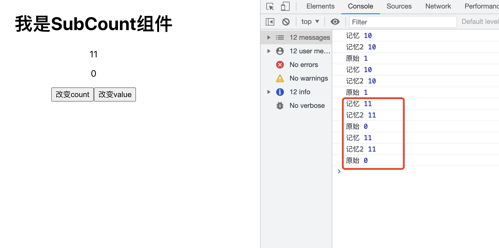
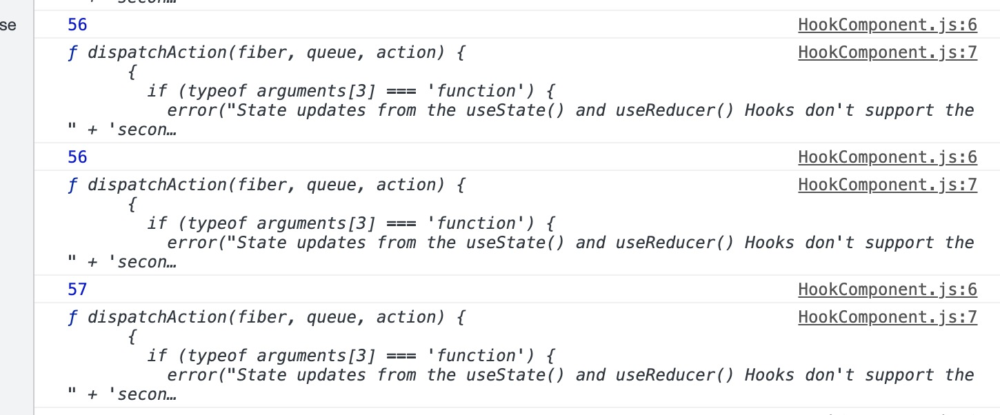

# React Hook

hook 钩子， 在非class情况下，可以使用更多react特性<br>
完全可选 100%向后兼容，class依旧可以用

为什么要使用Hook?
* 类组件虽然功能全面，但是要使用难以理解的生命周期，写起来比较复杂<br>
* 没有hook的函数组件能力有缺陷，hook可以让函数组件维护内部的状态，在不改变组件层次结构的情况下重用有状态逻辑<br>
* 在hook出现之前，React分为容器组件和UI组件，容器组件使用类组件，因为可以设置state，而UI组件和state无关，
  只需通过props传递进来使用，可以使用函数组件，但如果在之后的迭代需要在UI组件中加入自己的state，又需要将
  此UI组件改成类组件，或者接着写越来越多的props，所以新增了hook来补齐函数组件缺失的功能，这样可以实现
  类组件的功能，且可以复用逻辑，符合solid原则，使代码量变少

React单向数据流：
* 和vue双向绑定不同，是自上而下的单向数据流方式
* state和prop改变，组件会重新渲染
* 父组件改变，下面的所有子组件会重新渲染

## useState
每次渲染，函数都会重新执行。<br>
useState在函数内部创建一个当前函数组件的装填，提供一个修改状态的方法，底层通过闭包实现状态的保存

## useEffect
执行副作用操作<br>
纯函数组件：固定的输入，得到固定的输出

什么是副作用？
* 在页面中只想渲染一个dom，但是dom渲染完了，还想执行一段逻辑，这段逻辑就是副作用
* 比如ajax请求，访问原生dom对象，定时器，这些没有发生在数据向视图转换中的逻辑就是副作用
* 副作用分为需要清除的和不需要清除的
* 将componentDidMount等生命周期合成一个api
* 组件渲染到屏幕之后才执行，返回一个清除副作用的函数，或者不返回
* 不会同步执行，不会阻塞页面加载，需要同步，用useLayoutEffect
* 第二个参数：依赖值，改变了才会再次执行，浅比较，不加该参数的话，每次props或state改变都会执行

如何清除副作用？
* componentWillUnmount可以清除副作用
* 在useEffect用返回值来清除，执行时间：组件卸载前或下一次effect执行前

## useContext
用于爷孙组件传值，不相干的组件共享值

🌰 例子:
首先定义两个个顶层组件ContextProvider和ContextProvider2:
```js
import React, { createContext, useState } from "react";

export const context = createContext({});

//顶层组件
export function ContextProvider({ children }) {
  const [count, setCount] = useState(10);
  const countVal = {
    count,
    setCount,
    add: () => {
      setCount(count + 1);
    },
    reduce: () => setCount(count - 1),
  };
  // context对象中，提供了一个自带的Provider组件
  return <context.Provider value={countVal}>{children}</context.Provider>;
}
```

```js
import React, { createContext, useState } from "react";

export const context2 = createContext({});

//顶层组件
export function ContextProvider2({ children }) {
  const [value, setValue] = useState(2);
  const val = {
    value,
    setValue,
  };
  // context对象中，提供了一个自带的Provider组件
  return <context2.Provider value={val}>{children}</context2.Provider>;
}
```

定义子组件SubCount
```js
import React, { useContext } from "react";

import { context, ContextProvider } from "./ContextProvider";
import { context2, ContextProvider2 } from "./ContextProvider2";

function SubCount() {
  const { count = 10, add, reduce } = useContext(context); //拿到顶层组件定义的值
  const { value = 0 } = useContext(context2); //拿到顶层组件定义的值
  return (
    <div>
      <h1>我是SubCount组件</h1>
      <p>{count}</p>
      <p>{value}</p>
      <button onClick={add}>加</button>
      <button onClick={reduce}>减</button>
    </div>
  );
}

// 导出用ContextProvider包裹的子组件
// eslint-disable-next-line
export default () => (
  <ContextProvider2>
    <ContextProvider>
      <SubCount />
    </ContextProvider>
  </ContextProvider2>
);
```

在HookComponent中引用子组件：
```js
import React from "react";
import  SubCount from "./SubCount";

export function HookComponent() {
  return <div>
    <SubCount />
  </div>
}
```
页面显示如下，点击加和减按钮可以操作数据，这样SubCount就可以引用和它没有父子关系的ContextProvider
和ContextProvider2中的值和函数了<br>


## useReducer
useState内部靠useReducer来实现<br>
useState的替代方案,简单的场景用useState<br>
接收三个参数：state，配套的dispatch<br>

🌰 例子：<br>
定义一个ReducerComponent组件：
```js
import React, { useReducer } from "react";

//第一个参数
const reducer = (state, action) => {
  switch (action.type) {
    case "add":
      return { ...state, count: state.count + 1 }; //返回新的state
    case "reduce":
      return { ...state, count: state.count - 1 };
    default:
      return state;
  }
};

//第二个参数：管理数据的仓库,指定默认值
let initialState = { count: 10, name: "reducer" };

//第三个参数：把第二个参数当做参数传入,对初始值进行一些操作
const init = (initialCount) => {
  return { count: initialCount.count + 2 };
};

export default function ReducerComponent() {
  const [state, dispatch] = useReducer(reducer, initialState, init);
  return (
    <div>
      <p>{state.count}</p>
      <button onClick={() => dispatch({ type: "add" })}>加</button>
      <button onClick={() => dispatch({ type: "reduce" })}>减</button>
    </div>
  );
}
```
在HookComponent中引入：
 ```js
import React from "react";
import SubCount from "./SubCount";
import ReducerComponent from "./ReducerComponent";

export function HookComponent() {
  return (
    <div>
      <ReducerComponent />
    </div>
  );
}
```           
页面显示如下：<br>


reducer执行过程如下：


## useRef
一般用来获取dom的引用
🌰 例子：
```js
import React, {useRef, useEffect} from "react";

export function HookComponent() {

  // 创建一个Ref
  const refInput = useRef(null)

  useEffect(()=>{
    refInput.current.focus()  //refInput.current返回一个dom节点，在页面渲染完成后才执行，让input框自动获取焦点
  },[])

  return (
    <div>
      <input type='text' id='name' ref={refInput} />
    </div>
  );
}
```
useRef和createRef的区别：
* 使用createRef创建的ref会随着组件的更新而重新创建。
* 使用useRef创建的ref仿佛就像外部定义的一个全局变量，不会随着组件的更新而重新创建。但组件销毁，它也会消失，不用手动进行销毁。

下面这个例子，用全局变量store存储两种方式创建的ref，比较组件更新时和初始化值是否不同：
```js
import React, { useState, useEffect,useRef,createRef } from 'react';
const store = {}
export default () => {
  const ref1 = createRef()
  const ref2 = useRef()

  const [ count, setCount ] = useState(0)

  useEffect(() => {
    if (!store.ref1) {
      store.ref1 = ref1
    } else {
      console.log(store.ref1 === ref1)  // false
    }
  })

  useEffect(() => {
    if (!store.ref2) {
      store.ref2 = ref2
    } else {
      console.log(store.ref2 === ref2)  //true
    }
  })

  useEffect(() => {
    setTimeout(() => {
      setCount(1)
    }, 1000)
  }, [])

  return (
    <form ref={ref1}>
      <span>用户信息</span>
      <input type="text" ref={ref2} />
    </form>
  )
}
```

## useMemo和useCallback
记住返回值的缓存，当依赖项更新才更新；

useMemo: 把创建函数和依赖项数组作为参数传入useMemo,返回的是一个值<br>
useCallback: 和useMemo类似，返回的是函数

如果不传依赖项，则会实时更新，没有缓存的作用<br>
如果依赖项为空数组，则永远不会更新

🌰 例子：
```js
import React, { useContext, useCallback, useMemo } from "react";

import { context, ContextProvider } from "./ContextProvider";
import { context2, ContextProvider2 } from "./ContextProvider2"

function SubCount() {
  const { count = 10, add } = useContext(context); //拿到顶层组件定义的值
  const { value = 0, reduce } = useContext(context2); //拿到顶层组件定义的值

  const memorized = useCallback(() => {
    return count;
  }, [value]);

  const memorized2 = useMemo(() => {
    return count;
  }, [value]);

  console.log("记忆", memorized());
  console.log("记忆2", memorized2);
  console.log("原始", value);

  return (
    <div>
      <h1>我是SubCount组件</h1>
      <p>{count}</p>
      <p>{value}</p>
      <button onClick={add}>改变count</button>
      <button onClick={reduce}>改变value</button>
    </div>
  );
}

// 导出用ContextProvider包裹的子组件
// eslint-disable-next-line
export default () => (
  <ContextProvider2>
    <ContextProvider>
      <SubCount />
    </ContextProvider>
  </ContextProvider2>
);
```
当点击'改变count'时，memorized()和memorized2并不会更新：<br>


当点击'改变value'时，memorized()和memorized2才会更新：<br>


🌰 例子2：
```js
function CountButton({onClick, count}) {
  return <button onClick={onClick}>{count}</button>
}

function DualCounter() {
  const [count1, setCount1] = React.useState(0)
  const increment1 = () => setCount1(c => c + 1)

  const [count2, setCount2] = React.useState(0)
  const increment2 = () => setCount2(c => c + 1)

  return (
    <>
      <CountButton count={count1} onClick={increment1} />
      <CountButton count={count2} onClick={increment2} />
    </>
  )
}
```
每次单击其中任何一个按钮时，DualCounter 的状态都会发生变化，因此会重新渲染，然后重新渲染两个CountButton。
但是，实际上只需要重新渲染被点击的那个按钮？因此，如果你点击第一个按钮，则第二个也会重新渲染，
但没有任何变化，我们称之为“不必要的重新渲染”。

修改CountButton:
```js
const CountButton = React.memo(function CountButton({onClick, count}) {
  return <button onClick={onClick}>{count}</button>
})
```
现在 React 只会当 props 改变时会重新渲染 CountButton！ 但在 DualCounter 组件中，我们组件函数里定义
了 increment1 和 increment2 函数，这意味着每次 DualCounter 重新渲染，那些函数会新创建，
因此 React 无论如何会重新渲染两个 CountButton

再次优化：
```js
const CountButton = React.memo(function CountButton({onClick, count}) {
  return <button onClick={onClick}>{count}</button>
})

function DualCounter() {
  const [count1, setCount1] = React.useState(0)
  const increment1 = React.useCallback(() => setCount1(c => c + 1), [])

  const [count2, setCount2] = React.useState(0)
  const increment2 = React.useCallback(() => setCount2(c => c + 1), [])

  return (
    <>
      <CountButton count={count1} onClick={increment1} />
      <CountButton count={count2} onClick={increment2} />
    </>
  )
}
```
现在我们可以避免 CountButton 的所谓“不必要的重新渲染”。

🌰 例子3：计算素数
```js
function RenderPrimes({iterations, multiplier}) {
  const primes = React.useMemo(() => calculatePrimes(iterations, multiplier), [
    iterations,
    multiplier,
  ])
  return <div>Primes! {primes}</div>
}
```
useMemo会在给定输入的情况下存储先前的值，并在给定跟之前相同输入的情况下返回先前的值。

不能盲目使用useMemo和useCallback：
* 因为是使用闭包来实现缓存，会占用更大的内存
* 当依赖项频繁改变时，也不适合用
* 适用场景:减少不必要的更新，如例2和例3

额外笔记：
```js
   function A (){
     // 每次有更新的时候，就会创建一个新的function
     // 没有依赖的时候，就返回缓存了的函数
     // age变化的时候，会返回新的函数，age没变就返回之前的缓存的函数
     const onClick = useCallback(() => {
       setAge1(34)
       // this.setState()
     }, [age]);
     // useMemo(xxx, []); // div 最终也是一个对象
     return <div>
       {name}
       <B onClick={onClick}></B>
     </div>
   }
   
   // class component: shouldComponentUpdate 判断是否要更新
   // PureComponent 默认对props做了shouldComponentUpdate
   
   // React.memo + useCallback,可以减少hooks的渲染,React.memo + useCallback需要配对使用,即在父组件把要
   // 传递给子组件的函数用useCallback包裹，子组件创建的时候用React.memo包裹
   // 如果单使用useCallback，B组件还是会更新，使用React.memo包裹子组件，会对组件做一层props的浅比较，类似
   // shouldComponentUpdate的逻辑，当props改变的时候，才会重新渲染B组件，而没有memo的时候，根本就不比较，
   // 直接重新渲染B组件
   
   // React.useMemo 是hooks里对值的缓存，依赖变化的时候才会更新，依赖不变也不变
   const B = React.memo(() => {
     console.log('B');
     return <div></div>
   });
```

## 自定义Hook
把逻辑功能相同的片段封装成单独的函数来使用，提升开发效率<br>
在自定义的Hook中可以使用官方提供的Hook<br>
官方约定以use开头，表示只能在函数组件中使用<br>
复用状态逻辑的方式,而不是复用state本身,事实上Hook每次调用都有一个独立的state

🌰 例子：新建一个useNumber的Hook
```js
import {useEffect, useState} from 'react'

export default function useNum(){
  let [num, setNum] = useState(0)
  useEffect(()=>{
    setTimeout(()=>{
      setNum(num=>num + 1)
    }, 1000)
  })
  return [num, setNum]
}
```
使用它：
```js
import React from "react";
import useNum from "./useNum";

export function HookComponent() {
  const [num, setNum] = useNum();
  console.log(num);
  console.log(setNum);
  return <div></div>;
}
```
页面打印如下<br>


## Hook使用规则
* 1.Hooks 的使用必须要符合这条规则：确保 Hook 在每一次渲染中都按照同样的顺序被调用。因此最好每次只在最
顶层使用 Hook，不要在循环、条件、嵌套函数中调用 Hooks，否则容易出错。只能在最顶层使用Hook,不要在循环、
条件、嵌套函数中调用Hook
* 2.只在React函数或自定义Hook中调用Hook

安利一个网站，里面收集了实用的自定义HOOK[易于理解的 React Hook](https://usehooks.com/)


