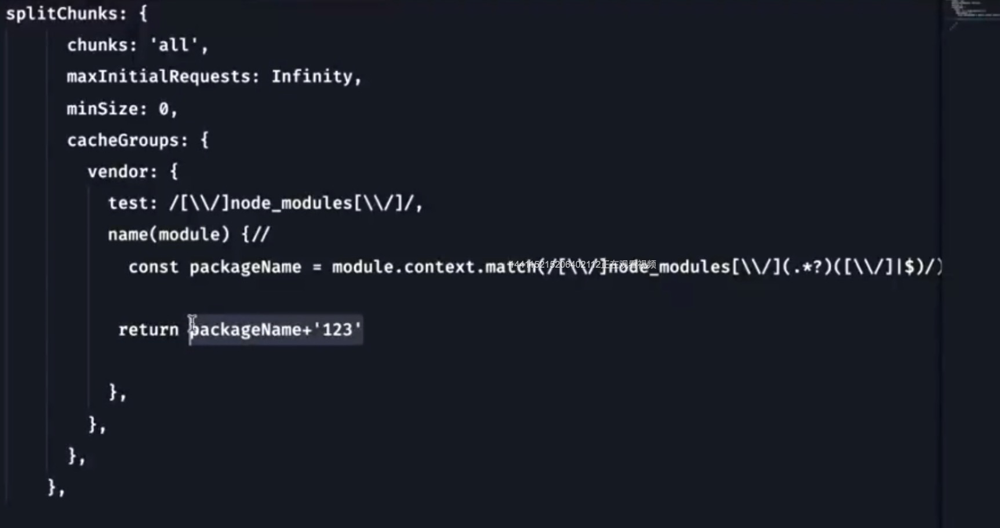

# React 性能优化

对于React应用，怎么优化它的性能？
1.应用加载性能
加载过程，页面渲染过程

怎么优化CDN对于静态资源的缓存？
缓存和回源
缓存分为缓存刷新和缓存预热
缓存刷新：客户端第一次请求的时候CDN从源站拉取资源
缓存预热：源站资源更新的时候主动推送到CDN

回源：CDN上没有找到资源，到源站上拉取
  
网站访问慢：
第一次访问慢？CDN没有资源，从源站拉取（预热）
不是第一次？
   资源访问量比较低，预热不够，cdn收到请求少，无法命中缓存
   资源配置时间不合理，频繁回流
   http header配置导致无法缓存
   gzip
   url带有参数，CDN认为是新请求，都会回源，要开启过滤参数
   大文件开启range(切片)
   资源动静分离，动态资源和静态资源放到不同的域名下
   
缓存
http缓存
cache(内存缓存)
dist（service worker）
push缓存(http2会话之间的缓存)

一个请求回来之后 (网络堆栈)-> http缓存 -> 渲染器的内存缓存(设置cache control，可以缓存) -> disk

分包：抽取公共业务包（splitChunks）

bundle splitting: 创建更多更小的文件，并行加载，只有代码修改了才重新加载，
code splitting：异步组件

splitChunks.chunks = 'all'：把node_module都放到vendor文件
如果依赖包更新，缓存就会失效
优化：把固定搭配的依赖包分到一起，如基础库，UI库


多页 动态组件
require.ensure(jsonp)
react lazy

结合项目，使用preload prefetch
preconnect:预连接，通过html webpack plugin配置
preload：请求资源时不会阻塞document渲染，加载当前页面资源
prefetch:先加载下一个页面的资源，跳过去时不会再请求，直接用


2.首屏打开的性能
FP FCP FMP TTI


FP：加载html
```
<div id="app"></div>
```
FCP:有结构，还没填充内容，加载html和js
```
<div id="app">
    <div></div>
    <div></div>
</div>
```
FMP:数据都渲染到页面了，加载html和js，数据请求回来
```
<div id="app">
    <div>11</div>
    <div>222</div>
</div>
```
优化指标：FP,FCP,FMP

预渲染和SSR区别？
预渲染时本地构建时通过无头浏览器构建
SSR:react renderToString(jsx应用) -> html
renderToString:
server端：先通过模板引擎来处理->构建页面
client端：用js构建状态，绑定事件 React.hydrate

3. react本身应用代码上的一些优化（memo, hooks,lazy）

4. 本地构建的优化
CommonsChunkPlugin和splitChunksPlugin区别：
CommonsChunkPlugin：
1.产出的chunk在引用的时候，会包含重复代码
entryA: vuex vue AComponent
entryB: vue axios BComponent
entryC: vue vuex axios CComponent
打包之后的包：
vendor-chunk:vuex vue axios
chunkA,chunkB,chunkC:Component（业务代码）
首次访问chunkB时会拉取vendor-chunk，会加载多余的库vuex

2.无法优化异步的chunk
entryA: vuex vue AComponent
asyncB: vue axios BComponent   //异步组件
entryC: vue vuex axios CComponent
打包之后的包：
vendor-chunk:Component
chunkA:Component
asyncB:vue axios BComponent  //异步组件，不提取
chunkC:axios CComponent

splitChunksPlugin：
抽离代码是有条件的，使用的是自动重复算法，有一个阈值，达到了才会抽离
  抽离条件：
  ① 被共享引用的新代码或者node_module里的代码
  ② 抽取的公共代码要>=30kb（默认配置）
  ③ 按需加载应用的代码，并行请求的数量不多于5次（可配）
  ④ 初始化加载的代码块，并行请求不多于三次（可配）

DllPlugin:
手动配置，新开一个webpack来构建第三方包

## React Hooks
react16新特性：hooks lazy memo fiber

class类组件
函数组件
hoc高阶组件
render-props:抽离业务逻辑，子组件通过属性传递进来

类组件：
1.状态逻辑复用差，比如处理一个点击事件，首先要在不同的生命周期初始化这个事件，一个单独的业务逻辑被
  不同的生命周期、不同的函数分开，难以复用
  可以通过hoc, render-props来解决该问题，但是嵌套逻辑会很冗余
2.复杂组件难以理解
3.this不好维护，class编译之后的代码太多，
4.热重载的时候会有不稳定的情况

class的继承和es5的集成有什么不一样

使用useState的变量：存到fiberNode的hook对象上以链表的形式存放

useEffect:
dom操作，浏览器的事件绑定，http请求，io操作都是有副作用的操作，不可控的操作，不能预估的

hooks:
1.只在外层使用，不要再循环、条件判断、子函数中使用
2.useEffect的第二个参数是空数组，相当于componentDidMount
3.自定义的hook如何影响使用它的函数组件
4.capture value（快照数据）的特性是如何产生的

实现useState
```js
// const [count, setCount] = useState(initialCount)
let state;
function useState(initValue) {
  state = state || initValue; //如果没有state,就是第一次执行，等于initValue
  function setState(newState) {
    state = newState;
    render(); //重新触发一次渲染
  }
```

实现useEffect:
1.接收两个参数，callback和deps
2.如果没有deps， callback每次都执行
3.deps有，只有deps发生变化才执行callback
```js
let _deps; //记录effect第二个参数的上一次状态
function useEffect(callback, depArray) {
  const hasNoDeps = !depArray;

  // 判断依赖是否改变
  const hasChangeDeps = _deps
    ? !depArray.every((el, i) => el === _deps[i])
    : true;

  // 如果没有依赖或者依赖被改变
  if (hasNoDeps || hasChangeDeps) {
    callback();
    _deps = depArray;
  }
}
```
使用方式如下：
```js
import React from "react";
import ReactDom from "react-dom";

// 实现useState
// const [count, setCount] = useState(initialCount)
let state;
function useState(initValue) {
  state = state || initValue; //如果没有state,就是第一次执行，等于initValue
  function setState(newState) {
    state = newState;
    render(); //重新触发一次渲染
  }
  return [state, setState];
}

// 实现useEffect
let _deps; //记录effect第二个参数的上一次状态
function useEffect(callback, depArray) {
  const hasNoDeps = !depArray;

  // 判断依赖是否改变
  const hasChangeDeps = _deps
    ? !depArray.every((el, i) => el === _deps[i])
    : true;

  // 如果没有依赖或者依赖被改变
  if (hasNoDeps || hasChangeDeps) {
    callback();
    _deps = depArray;
  }
}

function App() {
  const [count, setCount] = useState(0);
  const [name, setName] = useState('a');

  useEffect(()=>{
    console.log('count改变')
  },[count])

  return (
    <div>
      <div>{count}</div>
      <div>{name}</div>
      <button onClick={() => setCount(count + 1)}>点击</button>
    </div>
  );
}

const rootElement = document.getElementById("root");
function render() {
  ReactDom.render(<App />, rootElement);
}

render();
```
useState和useEffect是可以正常使用的但是当多加了个state:name,当改变count时name会跟着一起改变，原因是
只有一个全局的state

优化，用一个数组来维护全局state和effect
```js
import React from "react";
import ReactDom from "react-dom";

const memoizedState = []; //维护全局state和effect
let cursor = 0; //memorizedState下标

// 实现useState
// const [count, setCount] = useState(initialCount)
// let state;
function useState(initValue) {
  // state = state || initValue; //如果没有state,就是第一次执行，等于initValue
  memoizedState[cursor] = memoizedState[cursor] || initValue;
  const currentCursor = cursor

  function setState(newState) {
    memoizedState[currentCursor] = newState;
    render(); //重新触发一次渲染
  }
  // return [state, setState];
  return [memoizedState[cursor++], setState]; //取完后下标+1
}

// 实现useEffect
// let _deps; //记录effect第二个参数的上一次状态
function useEffect(callback, depArray) {
  const hasNoDeps = !depArray;
  const deps = memoizedState[cursor];

  // 判断依赖是否改变
  const hasChangeDeps = deps
    ? !depArray.every((el, i) => el === deps[i])
    : true;

  // 如果没有依赖或者依赖被改变
  if (hasNoDeps || hasChangeDeps) {
    callback();
    memoizedState[cursor] = depArray;
  }
  cursor++
}

function App() {
  const [count, setCount] = useState(0);  //cursor:0
  const [name, setName] = useState('a'); //cursor:1

  useEffect(() => {   //cursor:2
    console.log("count改变");
  }, [count]);

  useEffect(() => {
    console.log("name改变");
  }, [name]);

  return (
    <div>
      <div>{count}</div>
      <button onClick={() => setCount(count + 1)}>点击count</button>
      <div>{name}</div>
      <button onClick={() => setName(name + 'b')}>点击name</button>
    </div>
  );
}

const rootElement = document.getElementById("root");
function render() {
  cursor = 0;  //每次重新渲染要初始化下标，在react源码里使用环形链表来存全局的状态，所以不需要这一步
  ReactDom.render(<App />, rootElement);
}

render();
```
在这里用数组来存取全局状态和数据，在react源码里使用环形链表来存全局的状态
为什么不能在循环或if里面使用hooks?
因为状态和数据都存到链表里面，如果循环数目或if条件变更，下次再取数据就会变更,就会混乱

自定义的hook如何影响使用它的函数组件？
因为共享全局的状态，保持了统一的顺序

capture value（快照数据）的特性是如何产生的？
每一次重新执行的时候，对之前执行的函数组件并不会有任何操作