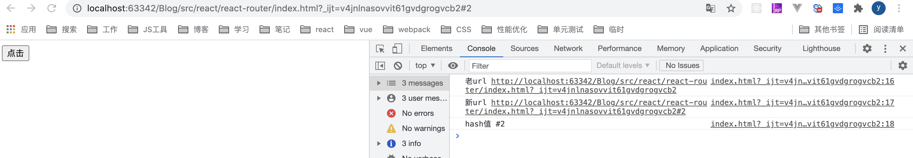

# React Router

## 介绍
v4/v5用法和基本理念一致,v2,v3差异较大

v4和v4之前的版本比较：
* v4:文档版本，属于动态路由<br>
    react-route被拆分成多个包发布，可以按需引用：
    * react-router: 路由基础库
    * react-router-dom:适用于浏览环境的再次封装
    * react-router-native:适用于react-native环境的再次封装
    * react-router-config:静态路由配置助手
    * 引入方式：`import React from 'react-router/Router'`
* v5:进行一些新特性的添加和改进，完全兼容v4
   * 引入方式：`import {React, Switch} from 'react-router' `
   * 支持数组匹配：`<Route path={["user/:id",info/>:id]} compnent={User}`
   
## 前端路由
原理：检测浏览器url变化，截获url地址，然后进行url路由匹配

方式：<br>
1.hash:锚点的方式，可以通过hashchange事件监听锚点的变化:
```html
<!DOCTYPE html>
<html lang="en">
<head>
  <meta charset="UTF-8">
  <title>Title</title>
</head>
<body>
<button id="btn">点击</button>
<script>
  const btnDom = document.getElementById('btn')
  btnDom.addEventListener('click', ()=>{
    location.href = '#' +Math.floor((Math.random()*10))
  })
  window.addEventListener('hashchange', e=>{
    const {oldURL,newURL} = e;
    console.log('老url',oldURL)
    console.log('新url',newURL)
    console.log('hash值',location.hash)
  })
</script>
</body>
</html>
```
每次点击按钮都会打印如下：<br>


2.html5:history模式(页面刷新的时候，浏览器会向服务器发请求，需要服务器支持)

## 基础路由配置
分类：
* BrowserRouter对应History模式
* HashRouter对应Hash模式

每个Router都会创建一个history对象，用来保持当前位置的追踪
```js
import './App.css';
import {Home} from './components/Home'
import {About} from './components/About'
import {BrowserRouter, Route, Link, HashRouter} from 'react-router-dom'

function App() {
  return (
    <div className="App">
      <BrowserRouter>
        {/*匹配的路由不带#：http://localhost:3000/home}*/}
        <Route path="/home" component={Home} />
      </BrowserRouter>

      <HashRouter>
        {/*匹配的路由带#：http://localhost:3000/#/about}*/}
        <Route path="/about" component={About} />
      </HashRouter>
    </div>
  );
}

export default App;
```

### Route组件：
* 一个具有渲染方法的普通react组件，路由匹配成功渲染该组件
* 常用属性
  * path: 路由匹配规则，可以省略，字符串类型
  * exact: 设置为true表示路径严格匹配
  * component:要渲染的组件
  * render:函数形式，进行一些逻辑操作，可以替代component，path匹配的时候才执行
  * children:函数形式，进行一些逻辑操作，可以替代component，任何时候都会执行
* 优先级:children > component > render
```html
<BrowserRouter>
    {/*匹配的路由不带#：http://localhost:3000/home}*/}
    <Route path="/home" component={Home} />
    
    {/*如果没有path，无论什么路径都会匹配到*/}
    {/*<Route component={Info}/>*/}
    
    {/*严格匹配根路径*/}
    <Route path="/" exact={true} component={Info} />
    
    {/*路径匹配时才渲染*/}
    <Route path="/render" render={() => <h1>我是render渲染的</h1>} />
    
    {/*路径不匹配也会渲染*/}
    <Route
      path="/children"
      children={({match}) => {
        console.log(match) //路径匹配到会打印出match对象，匹配不到会是null
        return <h1>我是children渲染的</h1>;
      }}
    />
</BrowserRouter>
```

### Switch组件：
* 最多只能匹配一个组件
* 可以将Route组件分组
* 可以实现404页面渲染
```html
<BrowserRouter>
    <Switch>
      {/*http://localhost:3000/home 只显示Info组件，即如果第一个组件匹配到了，不会匹配后面的组件*/}
      <Route path="/" component={Info} />
      <Route path="/home" component={Home} />
      <Route path="/about" component={About} />
      {/*匹配不到时匹配NotFound组件，提升用户的体验*/}
      <Route component={NotFound} />
    </Switch>
 </BrowserRouter>
```  

### Link与NavLink组件：
声明式的可访问导航

Link常用属性：
 * to:字符串或对象类型，对象类型时包含pathname,search,state属性
 * replace:为true表示替换当前的历史记录
```html
<BrowserRouter>
    <div>
      {/*Link组件一定要在BrowserRouter中,点击链接切换，实现局部刷新*/}
      <Link to="/home" replace>跳转home</Link>
      {/*to属性可以是对象，search表示带的参数*/}
      <Link to={{ pathname: "/about", search: "?name=abc" }}>跳转about</Link>
    </div>
    
    <Route path="/home" component={Home} />
    <Route path="/about" component={About} />
</BrowserRouter>
```
 
NavLink:特殊版的Link,当匹配的时候可以用activeStyle添加样式
```js
<BrowserRouter>
    <div>
      {/*匹配时会应用activeStyle*/}
      <NavLink to="/home" activeStyle={{ color: "red" }}>
        跳转home
      </NavLink>
      <Link to={{ pathname: "/about", search: "?name=abc" }}>
        跳转about
      </Link>
    </div>
    
    <Route path="/home" component={Home} />
    <Route path="/about" component={About} />
</BrowserRouter>
```

### Redirect组件
* 重定向组件
* 属性：
 * to: 必须属性
 * push: 为true时，把当前地址推入history中，通过history.push实现
 * from: 将要进入的url
 * exact:严格模式匹配
```html
<BrowserRouter>
    <Route path="/home" component={Home} />
    <Route path="/about" component={About} />
    {/*模拟登录就跳到Info组件，没有登录就跳到Home组件*/}
    <Route path="/info" render={()=>{
      return isLoginIn ? <Info/> : <Redirect to="/home"/>
    }} />
</BrowserRouter>
```

### History对象
实现编程式导航

修改Home组件，点击按钮可以跳到About组件：
```js
import React from "react";

export function Home(props) {
  function handleClick() {
    props.history.push("/about");  //只有通过路由跳转的props才有history属性
  }

  return (
    <div>
      <h1>我是Home组件</h1>
      <button onClick={handleClick}>跳转到about</button>
    </div>
  );
}
```

### withRouter
包裹没有经过路由匹配的页面，从props中获取history对象

### 动态路由
路由规则不是预先确定的，是在渲染过程中确定的
```html
<BrowserRouter>
    <Route path="/home" component={Home} />
    <Route path="/about/:id" component={About} />
</BrowserRouter>
```
当输入url为`http://localhost:3000/about/1`时，在About组件中通过match对象可以去到id：
```js
import React from 'react'

export function About(props){
  console.log(props.match.params.id)  //拿到路由中的id:1
  return <div>
    <h1>我是About组件</h1>
  </div>
}
```

### 嵌套路由
二级路由，如在Home组件中再进行路由的配置:
```js
import React from "react";
import { Route, Link } from "react-router-dom";

import { About } from "./About";
import { Info } from "./Info";

export function Home(props) {
  return (
    <div>
      <h1>我是Home组件</h1>
      <div>
        <Link to={`${props.match.path}/one`}>二级路由一</Link>
        <Link to="/home/two">二级路由二</Link>
      </div>
      <Route path={`${props.match.path}/one`} component={About} />
      <Route path="/home/two" component={Info} />
    </div>
  );
}
```