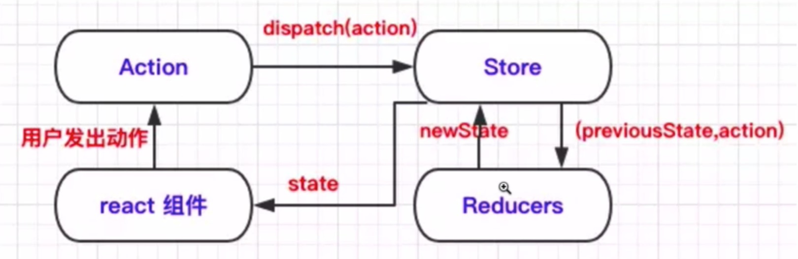
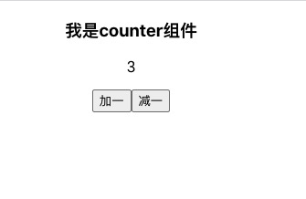

# Redux基础

什么是Redux?<br>
props:从父级传下来的属性，一级一级的<br>
state:组件内部管理<br>

由于react是单向数据流，当数据状态非常复杂时，很难让两个组件进行通信<br>
解决办法：把所有的state集中到组件的顶部，这就是Redux，集中管理组件状态的数据仓库

redux和react是没有任何关系的，redux是一个独立的状态管理的库（mobx，相比于redux上手容易，学习成本低）

action: 一个描述发生了什么的对象，动作，行为<br>
reducer:描述action如何改变state树<br>
应用中所有的state都以一个对象数的形式存储在一个单一的store中唯一改变state的方式就是派发action,
通过reducer完成state更新<br>
组件可以派发action，可以订阅state来更新视图

Redux解决的问题：
* 多级传递数据
* 相邻组件的数据传递
* 可以将数据连接到任何组件（connect函数）

Redux使用场景：公共组件，业务组件非常多，用户使用方式比较复杂，项目庞大，view需要从多个来源获取数据

Redux流程如下：

三大核心：
* action:描述发生什么的一个对象,如{type:'add'}
* reducer: 
    * 数据修改者，根据action.type，描述如何更新state，返回一个新的state
    *  reducer是纯函数，固定的输入一定有固定的输出，不能执行副作用的操作（如ajax请求结果不可预测，不能修改参数）
* store：数据仓库
    * redux只有一个单一的store
    * 如果项目很大，不应该拆分store，应该拆分reducer(通过combineReducers合并)
    
Redux三大原则：
* 单一数据源（单一store）
* state是只读的，不能直接修改，唯一改变的方法是触发action，在reducer中进行集中化的处理
* reducer中只能使用纯函数进行修改

怎样进行副作用操作？<br>
使用redux-thunk，进行不纯的操作<br>

例子：
先下载依赖包`cnpm i -S redux react-redux redux-thunk`

创建store文件夹，下面分别建立actions和reducers文件夹<br>
actions文件夹下建立counterAction.js和dataAction.js<br>

counterAction.js:存放普通action
```js
//普通action
export const ADD = 'ADD'
export const REDUCE = 'REDUCE'

export const add = ()=>({type:ADD})
export const reduce = ()=>({type:REDUCE})
```
dataAction.js:存放一些带有副作用的thunk action
```js
// thunk action: 存放一些带有副作用的action
export const FETCH_DATA_BEGIN = 'FETCH_DATA_BEGIN';
export const FETCH_DATA_SUCCESS = 'FETCH_DATA_SUCCESS';
export const FETCH_DATA_FAIL = 'FETCH_DATA_FAIL';

export const fetchDataBegin = () => ({ type: FETCH_DATA_BEGIN });
export const fetchDataSuccess = (data) => ({
  type: FETCH_DATA_SUCCESS,
  payLoad: { data },
});
export const fetchDataFail = (error) => ({
  type: FETCH_DATA_FAIL,
  payLoad: { error },
});

export function fetchData() {
  return (dispatch, getState) => {
    dispatch(fetchDataBegin());
    return fetch("http://xxx")
      .then((res) => res.json)
      .then((json) => {
        console.log("获取到接口数据", json);
        dispatch(fetchDataSuccess(json));
        return json;
      })
      .catch((err) => {
        // 捕获到错误
        dispatch(fetchDataFail(err));
      });
  };
}
```
reducers文件夹下建立counterReducer.js,dataReducer.js和rootReducer.js

counterReducer.js:
```js
import { ADD, REDUCE } from "../actions/counterAction";

//定义初始值
const initialState = {
  count: 0,
};

// 创建reducer
// 当state变化时，需要返回全新的state，不是修改原来的state
// 必须是纯的
export default function counterReducer(state = initialState, action) {
  switch (action.type) {
    case ADD:
      return {
        count: state.count + 1,
      };
    case REDUCE:
      return {
        count: state.count - 1,
      };
    default:
      return state;
  }
}
```
dataReducer.js:
```js
import {
  FETCH_DATA_FAIL,
  FETCH_DATA_SUCCESS,
  FETCH_DATA_BEGIN,
} from "../actions/dataAction";

//定义初始值
const initialState = {
  data: [],
  loading: false,
  error: null,
};

// 创建reducer
// 当state变化时，需要返回全新的state，不是修改原来的state
// 必须是纯的
export default function dataReducer(state = initialState, action) {
  switch (action.type) {
    case FETCH_DATA_BEGIN:
      return {
        ...state,
        loading: true,
        err: null,
      };
    case FETCH_DATA_SUCCESS:
      return {
        ...state,
        loading: true,
        data: action.payLoad.data,
      };
    case FETCH_DATA_FAIL:
      return {
        ...state,
        loading: true,
        error: action.payLoad.error,
      };
    default:
      return state;
  }
}
```
rootReducer.js:用combineReducers把counterReducer和dataReducer合并
```js
import { combineReducers } from "redux";
import counter from './counterReducer'
import data from './dataReducer'

export default combineReducers({
  counter,data
})
```

在store文件夹下新建index.js，创建store，并导出
```js
import { createStore, applyMiddleware } from "redux";
import thunk from "redux-thunk";
import rootReducer from "./reducers/rootReducer"

//将redux-thunk包裹在applyMiddleware中使用redux-thunk中间件
const store = createStore(rootReducer, applyMiddleware(thunk));

export default store;
```

新建ReduxCounter组件，并把它用connect函数包裹后导出：
```js
import React from "react";
import { connect } from "react-redux";
import { add, reduce } from "../store/actions/counterAction";
import { fetchData } from "../store/actions/dataAction";

//state到props的映射,建立组件和state的映射关系
function mapStateToProps(state) {
  return {
    count: state.counter.count,
    data: state.data.data,
    loading: state.data.loading,
    error: state.data.error,
  };
}

//将dispatch函数映射到props
const mapDispatchToProps = {
  add,
  reduce,
  fetchData,
};

class ReduxCounter extends React.Component {
  handleAdd = () => {
    // 通过props拿到dispatch方法
    // this.props.dispatch(add());

    //使用mapDispatchToProps作为connect的第二个参数，可以这样调用dispatch方法
    this.props.add();
  };

  handleReduce = () => {
    // this.props.dispatch(reduce());
    this.props.reduce();
  };

  componentDidMount() {
    this.props.fetchData().then((res) => {
      console.log("获取到接口数据");
    });
  }

  render() {
    const { error, loading, data } = this.props;
    if (error) {
      return <div>页面加载出错:{error}</div>;
    }
    if (loading) {
      return <div>页面加载中...</div>;
    }
    return (
      <div>
        <h3>我是counter组件</h3>
        <div>{data}</div>
        <div>
          {/*通过props拿到count值*/}
          <p>{this.props.count}</p>
          <button onClick={this.handleAdd}>加一</button>
          <button onClick={this.handleReduce}>减一</button>
        </div>
      </div>
    );
  }
}

// 使用connect函数包裹ReduxCounter，实现React和Redux的连接
// 传入mapStateToProps这个参数后，组件便会订阅store中状态的变化
// connect是高阶函数
export default connect(mapStateToProps, mapDispatchToProps)(ReduxCounter);
```

新建ReduxComponent组件来使用ReduxCounter，通过Provider把store传入ReduxCounter中：
```js
import React from "react";
import store from "../store";
import { Provider } from "react-redux";
import ReduxCounter from "./ReduxCounter";

class ReduxComponent extends React.Component {
  constructor(props) {
    super(props);
  }

  render() {
    return (
      <div>
        {/*通过Provider传入store*/}
        <Provider store={store}>
          <ReduxCounter />
        </Provider>
      </div>
    );
  }
}

export default ReduxComponent;
```


即可正常使用store里的count：<br>


📚 [本项目源码](../react/react-hook)
