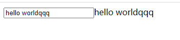
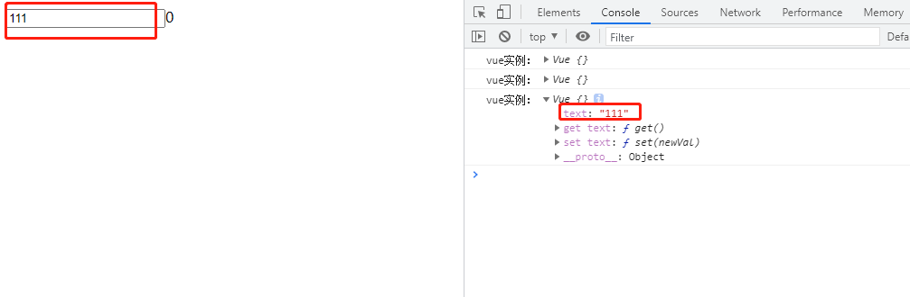

# 手写MVVM实现Vue的双向绑定

实现如下功能：修改input框输入值的时候，后面的文本一起改变<br>


先创建index.html，按照vue的用法写输入框和文本节点，用js创建vue实例：
```html
<!DOCTYPE html>
<html lang="en">
<head>
  <meta charset="UTF-8">
  <title>Simple Vue</title>
</head>
<body>
<div id="app">
  <input type="text" v-model="text"/>{{text}}
</div>
<script>
const vue = new Vue({
  el: "app",
  data: {
    text: 0
  }
})
</script>
</body>
</html>
```

# 第一步:建立入口文件
在src目录下建立index.js作为vue的入口文件：
```js
function Vue(options) {
  const {el,data} = options
  const obeserve = new Observe(data, this)  //数据挂载到实例上面去 

  const root = document.getElementById(el)
  const dom = new Compile(root, this) //生成dom
  root.appendChild(dom)
}
```
这里出现了两个新的对象：
* Observe：把data里的属性挂载到实例上，并重写get和set方法，监听属性的读取
* Compile: 处理dom里的每一个节点，根据data渲染dom

# 第二步 创建Observe，挂载data到vue实例并监听get和set
新建Observe.js:
```js
function Observe(data, vm){
  for(const key of Object.keys(data)) {
    defineReactive(vm,key,data[key])
  }
}

// 把data属性挂载到vm上，并重写get和set方法
function defineReactive(vm, key, val) {
    Object.defineProperty(vm,key, {
      get(){
        return val
      },
      set(newVal){
        val = newVal
      }
    })
}
```

# 第三步 创建Compile，用data来渲染dom
新建compile.js:
```js
function Compile(node, vm){
 if(node) {
   return this.nodeToFragment(node, vm)
 }
}

Compile.prototype = {
  // 把节点转成dom
  nodeToFragment(node,vm){
    const fragment = document.createDocumentFragment()  //创建文档片段再一次性加到dom中

    let children
    while (children = node.firstChild) {
      this.compileElement(children,vm)
      fragment.append(children)  //每次append会把children从原来的dom摘除放入内存中
    }
    return fragment;
  },

  // 处理每一个节点
  compileElement(node,vm){
    const reg = /\{\{(.*)\}\}/

    // 处理元素节点
    if(node.nodeType === 1) {
      const attr = node.attributes
      for(const item of attr) {
        const {nodeName, nodeValue} = item
        if(nodeName === 'v-model'){
          node.addEventListener('input', function(e){
            vm[nodeValue] = e.target.value  //修改vm的属性，触发observe里面定义的set方法
            console.log('vue实例：', vm)
          })
        }
      }
    }

    // 处理文本节点
    if(node.nodeType === 3) {
      if(reg.test(node.nodeValue)) {
        const name = RegExp.$1.trim();
        node.nodeValue = vm[name]  //取vm里的属性，触发observe里面定义的get方法
      }
    }
  }
}
```

现在，在输入框中输入数据，已经可以在控制台中看到vue实例里text属性同时被改变了：<br>


但是，后面的文本并没有跟着改变，所以我们需要在data里的属性发生改变时通知到所有用到它的dom做出相应的改变，
data里的属性就是依赖项，要想建立这个对应关系，就需要先收集依赖，即在data的属性被使用时把它放到一个依赖列表里。

# 第四步 创建Dep.js,收集依赖