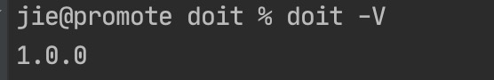
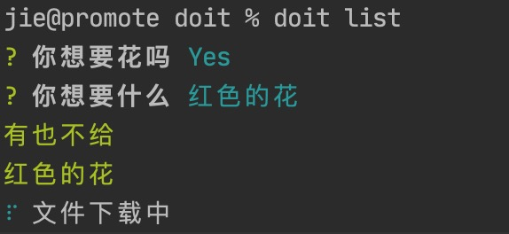
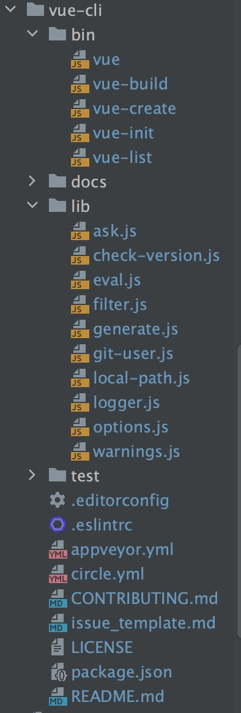
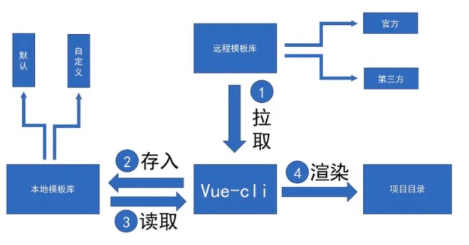
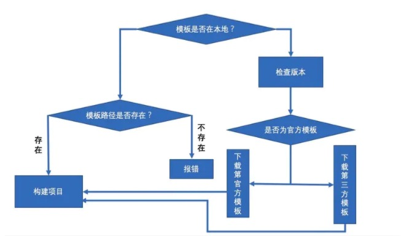

# vue-cli源码分析

**目录**
> * [基本概念](#基本概念)
> * [基本工具](#基本工具)
> * [源码分析](#源码分析)
>   * [vue](#vue)
>   * [vue list](#vue-list)
>   * [vue init](#vue-init)

## 基本概念
* 工程化：简化流程，提高开发效率
* vue: UI框架
* vue-cli: 脚手架，辅助搭建开发环境，通过远端的官方模板根据配置的参数来生成新的开发环境
    * 1.命令行：基于文本来查看、处理、操作计算机上面的文件程序
    * 2.搭建vue项目的开发环境：webpack打包css，把vue编译html\js, 把es9翻译成es5等

vue-cli的使用方法：
命令行工具： vue <command> [options]   主命令 + （子命令）+（参数）<br>
例如：
```
Options:
 -V, --version               output the version number
 -h, --help                 output usage information

Commands:
 create [options] <app-name>        create a new project powered by vue-cli-service
 
 add [options] <plugin> [pluginOptions]   install a plugin and invoke its generator in an already created project
 
 invoke [options] <plugin> [pluginOptions] invoke the generator of a plugin in an already created project
 
 inspect [options] [paths...]        inspect the webpack config in a project with vue-cli-service
```
vue-cli流程：
* 1.初始化：使用PATH环境里的全局vue变量
* 2.获取用户配置：交互的过程
* 3.解析配置信息：用户配置+默认配置=>真正的配置信息
* 4.生成项目文件：通过配置+模板（官方模板或者自己写的模板）<br>
    自己写模板必须包括下面两个：
    * 1.template:模板文件
    * 2.meta.js：
	    * prompts：弹框信息
		* helpers：模板引擎的扩展
        * complete：钩子函数
		* metalsmith：站点生成器
* 5.清理工作

脚手架目录结构：
* docs:文档
* scripts:脚本
* packages:lerna(管理多个项目打出来的包，可以单独发布并引用每个包)
* lib:核心代码逻辑
* test:测试
* bin: 命令的脚本
* package.json:
    * bin:专门用来放置用户自定义命令的地方
    * npm link :命令的软链接，链接到全局或某一个空间下
        * 全局命令可以直接执行，因为添加到全局的环境变量里了（PATH）<-usr/local/lib/node_modules)
        * npm run xx命令:运行命令，npm run的时候npm 把该命令添加到PATH中，运行完后删除 

做一个命令的步骤：
* 在package.json的bin里写命令
* 在bin目录下写对应的可执行文件
* 运行npm link

## 基本工具
做脚手架需要几个工具：
* 1.commander.js：node.js命令行接口的解决方案
* 2.inquirer.js：弹框交互的工具
* 3.chalk：美化命令行样式
* 4.ora:加载状态，进度条等动画
* 5.execa:直接执行脚本命令

下面用一个简单的例子先熟悉工具的使用，初始化一个叫doit的项目，在package.json的bin中加一条命令：
```
"bin": {
   "doit": "./bin/init.js"
}
```
新建一个bin目录，里面写一个init.js：
> 可执行文件前缀`#!/usr/bin/env node`用来标识Node环境执行
```js
#!/usr/bin/env node

const mainDoit = require('../lib/index.js')
mainDoit()
```
在lib文件夹中的index.js中写上初始化的代码逻辑：
```js
module.exports = function mainDoit(){
  const program = require('commander')

  program.version(require('../package').version)  // -V可以获取版本信息
  program
    .command('init <number> [number]', '初始化') 
    .command('list', '所有列表').action(()=>{   //跑bin下的doit-list.js(主命令拼接子命令)
      console.log('123')
  })

  program.parse(process.argv)
}
```
在bin中加入do-list.js:
```js
#!/usr/bin/env node
// 可执行文件前缀：标识Node环境执行

const inquirer = require('inquirer')
const chalk = require('chalk')
const ora = require('ora')

inquirer.prompt([
  {
    type:'confirm',
    message: '你想要花吗',
    name:'ok'
  },
  {
    type:'input',
    message: '你想要什么',
    name:'which'
  }
]).then(ans => {
  if(ans.ok) {
    console.log(chalk.green('有也不给'))
  } else {
    console.log(chalk.red('我没有'))
  }
  if(ans.which) {
    console.log(chalk.green(ans.which))
  }

  // 进度条
  const spinner = ora('文件下载中').start()
  setTimeout(()=>{
    spinner.stop()
  }, 5000)
})
```
运行npm link，可以看到把doit命令添加到全局了：
```
/usr/local/bin/doit -> /usr/local/lib/node_modules/doit/bin/init.js
/usr/local/lib/node_modules/doit -> /Users/jie/Desktop/project/git/Blog/vue/my-vue-cli/doit
```
可通过 doit -V查看package.json里的版本信息：<br>


运行doit list：<br>


🌺 本项目源码[点击这里](./doit)

## 源码分析

先看vue-cli的目录结构：<br>


package.json的bin属性里主要存放三个命令：
```
 "bin": {
    "vue": "bin/vue",
    "vue-init": "bin/vue-init",
    "vue-list": "bin/vue-list"
  }
```

###  vue
先看bin里面vue.js,这个文件主要是在用户输入“vue”时，终端上显示参数的使用说明
```js
#!/usr/bin/env node

//初始化整个命令
const program = require('commander')

program
  .version(require('../package').version)
  .usage('<command> [options]')
  .command('init', 'generate a new projec命令t from a template')
  .command('list', 'list available official templates')
  .command('build', 'prototype a new project')
  .command('create', '(for v3 warning only)')

program.parse(process.argv)
```

### vue list
再看vue-list.js
```js
#!/usr/bin/env node

const logger = require('../lib/logger')
const request = require('request')
const chalk = require('chalk')

/**
 * Padding.
 */

console.log()
process.on('exit', () => {  // 监测退出操作  Ctrl + C
  console.log()
})

/**
 * List repos.
 */

// 拉取接口数据，用于模板展示
request({
  url: 'https://api.github.com/users/vuejs-templates/repos',
  headers: {
    'User-Agent': 'vue-cli'
  }
}, (err, res, body) => {
  if (err) logger.fatal(err)
  const requestBody = JSON.parse(body)
  if (Array.isArray(requestBody)) {
    console.log('  Available official templates:')
    console.log()
    requestBody.forEach(repo => {
      console.log(
        '  ' + chalk.yellow('★') +
        '  ' + chalk.blue(repo.name) +
        ' - ' + repo.description)
    })
  } else {
    console.error(requestBody.message)
  }
})
```
当输入"vue list"时,vue-cli会请求接口，获取官方模板的信息，然后做了一定处理，在终端上显示出来模板
名称和对应的说明。

### vue init
再来看vue-init.js，“vue init”是用来构建项目的命令，也是vue-cli的核心文件<br>


vue init的工作流程如下：
* 先判断你的模板在远程github仓库上还是在你的本地某个文件里面，若是本地文件夹则会立即跳到第3步，反之则
走第2步。
* 第2步会判断是否为官方模板，官方模板则会从官方github仓库中下载模板到本地的默认仓库下，即根目录
下.vue-templates文件夹下。
* 第3步则读取模板目录下meta.js或者meta.json文件，根据里面的内容会询问开发者，根据开发者的回答，
确定一些修改。
*根据模板内容以及开发者的回答，渲染出项目结构并生成到指定目录。

下面分开看代码：<br>
初始化usage:
```js
/**
 * Usage.
 */

program
  .usage('<template-name> [project-name]')
  .option('-c, --clone', 'use git clone')
  .option('--offline', 'use cached template')
```

初始化help：
```js
/**
 * Help.
 */

program.on('--help', () => {
  console.log('  Examples:')
  console.log()
  console.log(chalk.gray('    # create a new project with an official template'))
  console.log('    $ vue init webpack my-project')
  console.log()
  console.log(chalk.gray('    # create a new project straight from a github template'))
  console.log('    $ vue init username/repo my-project')
  console.log()
})

/**
 * Help.
 */

function help () {
  program.parse(process.argv)
  if (program.args.length < 1) return program.help()  //如果参数是0(npm init)，调用help
}
help()
```
根据属性初始化配置：
```js
let template = program.args[0]  //模板名称
const hasSlash = template.indexOf('/') > -1   //是否有斜杠，后面将会用来判定是否为官方模板   
const rawName = program.args[1]  //项目构建目录名
const inPlace = !rawName || rawName === '.'  // 没写或者“.”，表示当前目录下构建项目
const name = inPlace ? path.relative('../', process.cwd()) : rawName  //如果在当前目录下构建项目,当前目录名为项目构建目录名，否则是当前目录下的子目录【rawName】为项目构建目录名
const to = path.resolve(rawName || '.') //项目构建目录的绝对路径
const clone = program.clone || false  //是否采用clone模式，提供给“download-git-repo”的参数

const tmp = path.join(home, '.vue-templates', template.replace(/[\/:]/g, '-'))  //远程模板下载到本地的路径
```
然后是主逻辑：
```js
if (inPlace || exists(to))  { //如果是当前目录，或者项目地址存在
  inquirer.prompt([{
    type: 'confirm',
    message: inPlace
      ? 'Generate project in current directory?' //是否在当前目录下构建项目
      : 'Target directory exists. Continue?', //构建目录已存在,是否继续
    name: 'ok'
  }]).then(answers => {
    if (answers.ok) {
      run()
    }
  }).catch(logger.fatal)
} else {
  run()
}
```
过程如下：
* 1.如果是当前目录，则询问'是否在当前目录下构建项目'
* 2.如果不是当前目录，项目地址存在，询问'构建目录已存在，是否继续'
* 3.上述两个问题回答'y'则执行run()
* 4.不是当前目录并且项目地址不存在，则直接执行run()

run函数如下：
```js
function run () {
  // check if template is local
  if (isLocalPath(template)) {    //是否是本地模板
    const templatePath = getTemplatePath(template)  //获取绝对路径
    if (exists(templatePath)) {  //判断模板所在路径是否存在
       //渲染模板
      generate(name, templatePath, to, err => {
        if (err) logger.fatal(err)
        console.log()
        logger.success('Generated "%s".', name)
      })
    } else {
       //打印错误日志，提示本地模板不存在
      logger.fatal('Local template "%s" not found.', template)
    }
  } else {
    checkVersion(() => {  //检查版本号
      if (!hasSlash) {  //官方模板还是第三方模板
        // use official templates
        // 从这句话以及download-git-repo的用法，我们得知了vue的官方的模板库的地址：https://github.com/vuejs-templates
        const officialTemplate = 'vuejs-templates/' + template
        if (template.indexOf('#') !== -1) {  //模板名是否带"#"
          downloadAndGenerate(officialTemplate) //下载模板
        } else {
          if (template.indexOf('-2.0') !== -1) { //是都带"-2.0"
             //发出警告
            warnings.v2SuffixTemplatesDeprecated(template, inPlace ? '' : name)
            return
          }

          // warnings.v2BranchIsNowDefault(template, inPlace ? '' : name)
          downloadAndGenerate(officialTemplate)//下载模板
        }
      } else {
        downloadAndGenerate(template)//下载模板
      }
    })
  }
}
```
流程如下：<br>


downloadAndGenerate函数如下：
```js
function downloadAndGenerate (template) {
  const spinner = ora('downloading template')  
  spinner.start()//显示加载状态
  // Remove if local template exists
  if (exists(tmp)) rm(tmp)  //当前模板库是否存在该模板，存在就删除
   //下载模板  template-模板名    tmp- 模板路径   clone-是否采用git clone模板   err-错误短信
    
  download(template, tmp, { clone }, err => {
    spinner.stop() //隐藏加载状态
    //如果有错误，打印错误日志
    if (err) logger.fatal('Failed to download repo ' + template + ': ' + err.message.trim())
    //渲染模板
    generate(name, tmp, to, err => {
      if (err) logger.fatal(err)
      console.log()
      logger.success('Generated "%s".', name)
    })
  })
}
```

📚 参考文章：[走进Vue-cli源码，自己动手搭建前端脚手架工具](https://segmentfault.com/a/1190000013975247)