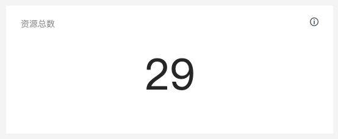
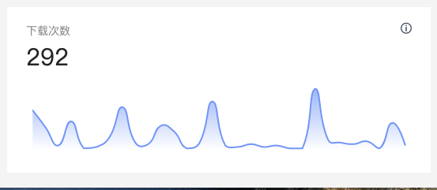

# 作用域插槽
子组件：statisticBox
```html
<template>
  <div class="box-wrapper">
    <div class="title">{{ title }}</div>
    <i class="icon-info" />
    <slot :number="number">
      <div class="number">{{ number }}</div>
      <div ref="chartDom" class="chart-dom"></div>
    </slot>
  </div>
</template>
```
父组件使用作用域插槽（使用子组件里的number数据）
```html
<statistic-box
  title="资源总数"
  :number="resourceNumber"
  ref="resourceNumber"
>
  <template v-slot="props">
    <div class="resource-number">{{ props.number }}</div>
  </template>
</statistic-box>
```
显示效果：


父组件使用插槽默认内容：
```html
 <statistic-box
  title="下载次数"
  :number="downloadCount"
  ref="downloadCount"
/>
```
显示效果：

