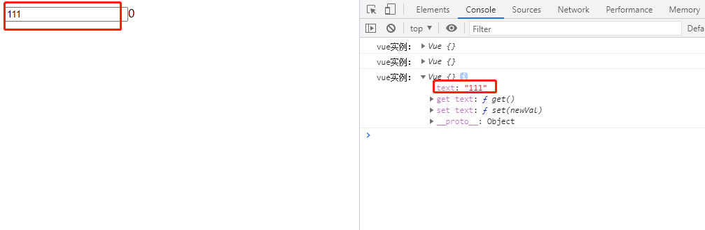
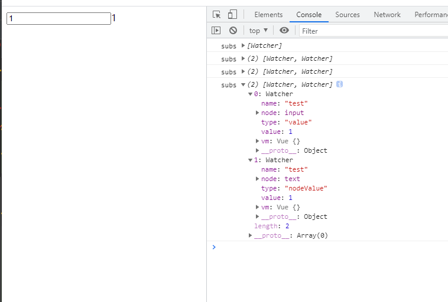
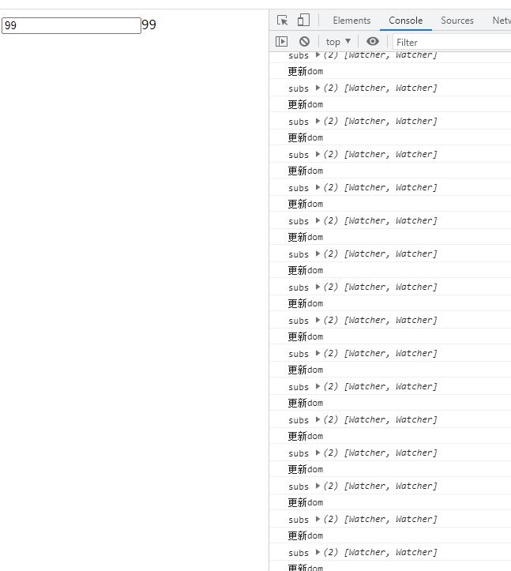
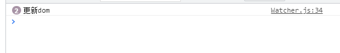
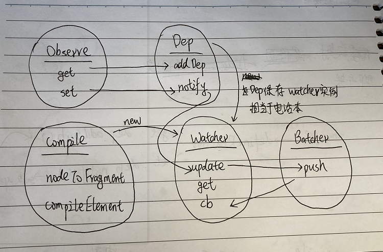

# 手写MVVM实现Vue2的双向绑定

> * [第一步:建立入口文件](#第一步:建立入口文件)
> * [第二步:创建Observe，挂载data到vue实例并监听get和set](#第二步:创建Observe，挂载data到vue实例并监听get和set)
> * [第三步:创建Compile，用data来渲染dom](#第三步:创建Compile，用data来渲染domt)
> * [第四步:创建Watcher,定义依赖项](#第四步:创建Watcher,定义依赖项)
> * [第五步:创建Dep,收集依赖项](#第五步:创建Dep,收集依赖项)
> * [第六步:手动设置vue实例的data,更新dom](#第六步:手动设置vue实例的data,更新dom)
> * [第七步:创建Batcher,增加批处理](#第七步:创建Batcher,增加批处理)

实现如下功能：修改input框输入值的时候，后面的文本一起改变<br>


先创建index.html，按照vue的用法写输入框和文本节点，用js创建vue实例：
```html
<!DOCTYPE html>
<html lang="en">
<head>
  <meta charset="UTF-8">
  <title>Simple Vue</title>
</head>
<body>
<div id="app">
  <input type="text" v-model="text"/>{{text}}
</div>
<script>
const vue = new Vue({
  el: "app",
  data: {
    text: 0
  }
})
</script>
</body>
</html>
```

## 第一步:建立入口文件
在src目录下建立index.js作为vue的入口文件：
```js
function Vue(options) {
  const {el,data} = options
  const obeserve = new Observe(data, this)  //数据挂载到实例上面去 

  const root = document.getElementById(el)
  const dom = new Compile(root, this) //生成dom
  root.appendChild(dom)
}
```
这里出现了两个新的对象：
* Observe：把data里的属性挂载到实例上，并重写get和set方法，监听属性的读取
* Compile: 处理dom里的每一个节点，根据data渲染dom

## 第二步:创建Observe，挂载data到vue实例并监听get和set
新建Observe.js:
```js
function Observe(data, vm){
  for(const key of Object.keys(data)) {
    defineReactive(vm,key,data[key])
  }
}

// 把data属性挂载到vm上，并重写get和set方法
function defineReactive(vm, key, val) {
    Object.defineProperty(vm,key, {
      get(){
        return val
      },
      set(newVal){
        val = newVal
      }
    })
}
```

## 第三步:创建Compile，用data来渲染dom
新建compile.js:
```js
function Compile(node, vm){
 if(node) {
   return this.nodeToFragment(node, vm)
 }
}

Compile.prototype = {
  // 把节点转成dom
  nodeToFragment(node,vm){
    const fragment = document.createDocumentFragment()  //创建文档片段再一次性加到dom中

    let children
    while (children = node.firstChild) {
      this.compileElement(children,vm)
      fragment.append(children)  //每次append会把children从原来的dom摘除放入内存中
    }
    return fragment;
  },

  // 处理每一个节点
  compileElement(node,vm){
    const reg = /\{\{(.*)\}\}/  //采用正则替换

    // 处理元素节点
    if(node.nodeType === 1) {
      const attr = node.attributes
      for(const item of attr) {
        const {nodeName, nodeValue} = item
        if(nodeName === 'v-model'){
          node.addEventListener('input', function(e){
            vm[nodeValue] = e.target.value  //修改vm的属性，触发observe里面定义的set方法
            console.log('vue实例：', vm)
          })
        }
      }
    }

    // 处理文本节点
    if(node.nodeType === 3) {
      if(reg.test(node.nodeValue)) {
        const name = RegExp.$1.trim();
        node.nodeValue = vm[name]  //取vm里的属性，触发observe里面定义的get方法
      }
    }
  }
}
```

现在，在输入框中输入数据，已经可以在控制台中看到vue实例里text属性同时被改变了：<br>


但是，后面的文本并没有跟着改变，所以我们需要在data里的属性发生改变时通知到所有用到它的dom做出相应的改变，
data里的属性就是依赖项，要想建立这个对应关系，就需要先收集依赖，即在data的属性被使用时把它放到一个依赖列表里。

通过阅读源码，可以知道每一个依赖项是一个Watcher实例，通过Dep来管理依赖项<br>

## 第四步:创建Watcher,定义依赖项
每一个依赖项都有vm,name,type,node以及update方法：
```js
function Watcher(vm, node, name, type) {
  Dep.target = this;
  this.vm = vm;
  this.node = node;
  this.name = name;
  this.type = type;
  this.update();

  // 清空target,避免observe里get的时候重复添加到subs
  Dep.target = null;
}

Watcher.prototype = {
  // 更新dom
  update() {
    this.get();
    this.node[this.type] = this.value;
  },

  // 获取vm里的属性，
  get() {
    this.value = this.vm[this.name]; //触发observe里面定义的get方法
  },
};
```
修改Compile,在触发get操作的时候改成创建一个Watcher实例，即依赖项：
```js
// 处理文本节点
if (node.nodeType === 3) {
  if (reg.test(node.nodeValue)) {
    const name = RegExp.$1.trim();
    // node.nodeValue = vm[name]  //取vm里的属性，触发observe里面定义的get方法(放到watcher中)
    new Watcher(vm, node, name, "nodeValue"); // 创建依赖项
  }
}
```

## 第五步:创建Dep,收集依赖项
Dep需要一个静态属性subs来维护依赖项，并要有添加依赖项和通知所有依赖项更新的方法：
```js
function Dep() {
  this.subs = []; //依赖项列表
}

Dep.prototype = {
  // 添加依赖
  addDep(sub) {
    this.subs.push(sub);
  },

  // 通知watcher更新
  notify() {
    this.subs.forEach(function (sub) {
      sub.update();
    });
  },
};
```
修改Observe.js在获取vue实例的时候就需要添加依赖项，在set的时候需要通知所有依赖项更新：
```js
function Observe(data, vm) {
  for (const key of Object.keys(data)) {
    defineReactive(vm, key, data[key]);
  }
}

// 把data属性挂载到vm上，并重写get和set方法
function defineReactive(vm, key, val) {
  const dep = new Dep(); //初始化依赖

  Object.defineProperty(vm, key, {
    get() {
      if (Dep.target) {
        //避免多次调用get的时候重复添加
        dep.addDep(Dep.target);
      }
      return val;
    },
    set(newVal) {
      if (val === newVal) return;
      val = newVal;
      dep.notify();
    },
  });
}
```
到这里就实现了在输入框中输入数据，后面的文本节点动态更新的效果<br>

## 第六步:手动设置vue实例的data,更新dom
如果在外部设置vm.test = 1：
```js
const vm = new Vue({
  el: "app",
  data: {
    test: 0,
    test2: 0,
  }
})

vm.test = 1  //外部设置vm.test
```
对应的input框依旧不会更新，还需要在compile中处理input节点时，创建一个新的依赖项：
```js
// 处理元素节点
if (node.nodeType === 1) {
  const attr = node.attributes;
  for (const item of attr) {
    const { nodeName, nodeValue } = item;
    if (nodeName === "v-model") {
      node.addEventListener("input", function (e) {
        vm[nodeValue] = e.target.value; //修改vm的属性，触发observe里面定义的set方法
        console.log("vue实例：", vm);
      });
       new Watcher(vm, node, nodeValue, "value"); //创建依赖项
    }
  }
}
```
这样，在处理元素节点是，如果有v-model属性，就会创建一个依赖项，再把该依赖性加入Dep的subs中，
此时，打印subs，可以看到有两个依赖项：<br>


## 第七步:创建Batcher,增加批处理
在index.html中更新vm.test100次:
```js
const vm = new Vue({
  el: "app",
  data: {
    test: 0,
    test2: 0,
  }
})

vm.test = 1

for(let i =0; i < 100; i++){
  vm.test = i
}
```
在Watcher的update方法里加个打印语句，可以看到dom也更新了非常多次：<br>
<br>

这其实是不必要的，可以加个批处理模块，把dom更新变成异步操作，在所有的同步任务执行完以后再去更新dom，
减少操作dom的次数，提高性能

新增Batcher.js
```js
function Batcher() {
  this.reset();
}

Batcher.prototype.reset = function () {
  this.has = {}; //记录已加入批处理的watcher的id
  this.queue = []; //保存所有的watcher
};

Batcher.prototype.push = function (job) {
  // 已经添加过不需要再处理
  if (!this.has[job.id]) {
    this.has[job.id] = true;
    this.queue.push(job);
    if ("Promise" in window) {
      Promise.resolve().then(() => {
        this.flush();
      });
    } else {
      setTimeout(() => {
        this.flush();
      });
    }
  }
};

// 执行所有的job
Batcher.prototype.flush = function () {
  this.queue.forEach(function (job) {
    job.cb();
  });
  this.reset();
};
```

修改Watcher.js,增加id属性，在update的时候调用批处理方法：
```js
let uid = 0
let batcher

function Watcher(vm, node, name, type) {
  Dep.target = this;
  this.vm = vm;
  this.id = ++uid;
  this.node = node;
  this.name = name;
  this.type = type;
  this.update();

  // 清空target,避免observe里get的时候重复添加到subs
  Dep.target = null;
}

Watcher.prototype = {
  // 调用批处理方法
  update() {
    this.get();
    if(!batcher) {
      batcher = new Batcher()
    }
    batcher.push(this)
  },

  // 获取vm里的属性，
  get() {
    this.value = this.vm[this.name]; //触发observe里面定义的get方法
  },

  // 更新dom
  cb(){
    console.log('更新dom')
    this.node[this.type] = this.value;
  }
};
```

查看控制台打印，只更新了两次dom，一次是初始化时，一次是循环结束时：<br>


vue2双向数据绑定的关系图如下：<br>


📚 本项目源码见[simpleVue](./simpleVue)