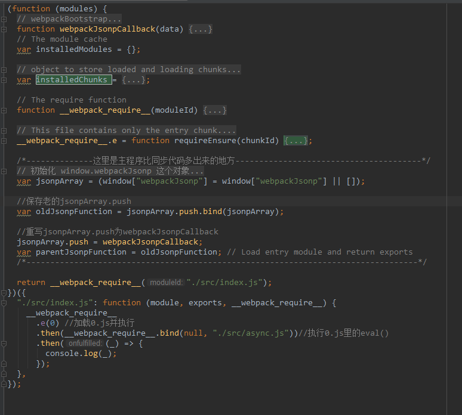

# Webpack4输出文件分析
**目录**
> * [单文件分析](#单文件分析)
> * [多文件引用分析](#多文件引用分析)
> * [异步文件引用分析](#异步文件引用分析)

## 单文件分析
首先创建src/index.js:
```javascript
let result = '你好'
console.log(result)
```
使用webpack打包命令：`webpack --mode development`<br>
☆tip:
本例中使用的webpack版本为4.44.1，此处为了更好的分析输出的bundle文件，将mode设置为'development'。<br>
mode有三个可选值，分别是'none'、'production'、'development'，默认值为'production'<br>

mode值为'production'默认开启以下插件：
* FlagDependencyUsagePlugin：编译时标记依赖；
* FlagIncludedChunksPlugin：标记子chunks，防止多次加载依赖；
* ModuleConcatenationPlugin：作用域提升(scope hosting)，预编译功能，提升或者预编译所有模块到一个闭包中，提升代码在浏览器中的执行速度；
* NoEmitOnErrorsPlugin：在输出阶段时，遇到编译错误跳过；
* OccurrenceOrderPlugin：给经常使用的ids更短的值；
* SideEffectsFlagPlugin：识别 package.json 或者 module.rules 的 sideEffects 标志（纯的 ES2015 模块)，安全地删除未用到的 export 导出；
* TerserPlugin：压缩代码<br>

mode值为'development'时，默认开启以下插件：
* NamedChunksPlugin：以名称固化chunkId；
* NamedModulesPlugin：以名称固化moduleId<br>
mode值为'none'时，不开启任何插件<br>
输出到dist文件夹中的 main.js,简化后文件内容如下：
```javascript
//webpack编译单文件
//一个IIFE（立即执行函数，避免函数执行时里面的变量和外面的冲突)，以对象{入口文件：入口文件的eval函数}为参数
(function (modules) {
  //模块缓存
  var installedModules = {};

  //加载模块
  function __webpack_require__(moduleId) {
    // 如果已经加载过该模块，则从缓存中直接读取
    if (installedModules[moduleId]) {
      return installedModules[moduleId].exports;
    }

    // 如果没有加载过该模块，则创建一个新的module存入缓存中
    var module = (installedModules[moduleId] = {
      exports: {},
    });

    //执行eval(...)，moduleId是入口文件
    // call方法第一个参数为modules.exports，是为了module内部的this指向该模块
    modules[moduleId].call(
      module.exports,
      module,
      module.exports,
      __webpack_require__
    );

    return module.exports;
  }

  //返回入口执行代码
  return __webpack_require__("./src/index.js");
})({
  "./src/index.js": function (module, exports) {
    eval(
      "let result = '你好'\nconsole.log(result)\n\n//# sourceURL=webpack:///./src/index.js?"
    );
  },
});
```
简化后代码中的 **__webpack_require__** 函数起到的就是加载模块的功能，IIFE函数接收的参数是个数组，第
0项内容便是 src/index.js 中的代码语句，通过 __webpack_require__ 函数加载并执行模块，最终在浏览器控
制台输出结果。

## 多文件引用分析
修改src/index.js:
```javascript
import data from './data'
let result = '你好'
console.log('', data)
console.log(result)
```
创建src/data.js:
```javascript
const data = '外部数据'
export default data
```
执行`webpack --mode development`,生成打包文件main.js，简化后如下：
```javascript
//webpack编译多文件
//立即执行函数的参数变成了两项
//webpack把依赖的文件都铺平了，遇到依赖就加到参数中
(function (modules) {
  //模块缓存
  var installedModules = {};

  function __webpack_require__(moduleId) {
    //检查模块缓存
    if (installedModules[moduleId]) {
      return installedModules[moduleId].exports;
    }

    var module = (installedModules[moduleId] = {
      exports: {},
    });

    //执行对应moduleId的eval(...)
    modules[moduleId].call(
      module.exports,
      module,
      module.exports,
      __webpack_require__
    );

    return module.exports;
  }

  //返回入口执行代码
  return __webpack_require__("./src/index.js");
})({
  "./src/data.js": function (module, __webpack_exports__, __webpack_require__) {
    const data = "外部数据";
    console.log(data);
    __webpack_exports__["default"] = data; //module.exports['default'] = data
  },
  "./src/index.js": function (
    module,
    __webpack_exports__,
    __webpack_require__
  ) {
    //在这里加载依赖的模块
    var _data__WEBPACK_IMPORTED_MODULE_0__ = __webpack_require__(
      "./src/data.js"
    );
    let result = "你好";
    console.log("", _data__WEBPACK_IMPORTED_MODULE_0__.default);
    console.log(result);
  },
});
```
webpack通过将原本独立的一个个模块存放到IIFE的参数中来加载，从而达到只进行一次网络请求便可执行所有模
块，避免了通过多次网络加载各个模块造成的加载时间过长的问题。并且在IIFE函数内部，webpack也对模块的加
载做了进一步优化，通过将已经加载过的模块缓存起来存在内存中，第二次加载相同模块时便直接从内存中取出。

## 异步文件引用分析
创建文件src/index.js:
```js
import("./async").then((_) => {
  console.log(_);
});
```
创建文件src/async.js:
```js
const data2 = '异步数据'
export default data2
```
用webpack编译后生成main.js和0.js<br>
先看main.js,简化后如下:<br>
<br>
先看这块比webpack4主程序多出来的代码：
```js
  //初始化 window.webpackJsonp 这个对象
  //异步的包需要调用window["webpackJsonp"]进行push
  var jsonpArray = (window["webpackJsonp"] = window["webpackJsonp"] || []);

  //保存老的jsonpArray.push
  var oldJsonpFunction = jsonpArray.push.bind(jsonpArray);

  //重写jsonpArray.push为webpackJsonpCallback
  jsonpArray.push = webpackJsonpCallback;
  var parentJsonpFunction = oldJsonpFunction; // Load entry module and return exports
```
这里实际上给 window["webpackJsonp"] 这个变量添加了一个 push 方法, window["webpackJsonp"] 是个
数组，也就是说 window["webpackJsonp"] 这个数组的 push 函数被复写成了 webpackJsonpCallback.<br>
按照执行顺序，再来看比webpack4多出来的__webpack_require__.e方法：
```js
__webpack_require__.e = function requireEnsure(chunkId) {
    // 声明一个队列，此队列与此 chunk 绑定。
    var promises = [];

    // JSONP chunk loading for javascript
    // 拿到该 chunk 对应的值, 我们这个调用中，显然 installedChunks 里没有0这个 chunk，所以
    // installedChunkData 就是 undefined
    var installedChunkData = installedChunks[chunkId];
    if (installedChunkData !== 0) {
      // 0 means "already installed".
      // a Promise means "currently loading".
      // 如果正在加载
      if (installedChunkData) {
        promises.push(installedChunkData[2]);
      } else {
        // 如果没有加载，(本例的场景), 构造一个 Promise 代表此异步模块的加载结果，并以
        // [resolve, reject, Promise] 这样的结构来存储
        // setup Promise in chunk cache
        var promise = new Promise(function (resolve, reject) {
          //installedChunks[chunkId]等于一个Promise,表示该chunk已经被加载
          installedChunkData = installedChunks[chunkId] = [resolve, reject];
        });
        // 将构造的这个 promise 加入队列
        //promises:[promise]
        //installedChunkData:[resolve, reject, promise]
        //installedChunks[0]:[resolve, reject, promise]
        promises.push((installedChunkData[2] = promise));

        // start chunk loading
        //// 开始加载 chunk，通过在页面里插入一个 script 标签来做
        var script = document.createElement("script");
        var onScriptComplete;

        script.charset = "utf-8"; // 设置编码方式
        script.timeout = 120; //设置超时时间,加载异步文件超过120ms就放弃加载，webpack加载超过120ms就报错
        if (__webpack_require__.nc) {
          script.setAttribute("nonce", __webpack_require__.nc);
        }

        // 拼接 chunk 文件的服务器地址
        //例如我这里为src为"http://localhost:63342/8.17webpack/webpack4/src/asyncDemo/dist/0.js"
        script.src = jsonpScriptSrc(chunkId);

        // create error before stack unwound to get useful stacktrace later
        var error = new Error();
        // 定义加载完成的处理函数
        onScriptComplete = function (event) {
          // avoid mem leaks in IE.
          script.onerror = script.onload = null;
          clearTimeout(timeout);// 有结果了，所以清除加载超时的定时器

          // 读出 chunk 的结构
          var chunk = installedChunks[chunkId];
          if (chunk !== 0) {
            if (chunk) {
              var errorType =
                event && (event.type === "load" ? "missing" : event.type);
              var realSrc = event && event.target && event.target.src;
              error.message =
                "Loading chunk " +
                chunkId +
                " failed.\n(" +
                errorType +
                ": " +
                realSrc +
                ")";
              error.name = "ChunkLoadError";
              error.type = errorType;
              error.request = realSrc;
              chunk[1](error); // 这里调用的错误处理函数，也就是说这里是没有加载成功的处理。
            }
            installedChunks[chunkId] = undefined;  //该chunk改为未加载状态
          }
        };

        // 设置超时的处理
        var timeout = setTimeout(function () {
          onScriptComplete({ type: "timeout", target: script });
        }, 120000);
        script.onerror = script.onload = onScriptComplete;
        document.head.appendChild(script); //把0.js追加到页面中，执行0.js
      }
    }
    
    //Promise.all(promises).then返回参数包含promises里所有元素执行结果的数组的回调
    return Promise.all(promises);  
  };

```
这段代码中，webpack为每一个异步模块都分配了一个 id，并维护了一个全局对象 installedChunks 用于存放
异步加载模块的信息，该例中如下：
```js
{
  main: 0,
  0: [resolve Function, reject Function, Promise]
}
```
该对象的值对应多种：
>* undefined: 未加载
>* null: preloaded 或 prefetched 的模块
>* 数组: 结构为 [resolve Function, reject Function, Promise] 的数组, 代表 chunk 在处于加载中. 
Promise 代表这个加载行为，resolve Function 和 reject Function 分别可以 resolve 和 reject 这个 
Promise
>* 0: 已加载<br>

接着为0.js创建一个script标签，插入到页面中，即执行0.js<br>
下面再看第二个打包出来的文件0.js:
```js
(window["webpackJsonp"] = window["webpackJsonp"] || []).push([
  [0],
  {
    "./src/async.js": function (
      module,
      __webpack_exports__,
      __webpack_require__
    ) {
      "use strict";
      const data2 = "异步数据";
      __webpack_exports__["default"] = data2;
    },
  },
]);
```
原来在这里window["webpackJsonp"] 的 push 方法 (webpackJsonpCallback) 被调用了，下面再看webpackJ
sonpCallback方法：
```js
// webpackBootstrap
  // install a JSONP callback for chunk loading
  //传入参数data:[
  //   [0],
  //   {
  //     "./src/async.js": function (
  //       module,
  //       __webpack_exports__,
  //       __webpack_require__
  //     ) {
  //       "use strict";
  //       const data2 = "异步数据";
  //       __webpack_exports__["default"] = data2;
  //     },
  //   },
  // ]
  function webpackJsonpCallback(data) {
    var chunkIds = data[0];  //取出模块id：[0]
    var moreModules = data[1]; //取出模块：{"./src/async.js": function}

    // add "moreModules" to the modules object,
    // then flag all "chunkIds" as loaded and fire callback
    // 标记所有 chunk 为已加载
    var moduleId,
      chunkId,
      i = 0,
      resolves = [];
    for (; i < chunkIds.length; i++) {
      chunkId = chunkIds[i];
      if (
        Object.prototype.hasOwnProperty.call(installedChunks, chunkId) &&
        installedChunks[chunkId]
      ) {
        resolves.push(installedChunks[chunkId][0]);// 前文中提到的 resolve Function
      }
      installedChunks[chunkId] = 0;// 并标记所有 chunk 为已加载
    }

    // 把所有的模块加入 modules 的对象中, 没错就是 __webpack_require__.m 对应的那个属性
    for (moduleId in moreModules) {
      if (Object.prototype.hasOwnProperty.call(moreModules, moduleId)) {
        //这里把{async.js:function}对象加入到modules中
        modules[moduleId] = moreModules[moduleId];
      }
    }
    // 执行一下原来的 push 函数
    if (parentJsonpFunction) parentJsonpFunction(data);

    // resolve 此模块的 chunk 对应的 Promise.
    //resolve的时候会调用之后then里面第一个参数指定的函数,即__webpack_require__("./src/async.js")
    while (resolves.length) {
      resolves.shift()();
    }
  }
```
可以看到webpackJsonpCallback 函数的执行会把模块的内容被插入到 __webpack_require__.m 中（即modules），
并 resolve 此模块加载的 Promise。就这样异步模块和同步模块一样, 被加载到了 __webpack_require__.m 
这个对象中了，接着只需要对其调用__webpack_require__函数就可以按照同步模块的 load 流程进行初load了<br>

☆本文完整demo见[asyncDemo](/webpack/webpack4/demo/webpack4/src/asyncDemo)<br>
☆理解Promise链式调用可以参考[Promise链式调用](/promise/promise-call-chaining/promise.md)

❀参考链接：
>* [webpack输出文件分析以及编写一个loader](https://juejin.im/post/6844903907810869261)
>* [webpack 输出文件分析 3 - 异步加载](https://www.njleonzhang.com/2019/02/12/webpack-bundle-3.html)
