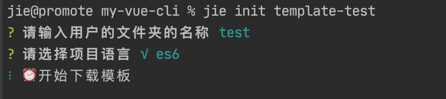
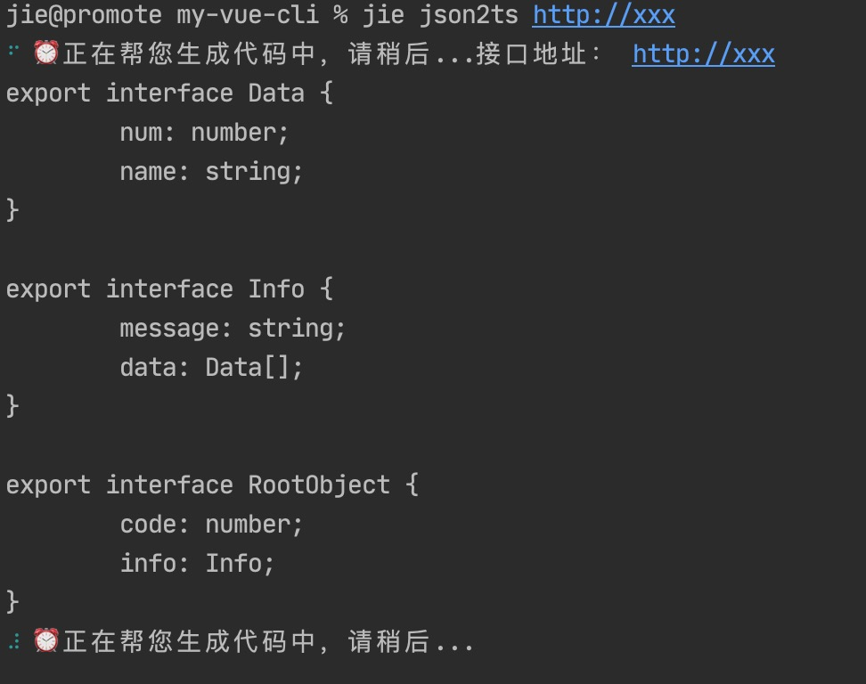

# 实现简单的脚手架工具

实现了以下功能：
* 用脚手架从github上下载项目
* 后端接口返回数据转TS接口

```js
#!/usr/bin/env node

const figlet = require("figlet"); //生成好看的字体
const Printer = require("@darkobits/lolcatjs"); //生成渐变色字体
const program = require("commander"); //处理用户命令
const inquirer = require("inquirer"); //和用户对话
const chalk = require("chalk"); // 美化提示信息样式
const json2ts = require("json2ts"); // 将后端接口返回数据生成ts接口
const ora = require("ora"); //进度条
const shell = require('shelljs')   //使用shell
const download = require("download-git-repo")  //下git包

const re = figlet.textSync("Jie") + "\n" + "Jie的脚手架";
const txt = Printer.default.fromString(re);

program.version(txt, "-v,--version");
program.option("init", "🌺 初始化项目");
program.option("json2ts", "🌺 将后端接口返回数据生成ts接口");

const bindHandler = {
  init() {
    inquirer
      .prompt([
        {
          type: "text",
          name: "dirName",
          message: "请输入用户的文件夹的名称",
        },
        {
          type: "list",
          name: "jskind",
          message: "请选择项目语言",
          choices: ["√ es6", "√ Typescript"],
        },
      ])
      .then((ans) => {
        const dirName = ans.dirName;
        if (dirName) {
          const spinner = ora("⏰ 开始下载模板");
          spinner.start();
          const pwd = shell.pwd().stdout
          const projectPath = pwd + dirName  //拿到目录
          shell.cd(pwd)
          shell.rm('-rf', projectPath)  //先删掉老的目录

          //下载模板
          download('direct:https://github.com/mjyg/simple-news-center.git', dirName,{clone:true},err=>{
            spinner.stop()
            if(err){
              console.error("模板下载失败",err)
            } else {
              //对文件内容替换,这里替换掉下载模板里的package.json里的"vue-test2"
              shell.sed("-i", "vue-test2",dirName, projectPath + '/package.json')
            }
          })
        }
      });
  },
  json2ts(jsonUrl) {
    //自动生成ts接口
    const spinner = ora("⏰ 正在帮您生成代码中，请稍后...");
    spinner.start();
    console.log("接口地址：", jsonUrl);
    const jsonContent = {
      code: 1,
      info: {
        message: "请求成功",
        data: [
          {
            num: 1,
            name: "Lily",
          },
        ],
      },
    };
    let re = json2ts.convert(JSON.stringify(jsonContent));
    console.log(re);
  },
};
program
  .usage("<cmd> [env]") //用法
  .arguments("<cmd> [env]")
  .action(function (cmd, otherParams) {
    //接收用户的参数
    const handler = bindHandler[cmd];
    if (handler) {
      handler(otherParams);
    } else {
      console.log(
        chalk.yellow("非常遗憾，暂未实现") + "【" + chalk.red(cmd) + "】"
      );
    }
  });

program.parse(process.argv); //处理用户的参数
```
运行效果：<br>
* 查看帮助 `jie -h`<br>


* 从github上下载项目 `jie init template-test`<br>


* 后端接口返回数据转TS接口 `jie json2ts http://xxx`<br>
