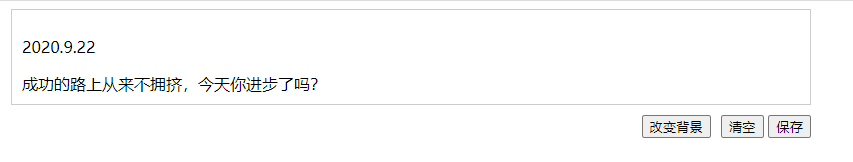
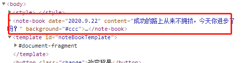

# Web Components 实现简单记事本
**目录**
> * [自定义元素](#自定义元素)
> * [template标签](#template标签)
> * [使用ShadowDOM](#使用ShadowDOM)
> * [添加事件](#添加事件)
> * [生命周期函数](#生命周期函数)

## 介绍
Web Components，一种实现浏览器的原生组件方式，可以只使用HTML、CSS、JavaScript来创建可以在任何现代
浏览器运行的可复用组件，不使用类似React和Angular的框架，甚至可以无缝的接入到这些框架中。<br>
Web Components可以创造一个定制的HTML标签，它将会继承HTM元素的所有属性，并且你可在任何支持的浏览器中
通过简单的引入一个script，所有的HTML、CSS、JavaScript将会在组件内部局部定义。这个组件在你的浏览器
开发工具中显示为一个单独个HTML标签，并且它的样式和行为都是完全在组件内进行，不需要工作区，框架和一些
前置的转换。<br>
Web Components现在已经被主要的浏览器的较新版本所支持。下面实现一个简单的记事本<br>

## 自定义元素
自定义一个记事本，使用window.customElements的define方法来注册：
```js
 window.customElements.define("note-book", NoteBook);
```
直接使用`<note-book></note-book>`作为自定义的HTML标签，为了避免和native标签冲突，这里强制使用中划
线来连接<br>
接下来实现NoteBook，这个是自定义元素的类，需要继承HTMLElement,从而拿到HTML元素的特性，需要使用ES6
的class来实现
```js
class NoteBook extends HTMLElement {
  constructor() {
    super();
  }
}
```

## template标签
Web Components API 提供了<template>标签，可以在它里面使用 HTML 定义 DOM
```html
<template id="noteBookTemplate">
      <style>
        body {
          background: url(assets/bright.png);
        }
        .button-wrapper {
          float: right;
          margin-top: 10px;
        }
        .note {
          border: 1px solid #ccc;
          padding: 10px;
        }
        .wrapper {
          width:800px;
          margin: 0 auto;
        }
      </style>
      <div class="wrapper">
      <div class="note">
        <p class="date" />
        <div class="content"></div>
      </div>
      <div class="button-wrapper">
        <button class="clear">清空</button>
        <button class="save">保存</button>
      </div>
      </div>
    </template>
```
使用<note-book>,传入参数date和content
```html
<note-book date="2020.9.22" content="成功的路上从来不拥挤，今天你进步了吗？"></note-book>
```
然后修改NoteBook类，获取<template>节点以后，克隆它的所有子元素,并把<note-book>上的参数值传进去
```js
 class NoteBook extends HTMLElement {
        //当时一个元素被创建时（好比document.createElement）将会调用构造函数
        constructor() {
          super();

          var template = document.getElementById("noteBookTemplate");
          var dom = template.content.cloneNode(true);

          dom.querySelector(".date").innerText = this.getAttribute("date");

          dom.querySelector(".content").innerText = this.getAttribute(
            "content"
          );
          
          //this表示自定义元素实例
          this.appendChild(dom);
        }
      }
```
现在效果如下图：<br>
<br>
浏览器查看dom结构如下,可以看到直接使用了自定义标签<note-book>：<br>


## 使用ShadowDOM
有时候不希望用户能够看到<note-book>的内部代码，Web Component 允许内部代码隐藏起来，这叫做
 Shadow DOM，即这部分 DOM 默认与外部 DOM 隔离，内部任何代码都无法影响外部。<br>
自定义元素的this.attachShadow()方法开启 Shadow DOM,修改NoteBook类：
```js
class NoteBook extends HTMLElement {
  //当时一个元素被创建时（好比document.createElement）将会调用构造函数
  constructor() {
    super();

    //自定义元素的this.attachShadow()方法开启 Shadow DOM,隐藏Web Component内部代码
    var shadow = this.attachShadow({ mode: "closed" });

    var template = document.getElementById("noteBookTemplate");
    var dom = template.content.cloneNode(true);

    dom.querySelector(".date").innerText = this.getAttribute("date");

    dom.querySelector(".content").innerText = this.getAttribute(
      "content"
    );

    shadow.appendChild(dom);
    
    console.log('note-book元素被初始化')
  }
}
```
查看dom结构，可以看到此时<note-book>内部代码已经被隐藏了<br>


## 添加事件
在NoteBook类加入如下代码，增加保存记事本方法:
```js
dom.querySelector('.save').addEventListener('click',()=>{
  alert('保存成功')
})
```

## 生命周期函数
这里说几个常用的生命周期函数：
> * constructor: 自定义元素初始化时执行
> * connectedCallback：自定义元素被插入DOM树的时候将会触发，所有的属性和子元素都已经可用
> * attributeChangedCallback:自定义元素属性改变时触发该函数
> * disconnectCallback：自定义元素从DOM中移除的时候触发<br>
在NoteBook类加入如下代码如下,测试生命周期函数
```js
//当这个元素被插入DOM树的时候将会触发这个方法，所有的属性和子元素都已经可用
connectedCallback() {
  console.log("note-book元素被插入");
}

//当元素从DOM中移除的时候将会调用它
disconnectCallback() {
  console.log("note-book元素被移除");
}

static get observedAttributes() {
  return ["date", "content"];
}

//当属性改变时就会调用这个函数，前提是被改变的属性在observedAttributes数组中。
//这个方法调用时参数分别为被改变的属性，旧值和新值。
attributeChangedCallback(attr, oldVal, newVal) {
  console.log(attr,'属性被改变','原来的值',oldVal,'现在的值',newVal)
}
```
控制台打印如下：<br>
<br>
可以看出生命周期函数执行的顺序是`constructor -> attributeChangedCallback -> connectedCallback`
> 思考一下：attributeChangedCallback为什么会在connectedCallback之前被调用呢？<br>
> 这是因为当组件被插入DOM时，自定义上的属性需要可以被访问了，因此attributeChangedCallback要在connectedCallback之前执行<br>

现在在自定义元素外部增加一个改变背景的按钮，通过attributeChangedCallback方法检测自定义元素的属性变化，
从而改变自定义元素内的背景<br>
* 增加一个改变背景的Button
```html
 <button class="change">改变背景</button>
```
* 为button添加click方法，改变自定义元素的属性：
```js
//通过外部按钮改变自定义元素里的背景颜色，会自动调用自定义元素的attributeChangedCallback方法
var changeBtn = document.querySelector('.change')
changeBtn.onclick = function(){
  var noteBook = document.getElementsByTagName('note-book')[0]
  noteBook.setAttribute('background', 'red')
}
```
* 改变自定义组件的attributeChangedCallback方法，监听background属性改变，改变记事本的背景色
```js
attributeChangedCallback(attr, oldVal, newVal) {
  console.log(attr,'属性被改变','原来的值',oldVal,'现在的值',newVal)
  switch (attr) {
    case "background":
      this.shadowRoot.querySelector(".wrapper").style.background = newVal
      break;
  }
  }
```
现在界面如下：<br>

点击改变背景按钮，可以看到记事本背景变成了红色,控制台打印出了attributeChangedCallback里被改变的属性<br>

